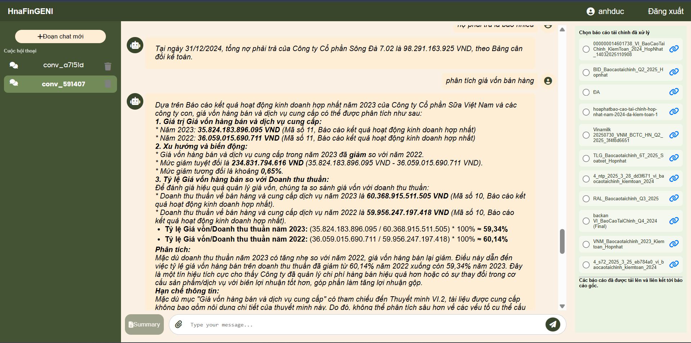
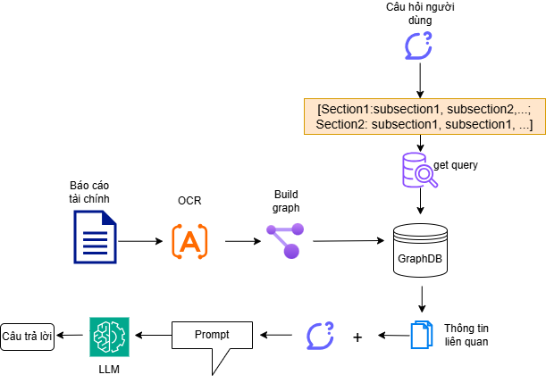
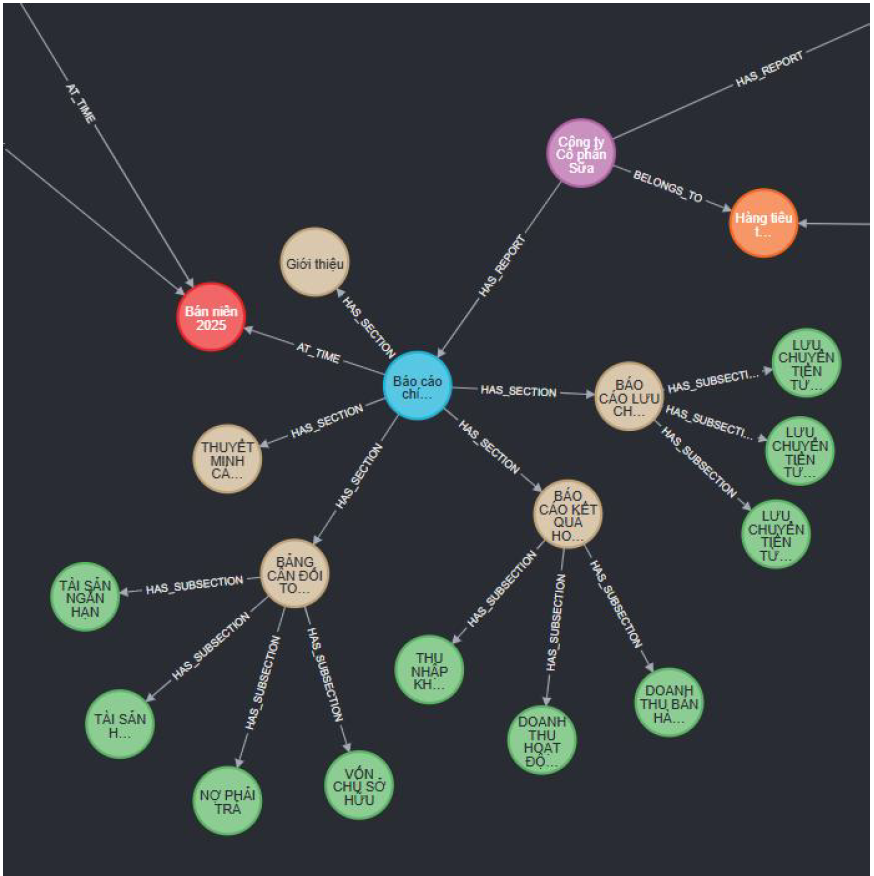

## Giới thiệu
Dự án này xây dựng **hệ thống chatbot đọc hiểu và phân tích báo cáo tài chính**, cho phép người dùng đặt câu hỏi và báo cáo tài chính hệ thống sẽ đọc hiểu báo cáo đó và trả lời câu hỏi cảu người dùng dựa trên thông tin từ báo cáo tài chính.  
Hệ thống ứng dụng **Graph RAG (Retrieval-Augmented Generation dựa trên đồ thị)** nhằm biểu diễn báo cáo tài chính dưới dạng **đồ thị tri thức**, từ đó nâng cao khả năng truy hồi thông tin, suy luận và độ chính xác của câu trả lời.

Dự án được thực hiện trong khuôn khổ **khóa luận tốt nghiệp**, tập trung vào bài toán **Question Answering trên báo cáo tài chính tiếng Việt**.

---

##  Mục tiêu
- Đọc hiểu báo cáo tài chính phi cấu trúc (PDF, văn bản)
- Biểu diễn thông tin tài chính dưới dạng **đồ thị tri thức**
- Ứng dụng **Graph RAG** để cải thiện chất lượng truy hồi so với RAG truyền thống
- Đánh giá hệ thống bằng các chỉ số định lượng

---

##  Luồng xử lý chính của hệ thống

##  Biểu diễn đồ thị tri thức
Dưới đây là ví dụ minh họa **đồ thị tri thức báo cáo tài chính**, trong đó các nút biểu diễn thực thể tài chính và các cạnh biểu diễn mối quan hệ ngữ nghĩa:

>  Việc biểu diễn báo cáo tài chính dưới dạng đồ thị giúp mô hình khai thác tốt hơn mối quan hệ giữa các chỉ tiêu và hỗ trợ suy luận đa bước.

---

##  Đánh giá 
Hệ thống được đánh giá trên tập câu hỏi về báo cáo tài chính bằng các chỉ số phổ biến trong bài toán **Retrieval-Augmented Generation (RAG)**, bao gồm:

- **Faithfulness**: mức độ trung thực của câu trả lời so với ngữ cảnh
- **Answer Relevancy**: mức độ liên quan của câu trả lời với câu hỏi
- **Context Precision**: độ chính xác của ngữ cảnh được truy hồi
- **Context Recall**: khả năng bao phủ ngữ cảnh cần thiết
- **LLM Rank**: điểm đánh giá tổng hợp từ mô hình ngôn ngữ

| Method | Faithfulness | Answer Relevancy | Context Precision | Context Recall | LLM Rank |
|------|-------------|------------------|------------------|---------------|---------|
| Basic RAG | 0.79 | 0.11 | 0.32 | 0.50 | 3.50 |
| Basic RAG (SLM) | 0.69 | 0.17 | 0.38 | 0.62 | 3.43 |
| Hybrid Search + Rerank RAG (baseline) | 0.83 | 0.11 | 0.64 | 0.79 | 4.19 |
| Hybrid Search + Rerank RAG (baseline, SLM) | 0.72 | 0.12 | 0.65 | **0.84** | 3.83 |
| **Financial Report Graph-RAG** | **0.90** | **0.19** | **0.94** | 0.81 | **4.28** |
| **Financial Report Graph-RAG (SLM)** | 0.83 | 0.18 | 0.92 | 0.83 | 3.90 |

> Kết quả cho thấy **Graph RAG cải thiện đáng kể khả năng truy hồi ngữ cảnh và độ chính xác câu trả lời** so với RAG truyền thống.

---

## 🛠️ Công nghệ sử dụng
- Django
- Neo4j
- MongoDB
- FAISS
- LlamaIndex
- Google AI Studio

---

