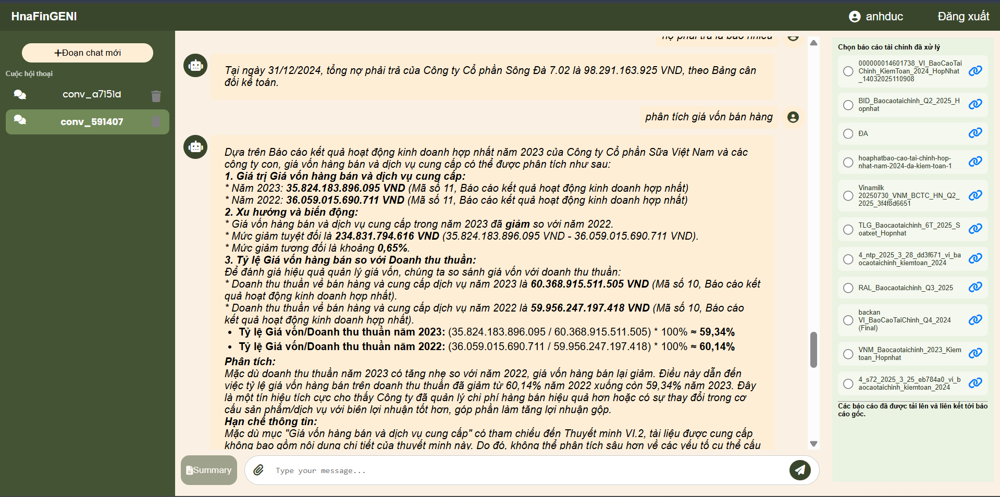
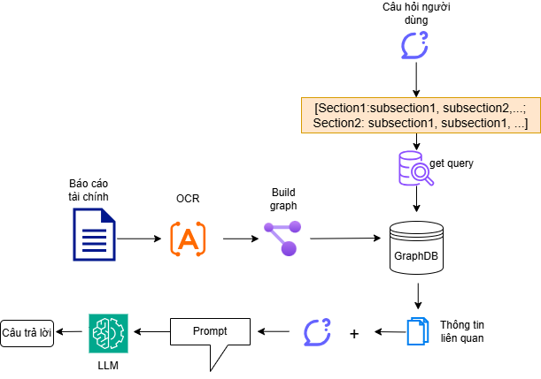
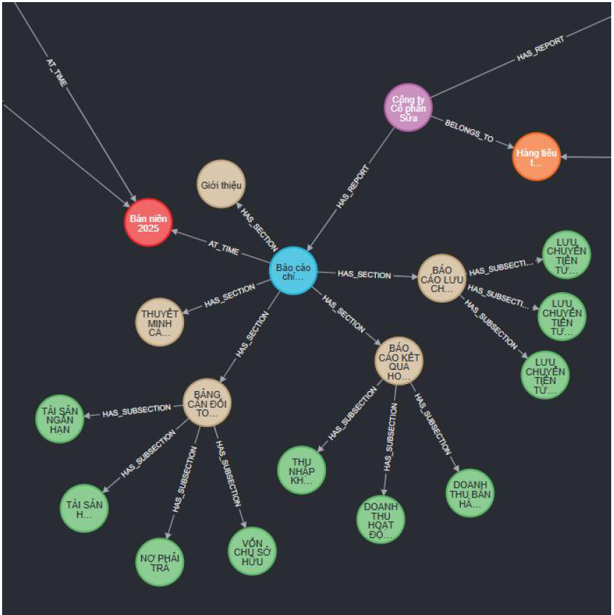

## Introduction

This research presents a **chatbot system for financial statement understanding and analysis**, allowing users to submit questions regarding financial reports. The system is designed to comprehend financial statements and generate responses based on the information extracted from the provided documents.

The framework leverages **Graph Retrieval-Augmented Generation (Graph RAG)** to represent financial statements as a **knowledge graph**, improving information retrieval, reasoning capability, and answer accuracy.

This project was developed as part of my **[graduation thesis](https://github.com/anhduc1234567/Djago-system-for-FinQA-VietNamese-financial-reports-/blob/server/NguyenDucAnh_Khoa_Luan.pdf)**, focusing on the task of **Question Answering over Vietnamese financial statements**.

> **Note:** This repository is intended for demonstration and research purposes only.  
> The implementation serves as a prototype of the proposed framework and has not yet been fully refactored or optimized for production-level deployment.

---

## Objectives

- Understand unstructured financial statements (PDFs, text documents)
- Represent financial information as a **knowledge graph**
- Apply **Graph RAG** to improve retrieval quality compared to traditional RAG pipelines
- Evaluate system performance using quantitative metrics

---

## System Pipeline

---

## Knowledge Graph Representation

Below is an example visualization of the **financial statement knowledge graph**, where nodes represent financial entities and edges represent semantic relationships:

> Representing financial statements as graphs enables the model to better capture relationships among financial indicators and supports multi-hop reasoning.

---

## Evaluation

The system was evaluated on a financial statement question-answering benchmark using common **Retrieval-Augmented Generation (RAG)** metrics, including:

- **Faithfulness**: Measures factual consistency between the response and retrieved context
- **Answer Relevancy**: Measures how relevant the generated answer is to the user query
- **Context Precision**: Measures the precision of retrieved supporting context
- **Context Recall**: Measures the coverage of necessary context retrieval
- **LLM Rank**: Overall qualitative score assigned by an LLM evaluator

| Method | Faithfulness | Answer Relevancy | Context Precision | Context Recall | LLM Rank |
|------|-------------|------------------|------------------|---------------|---------|
| Basic RAG | 0.79 | 0.11 | 0.32 | 0.50 | 3.50 |
| Basic RAG (SLM) | 0.69 | 0.17 | 0.38 | 0.62 | 3.43 |
| Hybrid Search + Rerank RAG (baseline) | 0.83 | 0.11 | 0.64 | 0.79 | 4.19 |
| Hybrid Search + Rerank RAG (baseline, SLM) | 0.72 | 0.12 | 0.65 | **0.84** | 3.83 |
| **Financial Report Graph-RAG** | **0.90** | **0.19** | **0.94** | 0.81 | **4.28** |
| **Financial Report Graph-RAG (SLM)** | 0.83 | 0.18 | 0.92 | 0.83 | 3.90 |

> Experimental results demonstrate that **Graph RAG significantly improves contextual retrieval and answer accuracy** compared to conventional RAG approaches.

---

## Technologies Used

- Django  
- Neo4j  
- MongoDB  
- FAISS  
- LlamaIndex  
- Google AI Studio  
