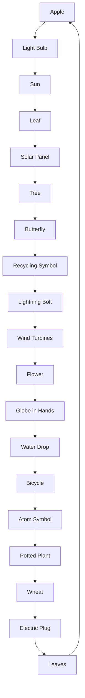

Deloitte.

CÔNG TY CỔ PHẦN TẬP ĐOÀN HÒA PHÁT
*(Thành lập tại nước Cộng hoà Xã hội Chủ nghĩa Việt Nam)*

# BÁO CÁO TÀI CHÍNH RIÊNG
# GIỮA NIÊN ĐỘ ĐÃ ĐƯỢC SOÁT XÉT
Cho kỳ hoạt động 6 tháng kết thúc ngày 30 tháng 6 năm 2025

-----------Page 0

CÔNG TY CỔ PHẦN TẬP ĐOÀN HÒA PHÁT
Khu Công nghiệp Phố Nối A, Xã Nguyễn Văn Linh,
Tỉnh Hưng Yên, Việt Nam

## MỤC LỤC

| NỘI DUNG                                                | TRANG   |
| ------------------------------------------------------- | ------- |
| BÁO CÁO CỦA BAN TỔNG GIÁM ĐỐC                           | 1 - 2   |
| BÁO CÁO SOÁT XÉT BÁO CÁO TÀI CHÍNH RIÊNG GIỮA NIÊN ĐỘ   | 3 - 4   |
| BẢNG CÂN ĐỐI KẾ TOÁN RIÊNG GIỮA NIÊN ĐỘ                 | 5 - 6   |
| BÁO CÁO KẾT QUẢ HOẠT ĐỘNG KINH DOANH RIÊNG GIỮA NIÊN ĐỘ | 7       |
| BÁO CÁO LƯU CHUYỂN TIỀN TỆ RIÊNG GIỮA NIÊN ĐỘ           | 8 - 9   |
| THUYẾT MINH BÁO CÁO TÀI CHÍNH RIÊNG GIỮA NIÊN ĐỘ        | 10 - 37 |

-----------Page 1

CÔNG TY CỔ PHẦN TẬP ĐOÀN HÒA PHÁT
Khu Công nghiệp Phố Nối A, Xã Nguyễn Văn Linh,
Tỉnh Hưng Yên, Việt Nam

BÁO CÁO CỦA BAN TỔNG GIÁM ĐỐC

Ban Tổng Giám đốc Công ty Cổ phần Tập đoàn Hòa Phát (gọi tắt là "Công ty") đệ trình báo cáo này cùng với báo
cáo tài chính riêng giữa niên độ của Công ty cho kỳ hoạt động 6 tháng kết thúc ngày 30 tháng 6 năm 2025.

HỘI ĐỒNG QUẢN TRỊ, BAN TỔNG GIÁM ĐỐC, BAN KIỂM SOÁT VÀ KẾ TOÁN TRƯỞNG

Các thành viên của Hội đồng Quản trị, Ban Tổng Giám đốc, Ban Kiểm soát và Kế toán trưởng Công ty trong kỳ và
đến ngày lập báo cáo này bao gồm:

Hội đồng Quản trị

| Họ và tên             | Chức vụ            |
| --------------------- | ------------------ |
| Ông Trần Đình Long    | Chủ tịch           |
| Ông Trần Tuấn Dương   | Thành viên         |
| Ông Nguyễn Mạnh Tuấn  | Thành viên         |
| Ông Đoàn Gia Cường    | Thành viên         |
| Ông Nguyễn Ngọc Quang | Thành viên         |
| Ông Hoàng Quang Việt  | Thành viên         |
| Ông Nguyễn Việt Thắng | Thành viên         |
| Ông Chu Quang Vũ      | Thành viên độc lập |
| Ông Đặng Ngọc Khánh   | Thành viên độc lập |

Ban Tổng Giám đốc

| Họ và tên                 | Chức vụ           |
| ------------------------- | ----------------- |
| Ông Nguyễn Việt Thắng     | Tổng Giám đốc     |
| Bà Nguyễn Thị Thảo Nguyên | Phó Tổng Giám đốc |
| Bà Trần Thị Thu Hiền      | Phó Tổng Giám đốc |

Ban Kiểm soát

| Họ và tên          | Chức vụ    |
| ------------------ | ---------- |
| Bà Bùi Thị Hải Vân | Trưởng ban |
| Bà Ngô Lan Anh     | Thành viên |
| Bà Thái Thị Lộc    | Thành viên |

Kế toán trưởng

| Họ và tên            | Chức vụ        |
| -------------------- | -------------- |
| Bà Phạm Thị Kim Oanh | Kế toán trưởng |

TRÁCH NHIỆM CỦA BAN TỔNG GIÁM ĐỐC

Ban Tổng Giám đốc Công ty có trách nhiệm lập báo cáo tài chính riêng giữa niên độ phản ánh một cách trung thực
và hợp lý tình hình tài chính của Công ty tại ngày 30 tháng 6 năm 2025, cũng như kết quả hoạt động kinh doanh
và tình hình lưu chuyển tiền tệ cho kỳ hoạt động 6 tháng kết thúc cùng ngày, phù hợp với chuẩn mực kế toán, chế
độ kế toán doanh nghiệp Việt Nam và các quy định pháp lý có liên quan đến việc lập và trình bày báo cáo tài chính
giữa niên độ. Trong việc lập báo cáo tài chính riêng giữa niên độ này, Ban Tổng Giám đốc được yêu cầu phải:

- Lựa chọn các chính sách kế toán thích hợp và áp dụng các chính sách đó một cách nhất quán;
- Đưa ra các xét đoán và ước tính một cách hợp lý và thận trọng;
- Nêu rõ các nguyên tắc kế toán thích hợp có được tuân thủ hay không, có những áp dụng sai lệch trọng yếu
cần được công bố và giải thích trong báo cáo tài chính riêng giữa niên độ hay không;
- Lập báo cáo tài chính riêng giữa niên độ trên cơ sở hoạt động liên tục trừ trường hợp không thể cho rằng
Công ty sẽ tiếp tục hoạt động kinh doanh; và
- Thiết kế và thực hiện hệ thống kiểm soát nội bộ một cách hữu hiệu cho mục đích lập và trình bày báo cáo tài
chính riêng giữa niên độ hợp lý nhằm hạn chế rủi ro và gian lận.

-----------Page 2

CÔNG TY CỔ PHẦN TẬP ĐOÀN HÒA PHÁT
Khu Công nghiệp Phố Nối A, Xã Nguyễn Văn Linh,
Tỉnh Hưng Yên, Việt Nam

BÁO CÁO CỦA BAN TỔNG GIÁM ĐỐC (Tiếp theo)

TRÁCH NHIỆM CỦA BAN TỔNG GIÁM ĐỐC (Tiếp theo)

Ban Tổng Giám đốc Công ty chịu trách nhiệm đảm bảo rằng sổ kế toán được ghi chép một cách phù hợp để phản ánh một cách hợp lý tình hình tài chính của Công ty ở bất kỳ thời điểm nào và đảm bảo rằng báo cáo tài chính riêng giữa niên độ tuân thủ chuẩn mực kế toán, chế độ kế toán doanh nghiệp Việt Nam và các quy định pháp lý có liên quan đến việc lập và trình bày báo cáo tài chính giữa niên độ. Ban Tổng Giám đốc cũng chịu trách nhiệm đảm bảo an toàn cho tài sản của Công ty và thực hiện các biện pháp thích hợp để ngăn chặn và phát hiện các hành vi gian lận và sai phạm khác.

Ban Tổng Giám đốc xác nhận rằng Công ty đã tuân thủ các yêu cầu nêu trên trong việc lập báo cáo tài chính riêng giữa niên độ.

Thay mặt và đại diện cho Ban Tổng Giám đốc

[Signature]

[Company seal: CÔNG TY CỔ PHẦN TẬP ĐOÀN HÒA PHÁT]

Nguyễn Việt Thắng
Tổng Giám đốc

Ngày 29 tháng 8 năm 2025

2

-----------Page 3

Deloitte.

Công Ty TNHH Kiểm toán
Deloitte Việt Nam
Tầng 12, Tòa nhà Diamond Park Plaza,
số 16 Láng Hạ, Phường Giảng Võ,
Thành phố Hà Nội, Việt Nam
Điện thoại: +84 24 710 50000
www.deloitte.com/vn

Số: 0308 /VN1A-HN-BC

BÁO CÁO SOÁT XÉT BÁO CÁO TÀI CHÍNH RIÊNG GIỮA NIÊN ĐỘ

Kính gửi:     Các Cổ đông
               Hội đồng Quản trị và Ban Tổng Giám đốc
               Công ty Cổ phần Tập đoàn Hòa Phát

Chúng tôi đã soát xét báo cáo tài chính riêng giữa niên độ kèm theo của Công ty Cổ phần Tập đoàn Hòa Phát (gọi
tắt là "Công ty"), được lập ngày 29 tháng 8 năm 2025, từ trang 05 đến trang 37, bao gồm Bảng cân đối kế toán
riêng giữa niên độ tại ngày 30 tháng 6 năm 2025, Báo cáo kết quả hoạt động kinh doanh riêng giữa niên độ, Báo
cáo lưu chuyển tiền tệ riêng giữa niên độ cho kỳ hoạt động 6 tháng kết thúc cùng ngày và Bản thuyết minh báo
cáo tài chính riêng giữa niên độ.

Trách nhiệm của Ban Tổng Giám đốc

Ban Tổng Giám đốc Công ty chịu trách nhiệm lập và trình bày trung thực và hợp lý báo cáo tài chính riêng giữa
niên độ theo chuẩn mực kế toán, chế độ kế toán doanh nghiệp Việt Nam và các quy định pháp lý có liên quan đến
việc lập và trình bày báo cáo tài chính giữa niên độ và chịu trách nhiệm về kiểm soát nội bộ mà Ban Tổng Giám
đốc xác định là cần thiết để đảm bảo việc lập và trình bày báo cáo tài chính riêng giữa niên độ không có sai sót
trọng yếu do gian lận hoặc nhầm lẫn.

Trách nhiệm của Kiểm toán viên

Trách nhiệm của chúng tôi là đưa ra kết luận về báo cáo tài chính riêng giữa niên độ kèm theo dựa trên kết quả
soát xét của chúng tôi. Chúng tôi đã thực hiện công việc soát xét theo Chuẩn mực Việt Nam về hợp đồng dịch vụ
soát xét số 2410 - Soát xét thông tin tài chính giữa niên độ do kiểm toán viên độc lập của đơn vị thực hiện.

Công việc soát xét báo cáo tài chính riêng giữa niên độ bao gồm việc thực hiện các cuộc phỏng vấn, chủ yếu là
phỏng vấn những người chịu trách nhiệm về các vấn đề tài chính kế toán, và thực hiện thủ tục phân tích và các
thủ tục soát xét khác. Một cuộc soát xét về cơ bản có phạm vi hẹp hơn một cuộc kiểm toán được thực hiện theo
các chuẩn mực kiểm toán Việt Nam và do vậy không cho phép chúng tôi đạt được sự đảm bảo rằng chúng tôi sẽ
nhận biết được tất cả các vấn đề trọng yếu có thể được phát hiện trong một cuộc kiểm toán. Theo đó, chúng tôi
không đưa ra ý kiến kiểm toán.

Tên Deloitte được dùng để chỉ một hoặc nhiều thành viên của Deloitte Touche Tohmatsu Limited ("DTTL" hay "Deloitte Toàn cầu"), và mạng lưới các hãng thành viên trên toàn cầu (gọi chung là Tổ chức Deloitte). DTTL và mỗi thành viên trực thuộc là một pháp nhân riêng biệt và độc lập về mặt pháp lý, không bị ràng buộc lẫn nhau đối với các bên thứ ba. DTTL và mỗi thành viên trực thuộc DTTL chỉ chịu trách nhiệm cho hành vi và thiếu sót của mình, chứ không phải chịu trách nhiệm lẫn nhau. DTTL không cung cấp dịch vụ cho các khách hàng. Vui lòng xem tại www.deloitte.com/about để biết thêm thông tin chi tiết.

Deloitte Châu Á Thái Bình Dương là một hãng thành viên của Deloitte Toàn cầu. Các thành viên và các đơn vị trực thuộc của Deloitte Châu Á Thái Bình Dương cung cấp dịch vụ cho khách hàng tại hơn 100 thành phố trong khu vực, bao gồm Auckland, Bangkok, Bắc Kinh, Bengaluru, Hà Nội, Hồng Kông, Jakarta, Kuala Lumpur, Manila, Melbourne, Mumbai, New Delhi, Osaka, Seoul, Thượng Hải, Singapore, Sydney, Đài Bắc và Tokyo. Tại các nước thành viên, các hoạt động kinh doanh được thực hiện độc lập bởi các pháp nhân riêng biệt.

Deloitte Việt Nam
Tại Việt Nam, dịch vụ chuyên ngành được cung cấp bởi từng pháp nhân riêng biệt, và chi nhánh của pháp nhân đó, được gọi chung là Deloitte Việt Nam.
Tài liệu này chỉ chứa đựng những thông tin chung, và không một hãng DTTL, hay bất kỳ một hãng thành viên hay công ty con và các nhân viên của họ được xem là, trong phạm vi nội dung của tài liệu này, cung cấp dịch vụ hay đưa ra những ý kiến, tư vấn về chuyên môn cho người đọc. Trước khi đưa ra bất kỳ một quyết định hay hành động nào có thể ảnh hưởng tới tình hình tài chính hoặc hoạt động kinh doanh, người đọc nên tham khảo ý kiến chuyên gia tư vấn.
Không có tuyên bố, bảo đảm hoặc cam kết nào (rõ ràng hay ngầm định) được đưa ra về tính chính xác hoặc tính đầy đủ của thông tin trong tài liệu này, và không một hãng thành viên nào thuộc Mạng lưới các công ty Deloitte chịu trách nhiệm đối với bất kỳ thiệt hại, tổn thất xảy ra trực tiếp hay gián tiếp do kết quả của việc người đọc sử dụng, công bố, phát tán ra bên ngoài hoặc dựa vào tài liệu này để hành động, không hành động hoặc ra bất kỳ quyết định nào.

© 2025 Công ty TNHH Kiểm toán Deloitte Việt Nam

-----------Page 4

# Deloitte.

## BÁO CÁO SOÁT XÉT BÁO CÁO TÀI CHÍNH RIÊNG GIỮA NIÊN ĐỘ (Tiếp theo)

### Kết luận của Kiểm toán viên

Căn cứ trên kết quả soát xét của chúng tôi, chúng tôi không thấy có vấn đề gì khiến chúng tôi cho rằng báo cáo tài chính riêng giữa niên độ kèm theo không phản ánh trung thực và hợp lý, trên các khía cạnh trọng yếu, tình hình tài chính của Công ty tại ngày 30 tháng 6 năm 2025, cũng như kết quả hoạt động kinh doanh và tình hình lưu chuyển tiền tệ của Công ty cho kỳ hoạt động 6 tháng kết thúc cùng ngày, phù hợp với chuẩn mực kế toán, chế độ kế toán doanh nghiệp Việt Nam và các quy định pháp lý có liên quan đến việc lập và trình bày báo cáo tài chính giữa niên độ.

### Vấn đề khác

Báo cáo tài chính riêng cho năm tài chính kết thúc ngày 31 tháng 12 năm 2024 của Công ty đã được kiểm toán bởi một công ty kiểm toán độc lập khác, với báo cáo kiểm toán đề ngày 24 tháng 3 năm 2025 đưa ra ý kiến chấp nhận toàn phần. Đồng thời, báo cáo tài chính riêng giữa niên độ cho kỳ hoạt động 6 tháng kết thúc ngày 30 tháng 6 năm 2024 của Công ty cũng được soát xét bởi một công ty kiểm toán độc lập khác, với báo cáo soát xét đề ngày 29 tháng 8 năm 2024 đưa ra kết luận chấp nhận toàn phần.

[Signature]

Phạm Nam Phong
Phó Tổng Giám đốc
Giấy chứng nhận đăng ký hành nghề
kiểm toán số 0929-2024-001-1

CÔNG TY TNHH KIỂM TOÁN DELOITTE VIỆT NAM

Ngày 29 tháng 8 năm 2025
Hà Nội, CHXHCN Việt Nam

-----------Page 5

CÔNG TY CỔ PHẦN TẬP ĐOÀN HÒA PHÁT
Khu Công nghiệp Phố Nối A, xã Nguyễn Văn Linh,
Tỉnh Hưng Yên, Việt Nam

MẪU SỐ B 01a-DN
Ban hành theo Thông tư số 200/2014/TT-BTC
ngày 22 tháng 12 năm 2014 của Bộ Tài chính

BẢNG CÂN ĐỐI KẾ TOÁN RIÊNG GIỮA NIÊN ĐỘ
Tại ngày 30 tháng 6 năm 2025

Đơn vị: VND

| TÀI SẢN                                     | Mã số | Thuyết minh | Số cuối kỳ         | Số đầu kỳ          |
| ------------------------------------------- | ----- | ----------- | ------------------ | ------------------ |
| A. TÀI SẢN NGẮN HẠN                         | 100   |             | 1.736.246.725.313  | 1.015.072.291.199  |
| I. Tiền và các khoản tương đương tiền       | 110   | 4           | 821.809.167.327    | 319.257.876.941    |
| 1. Tiền                                     | 111   |             | 70.509.167.327     | 46.457.876.941     |
| 2. Các khoản tương đương tiền               | 112   |             | 751.300.000.000    | 272.800.000.000    |
| II. Đầu tư tài chính ngắn hạn               | 120   | 5           | 228.767.090.411    | 281.046.575.342    |
| 1. Đầu tư nắm giữ đến ngày đáo hạn          | 123   |             | 228.767.090.411    | 281.046.575.342    |
| III. Các khoản phải thu ngắn hạn            | 130   |             | 641.540.446.977    | 382.019.681.921    |
| 1. Phải thu ngắn hạn của khách hàng         | 131   | 6           | 210.890.145.821    | 146.311.178.378    |
| 2. Trả trước cho người bán ngắn hạn         | 132   | 7           | 50.806.231.458     | 19.125.157.288     |
| 3. Phải thu về cho vay ngắn hạn             | 135   | 8           | 360.000.000.000    | 196.900.000.000    |
| 4. Phải thu ngắn hạn khác                   | 136   | 9           | 19.844.069.698     | 19.683.346.255     |
| IV. Hàng tồn kho                            | 140   |             | 1.792.131.605      | 721.931.618        |
| 1. Hàng tồn kho                             | 141   |             | 1.792.131.605      | 721.931.618        |
| V. Tài sản ngắn hạn khác                    | 150   |             | 42.337.888.993     | 32.026.225.377     |
| 1. Chi phí trả trước ngắn hạn               | 151   | 10          | 40.178.853.899     | 29.956.239.110     |
| 2. Thuế giá trị gia tăng được khấu trừ      | 152   |             | 1.011.925.292      | 922.876.465        |
| 3. Thuế và các khoản khác phải thu Nhà nước | 153   | 11          | 1.147.109.802      | 1.147.109.802      |
| B. TÀI SẢN DÀI HẠN                          | 200   |             | 90.078.748.217.004 | 80.778.004.224.445 |
| I. Các khoản phải thu dài hạn               | 210   |             | 143.595.000.000    | 23.095.000.000     |
| 1. Phải thu về cho vay dài hạn              | 215   | 8           | 139.400.000.000    | 19.000.000.000     |
| 2. Phải thu dài hạn khác                    | 216   | 9           | 4.195.000.000      | 4.095.000.000      |
| II. Tài sản cố định                         | 220   |             | 51.303.948.832     | 67.613.461.560     |
| 1. Tài sản cố định hữu hình                 | 221   | 12          | 44.176.300.381     | 59.554.496.946     |
| - Nguyên giá                                | 222   |             | 186.863.381.297    | 186.037.992.716    |
| - Giá trị hao mòn lũy kế                    | 223   |             | (142.687.080.916)  | (126.483.495.770)  |
| 2. Tài sản cố định vô hình                  | 227   | 13          | 7.127.648.451      | 8.058.964.614      |
| - Nguyên giá                                | 228   |             | 29.662.833.440     | 29.362.833.440     |
| - Giá trị hao mòn lũy kế                    | 229   |             | (22.535.184.989)   | (21.303.868.826)   |
| III. Bất động sản đầu tư                    | 230   | 14          | 85.962.369.994     | 92.443.046.398     |
| - Nguyên giá                                | 231   |             | 259.227.056.200    | 259.227.056.200    |
| - Giá trị hao mòn lũy kế                    | 232   |             | (173.264.686.206)  | (166.784.009.802)  |
| IV. Tài sản dở dang dài hạn                 | 240   |             | 5.285.735.250      | 5.560.498.118      |
| 1. Chi phí xây dựng cơ bản dở dang          | 242   |             | 5.285.735.250      | 5.560.498.118      |
| V. Đầu tư tài chính dài hạn                 | 250   | 5           | 89.765.849.440.000 | 80.585.847.420.000 |
| 1. Đầu tư vào công ty con                   | 251   |             | 89.765.849.440.000 | 80.585.847.420.000 |
| VI. Tài sản dài hạn khác                    | 260   |             | 26.751.722.928     | 3.444.798.369      |
| 1. Chi phí trả trước dài hạn                | 261   | 10          | 26.751.722.928     | 3.444.798.369      |
| TỔNG CỘNG TÀI SẢN (270=100+200)             | 270   |             | 91.814.994.942.317 | 81.793.076.515.644 |

Các thuyết minh kèm theo là một bộ phận hợp thành của báo cáo tài chính riêng giữa niên độ này

5

-----------Page 6

CÔNG TY CỔ PHẦN TẬP ĐOÀN HÒA PHÁT
Khu Công nghiệp Phố Nối A, Xã Nguyễn Văn Linh,
Tỉnh Hưng Yên, Việt Nam

MẪU SỐ B 01a-DN
Ban hành theo Thông tư số 200/2014/TT-BTC
ngày 22 tháng 12 năm 2014 của Bộ Tài chính

BẢNG CÂN ĐỐI KẾ TOÁN RIÊNG GIỮA NIÊN ĐỘ (Tiếp theo)
Tại ngày 30 tháng 6 năm 2025

Đơn vị: VND

| NGUỒN VỐN                                                     | Mã số | Thuyết minh | Số cuối kỳ         | Số đầu kỳ          |
| ------------------------------------------------------------- | ----- | ----------- | ------------------ | ------------------ |
| C. NỢ PHẢI TRẢ                                                | 300   |             | 6.078.241.901.235  | 1.012.889.937.592  |
| I. Nợ ngắn hạn                                                | 310   |             | 1.728.241.901.235  | 1.012.889.937.592  |
| 1. Phải trả người bán ngắn hạn                                | 311   | 15          | 17.586.586.287     | 20.302.825.821     |
| 2. Thuế và các khoản phải nộp Nhà nước                        | 313   | 11          | 7.387.985.106      | 11.898.040.627     |
| 3. Phải trả người lao động                                    | 314   |             | 1.659.682.522      | 8.110.460.639      |
| 4. Chi phí phải trả ngắn hạn                                  | 315   |             | 2.919.690.669      | 480.866.916        |
| 5. Doanh thu chưa thực hiện ngắn hạn                          | 318   |             | 3.250.488.025      | 3.151.245.281      |
| 6. Phải trả ngắn hạn khác                                     | 319   | 16          | 31.501.956.117     | 30.484.725.723     |
| 7. Vay ngắn hạn                                               | 320   | 18          | 572.500.000.000    |                    |
| 8. Quỹ khen thưởng, phúc lợi                                  | 322   | 17          | 1.091.435.512.509  | 938.461.772.585    |
| II. Nợ dài hạn                                                | 330   |             | 4.350.000.000.000  | -                  |
| 1. Vay dài hạn                                                | 338   | 19          | 4.350.000.000.000  | -                  |
| D. VỐN CHỦ SỞ HỮU                                             | 400   |             | 85.736.753.041.082 | 80.780.186.578.052 |
| I. Vốn chủ sở hữu                                             | 410   | 20          | 85.736.753.041.082 | 80.780.186.578.052 |
| 1. Vốn góp của chủ sở hữu                                     | 411   |             | 63.962.502.000.000 | 63.962.502.000.000 |
| - Cổ phiếu phổ thông có quyền biểu quyết                      | 411a  |             | 63.962.502.000.000 | 63.962.502.000.000 |
| 2. Quỹ đầu tư phát triển                                      | 418   |             | 1.388.437.800.829  | 788.437.800.829    |
| 3. Lợi nhuận sau thuế chưa phân phối                          | 421   |             | 20.385.813.240.253 | 16.029.246.777.223 |
| - Lợi nhuận sau thuế chưa phân phối lũy kế đến cuối năm trước | 421a  |             | 15.005.817.052.223 | 5.781.846.305.123  |
| - Lợi nhuận sau thuế chưa phân phối kỳ này/năm nay            | 421b  |             | 5.379.996.188.030  | 10.247.400.472.100 |
| TỔNG CỘNG NGUỒN VỐN (440=300+400)                             | 440   |             | 91.814.994.942.317 | 81.793.076.515.644 |

Nguyễn Diệu Linh
Người lập biểu

Phạm Thị Kim Oanh
Kế toán trưởng

Nguyễn Việt Thắng
Tổng Giám đốc

Ngày 29 tháng 8 năm 2025

Các thuyết minh kèm theo là một bộ phận hợp thành của báo cáo tài chính riêng giữa niên độ này

6

-----------Page 7

CÔNG TY CỔ PHẦN TẬP ĐOÀN HÒA PHÁT
Khu Công nghiệp Phố Nối A, Xã Nguyễn Văn Linh,
Tỉnh Hưng Yên, Việt Nam

MẪU SỐ B 02a-DN
Ban hành theo Thông tư số 200/2014/TT-BTC
ngày 22 tháng 12 năm 2014 của Bộ Tài chính

BÁO CÁO KẾT QUẢ HOẠT ĐỘNG KINH DOANH RIÊNG GIỮA NIÊN ĐỘ
Cho kỳ hoạt động 6 tháng kết thúc ngày 30 tháng 6 năm 2025

Đơn vị: VND

| CHỈ TIÊU                                                            | Mã số | Thuyết minh | Kỳ này            | Kỳ trước          |
| ------------------------------------------------------------------- | ----- | ----------- | ----------------- | ----------------- |
| 1. Doanh thu cung cấp dịch vụ                                       | 01    | 22          | 177.662.880.141   | 62.561.626.570    |
| 2. Các khoản giảm trừ doanh thu                                     | 02    | 22          | 1.460.500         | -                 |
| 3. Doanh thu thuần về cung cấp dịch vụ (10=01-02)                   | 10    | 22          | 177.661.419.641   | 62.561.626.570    |
| 4. Giá vốn dịch vụ cung cấp                                         | 11    | 23          | 126.525.372.761   | 48.605.318.118    |
| 5. Lợi nhuận gộp về cung cấp dịch vụ (20=10-11)                     | 20    |             | 51.136.046.880    | 13.956.308.452    |
| 6. Doanh thu hoạt động tài chính                                    | 21    | 25          | 5.499.712.962.181 | 5.107.061.479.938 |
| 7. Chi phí tài chính                                                | 22    | 26          | 62.018.961.390    | -                 |
| - Trong đó: Chi phí lãi vay                                         | 23    |             | 62.018.158.906    | -                 |
| 8. Chi phí bán hàng                                                 | 25    |             | 10.709.626        | -                 |
| 9. Chi phí quản lý doanh nghiệp                                     | 26    | 27          | 108.802.204.269   | 44.227.832.288    |
| 10. Lợi nhuận thuần từ hoạt động kinh doanh (30=20+(21-22)-(25+26)) | 30    |             | 5.380.017.133.776 | 5.076.789.956.102 |
| 11. Thu nhập khác                                                   | 31    |             | 30.082.136        | 231.819.104       |
| 12. Chi phí khác                                                    | 32    |             | 51.027.882        | 477.435.720       |
| 13. Lỗ khác (40=31-32)                                              | 40    |             | (20.945.746)      | (245.616.616)     |
| 14. Tổng lợi nhuận kế toán trước thuế (50=30+40)                    | 50    |             | 5.379.996.188.030 | 5.076.544.339.486 |
| 15. Chi phí thuế thu nhập doanh nghiệp hiện hành                    | 51    | 28          | -                 | -                 |
| 16. Lợi nhuận sau thuế thu nhập doanh nghiệp (60=50-51)             | 60    |             | 5.379.996.188.030 | 5.076.544.339.486 |

Nguyễn Diệu Linh
Người lập biểu

Phạm Thị Kim Oanh
Kế toán trưởng

Nguyễn Việt Thắng
Tổng Giám đốc

Ngày 29 tháng 8 năm 2025

Các thuyết minh kèm theo là một bộ phận hợp thành của báo cáo tài chính riêng giữa niên độ này

7

-----------Page 8

CÔNG TY CỔ PHẦN TẬP ĐOÀN HÒA PHÁT
Khu Công nghiệp Phố Nối A, Xã Nguyễn Văn Linh,
Tỉnh Hưng Yên, Việt Nam

MẪU SỐ B 03a-DN
Ban hành theo Thông tư số 200/2014/TT-BTC
ngày 22 tháng 12 năm 2014 của Bộ Tài chính

BÁO CÁO LƯU CHUYỂN TIỀN TỆ RIÊNG GIỮA NIÊN ĐỘ
Cho kỳ hoạt động 6 tháng kết thúc ngày 30 tháng 6 năm 2025

Đơn vị: VND

| CHỈ TIÊU                                                                                       | Mã số | Kỳ này              | Kỳ trước            |
| ---------------------------------------------------------------------------------------------- | ----- | ------------------- | ------------------- |
| I. LƯU CHUYỂN TIỀN TỪ HOẠT ĐỘNG KINH DOANH                                                     |       |                     |                     |
| 1. Lợi nhuận trước thuế                                                                        | 01    | 5.379.996.188.030   | 5.076.544.339.486   |
| 2. Điều chỉnh cho các khoản:                                                                   |       |                     |                     |
| Khấu hao tài sản cố định và bất động sản đầu tư                                                | 02    | 23.549.802.713      | 23.335.606.065      |
| Lỗ chênh lệch tỷ giá hối đoái do đánh giá lại các khoản mục tiền tệ có gốc ngoại tệ            | 04    | 802.484             | -                   |
| Lãi từ hoạt động đầu tư                                                                        | 05    | (5.499.334.194.910) | (5.106.815.820.127) |
| Chi phí lãi vay                                                                                | 06    | 62.018.158.906      | -                   |
| 3. Lợi nhuận từ hoạt động kinh doanh trước thay đổi vốn lưu động                               | 08    | (33.769.242.777)    | (6.935.874.576)     |
| Tăng, giảm các khoản phải thu                                                                  | 09    | (102.142.167.576)   | 545.631.569         |
| Tăng, giảm hàng tồn kho                                                                        | 10    | (1.070.199.987)     | (66.593.780.266)    |
| Tăng, giảm các khoản phải trả (Không kể lãi vay phải trả, thuế thu nhập doanh nghiệp phải nộp) | 11    | (28.068.556.847)    | (9.354.672.751)     |
| Tăng, giảm chi phí trả trước                                                                   | 12    | (33.529.539.348)    | (42.568.576.072)    |
| Tiền lãi vay đã trả                                                                            | 14    | (44.072.180.824)    | -                   |
| Thuế thu nhập doanh nghiệp đã nộp                                                              | 15    | -                   | (16.980.955.505)    |
| Tiền chi khác cho hoạt động kinh doanh                                                         | 17    | (270.209.062.848)   | (205.835.638.732)   |
| Lưu chuyển tiền thuần từ hoạt động kinh doanh                                                  | 20    | (512.860.950.207)   | (347.723.866.333)   |
| II. LƯU CHUYỂN TIỀN TỪ HOẠT ĐỘNG ĐẦU TƯ                                                        |       |                     |                     |
| 1. Tiền chi mua sắm, xây dựng TSCĐ và các tài sản dài hạn khác                                 | 21    | (850.625.713)       | (11.687.294.000)    |
| 2. Tiền thu thanh lý, nhượng bán TSCĐ và các tài sản dài hạn khác                              | 22    | 375.840.000         | 231.818.182         |
| 3. Tiền chi cho vay, mua công cụ nợ của đơn vị khác                                            | 23    | (588.767.090.411)   | (1.354.946.575.342) |
| 4. Tiền thu hồi cho vay, bán lại các công cụ nợ của đơn vị khác                                | 24    | 357.546.575.342     | 2.774.200.000.000   |
| 5. Tiền chi đầu tư góp vốn vào đơn vị khác                                                     | 25    | (9.430.000.000.000) | (6.437.000.000.000) |
| 6. Tiền thu hồi đầu tư vốn vào đơn vị khác                                                     | 26    | 249.997.980.000     | 299.997.580.000     |
| 7. Tiền thu lãi cho vay, cổ tức và lợi nhuận được chia                                         | 27    | 5.504.609.561.375   | 5.119.092.433.273   |
| Lưu chuyển tiền thuần từ hoạt động đầu tư                                                      | 30    | (3.907.087.759.407) | 389.887.962.113     |

Các thuyết minh kèm theo là một bộ phận hợp thành của báo cáo tài chính riêng giữa niên độ này

8

-----------Page 9

CÔNG TY CỔ PHẦN TẬP ĐOÀN HÒA PHÁT
Khu Công nghiệp Phố Nối A, Xã Nguyễn Văn Linh,
Tỉnh Hưng Yên, Việt Nam

MẪU SỐ B 03a-DN
Ban hành theo Thông tư số 200/2014/TT-BTC
ngày 22 tháng 12 năm 2014 của Bộ Tài chính

BÁO CÁO LƯU CHUYỂN TIỀN TỆ RIÊNG GIỮA NIÊN ĐỘ (Tiếp Theo)
Cho kỳ hoạt động 6 tháng kết thúc ngày 30 tháng 6 năm 2025

Đơn vị: VND

| CHỈ TIÊU                                     | Mã số | Kỳ này            | Kỳ trước        |
| -------------------------------------------- | ----- | ----------------- | --------------- |
| III. LƯU CHUYỂN TIỀN TỪ HOẠT ĐỘNG TÀI CHÍNH  |       |                   |                 |
| 1. Tiền thu từ đi vay                        | 33    | 5.024.500.000.000 | -               |
| 2. Tiền trả nợ gốc vay                       | 34    | (102.000.000.000) | -               |
| 3. Cổ tức, lợi nhuận đã trả cho chủ sở hữu   | 36    | -                 | (38.996.000)    |
| Lưu chuyển tiền thuần từ hoạt động tài chính | 40    | 4.922.500.000.000 | (38.996.000)    |
| Lưu chuyển tiền thuần trong kỳ (50=20+30+40) | 50    | 502.551.290.386   | 42.125.099.780  |
| Tiền và tương đương tiền đầu kỳ              | 60    | 319.257.876.941   | 140.727.541.395 |
| Tiền và tương đương tiền cuối kỳ (70=50+60)  | 70    | 821.809.167.327   | 182.852.641.175 |

Nguyễn Diệu Linh
Người lập biểu

Phạm Thị Kim Oanh
Kế toán trưởng

Nguyễn Việt Thắng
Tổng Giám đốc

Ngày 29 tháng 8 năm 2025

Các thuyết minh kèm theo là một bộ phận hợp thành của báo cáo tài chính riêng giữa niên độ này

9

-----------Page 10

CÔNG TY CỔ PHẦN TẬP ĐOÀN HÒA PHÁT
Khu Công nghiệp Phố Nối A, Xã Nguyễn Văn Linh,
Tỉnh Hưng Yên, Việt Nam

MẪU SỐ B 09a-DN
Ban hành theo Thông tư số 200/2014/TT-BTC
ngày 22 tháng 12 năm 2014 của Bộ Tài chính

THUYẾT MINH BÁO CÁO TÀI CHÍNH RIÊNG GIỮA NIÊN ĐỘ
*Các thuyết minh này là một bộ phận hợp thành và cần được đọc đồng thời với báo cáo tài chính riêng giữa niên độ kèm theo*

1. THÔNG TIN KHÁI QUÁT

   Hình thức sở hữu vốn

   Công ty Cổ phần Tập đoàn Hòa Phát (gọi tắt là "Công ty"), tiền thân là Công ty Cổ phần Thép Hòa Phát được thành lập theo Giấy Chứng nhận Đăng ký Kinh doanh lần đầu số 0503000008 do Sở Tài chính Tỉnh Hưng Yên (trước đây là Sở Kế hoạch và Đầu tư Tỉnh Hưng Yên) cấp ngày 26 tháng 10 năm 2001. Theo Giấy Chứng nhận Đăng ký Kinh doanh thay đổi lần thứ 8 ngày 09 tháng 01 năm 2007, Công ty Cổ phần Thép Hòa Phát đã chuyển đổi thành Công ty Cổ phần Tập đoàn Hòa Phát.

   Giấy Chứng nhận Đăng ký Doanh nghiệp của Công ty đã được điều chỉnh nhiều lần và lần điều chỉnh gần nhất lần thứ 38 ngày 11 tháng 8 năm 2025 do Sở Tài chính Tỉnh Hưng Yên cấp.

   Cổ phiếu của Công ty được niêm yết trên Sở Giao dịch Chứng khoán Thành phố Hồ Chí Minh (HOSE) với mã chứng khoán là HPG từ ngày 15 tháng 11 năm 2007.

   Tổng số nhân viên của Công ty tại ngày 30 tháng 6 năm 2025 là 128 người (ngày 31 tháng 12 năm 2024: 154 người).

   Ngành nghề kinh doanh và hoạt động chính

   Ngành nghề kinh doanh chính của Công ty là:

   - Cho thuê văn phòng;
   - Đầu tư tài chính;
   - Đầu tư và xây dựng đồng bộ hạ tầng, kỹ thuật khu công nghiệp và khu đô thị;
   - Sản xuất thùng, bể chứa và các dụng cụ chứa đựng bằng kim loại;
   - Sản xuất các cấu kiện bằng kim loại;
   - Thăm dò, khai thác khoáng sản;
   - Dịch vụ cho thuê máy móc, thiết bị và phương tiện;
   - Buôn bán ô tô, xe máy, thiết bị phụ tùng, ngành công nghiệp vận tải, khai thác mỏ và phương tiện vận tải;
   - Sản xuất và kinh doanh các loại máy xây dựng và máy khai thác mỏ;
   - Buôn bán đồ điện, điện tử, các thiết bị y tế và quang học;
   - Sản xuất, kinh doanh, lắp ráp, lắp đặt, sửa chữa và bảo hành hàng điện, điện tử, điện lạnh, điện dân dụng và điều hòa không khí;
   - Sản xuất và kinh doanh nguyên vật liệu và các sản phẩm nhựa plastic;
   - Các hoạt động quảng cáo;
   - Xây dựng công nghiệp và dân dụng;
   - Khai thác cát, đá và sỏi;
   - Sản xuất, kinh doanh và lắp ráp các thiết bị xây dựng;
   - Kinh doanh bất động sản (không bao gồm hoạt động tư vấn về giá đất);
   - Tư vấn đầu tư trong và ngoài nước (không bao gồm tư vấn pháp luật);
   - Sản xuất và mua bán kim loại màu các loại, phế liệu kim loại màu;
   - Buôn bán và xuất nhập khẩu thép, vật tư thiết bị luyện và cán thép;
   - Sản xuất cán kéo thép và sản xuất tôn lợp;

-----------Page 11

CÔNG TY CỔ PHẦN TẬP ĐOÀN HÒA PHÁT
THUYẾT MINH BÁO CÁO TÀI CHÍNH RIÊNG GIỮA NIÊN ĐỘ (Tiếp theo)                      MẪU SỐ B 09a-DN

- Khai thác quặng kim loại;
- Mua bán kim loại, quặng kim loại và sắt thép phế liệu;
- Luyện gang thép, đúc gang và sắt, thép;
- Sản xuất ống thép không mạ và có mạ, ống inox;
- Sản xuất và kinh doanh các loại tôn mạ kẽm, tôn mạ màu và tôn mạ lạnh;
- Dịch vụ thể dục, thể thao (đào tạo, tổ chức thi đấu và chuyển giao vận động viên);
- Xây dựng, cho thuê sân tập và sân thi đấu thể thao;
- Ủy thác xuất - nhập khẩu;
- Chăn nuôi lợn;
- Chăn nuôi bò;
- Chăn nuôi gia cầm;
- Chăn nuôi khác;
- Hoạt động dịch vụ chăn nuôi;
- Chế biến, bảo quản thịt và các sản phẩm từ thịt;
- Sản xuất thức ăn gia súc, gia cầm và thủy sản;
- Sản xuất phân bón và hợp chất ni tơ;
- Buôn bán máy móc, thiết bị và phụ tùng máy nông nghiệp;
- Xây dựng công trình đường sắt;
- Chuẩn bị mặt bằng;
- Dịch vụ hỗ trợ tổng hợp;
- Nhà hàng và các dịch vụ ăn uống lưu động;
- Cung cấp dịch vụ ăn uống theo hợp đồng không thường xuyên với khách hàng;
- Dịch vụ phục vụ đồ uống;
- Vận tải hàng hóa ven biển, đường thủy nội địa và viễn dương;
- Xuất, nhập khẩu, mua bán, phân phối hàng hóa không thuộc danh mục hàng hóa cấm kinh doanh 
theo quy định của Pháp luật;
- Sản xuất gỗ dán, gỗ lạng, ván ép và ván mỏng khác;
- Đầu tư, sản xuất, kinh doanh các sản phẩm điện máy - gia dụng;
- Sản xuất và kinh doanh thương mại sản phẩm điện lạnh; và
- Sản xuất tủ đông, tủ mát.

Hoạt động chính của Công ty trong kỳ là kinh doanh dịch vụ cho thuê văn phòng, quảng cáo, và đầu tư tài 
chính.

Chu kỳ sản xuất, kinh doanh thông thường

Chu kỳ sản xuất, kinh doanh thông thường của Công ty được thực hiện trong thời gian không quá 12 
tháng.

Cấu trúc doanh nghiệp

Tại ngày 30 tháng 6 năm 2025, Công ty có các đơn vị hạch toán phụ thuộc và các công ty con trực tiếp 
như sau:

Các đơn vị hạch toán phụ thuộc:

| Tên đơn vị                                             | Nơi thành lậpvà hoạt động                                | Giấy chứng nhận đăng ký hoạt độngchi nhánh                                                     |
| ------------------------------------------------------ | -------------------------------------------------------- | ---------------------------------------------------------------------------------------------- |
| Chi nhánh Công ty Cổ phần Tập đoàn Hòa Phát tại Hà Nội | Số 66, Đường Nguyễn Du, Phường Cửa Nam, Thành phố Hà Nội | Giấy chứng nhận đăng ký hoạt động chi nhánh số 0900189284-002 đăng ký ngày 05 tháng 9 năm 2002 |

11

-----------Page 12

CÔNG TY CỔ PHẦN TẬP ĐOÀN HÒA PHÁT
THUYẾT MINH BÁO CÁO TÀI CHÍNH RIÊNG GIỮA NIÊN ĐỘ (Tiếp theo)                                            MẪU SỐ B 09a-DN

| Tên đơn vị                                                            | Nơi thành lập và hoạt động                                        | Giấy chứng nhận đăng ký hoạt động chi nhánh                                                     |
| --------------------------------------------------------------------- | ----------------------------------------------------------------- | ----------------------------------------------------------------------------------------------- |
| Chi nhánh Công ty Cổ phần Tập đoàn Hòa Phát tại Thành phố Hồ Chí Minh | Số 22, Đường Võ Văn Kiệt, Phường Bến Thành, Thành phố Hồ Chí Minh | Giấy chứng nhận đăng ký hoạt động chi nhánh số 0900189284-005 đăng ký ngày 03 tháng 01 năm 2009 |
| Chi nhánh Công ty Cổ phần Tập đoàn Hòa Phát tại Thành phố Đà Nẵng     | Số 171, Đường Trường Chinh, Phường An Khê, Thành phố Đà Nẵng      | Giấy chứng nhận đăng ký hoạt động chi nhánh số 0900189284-003 đăng ký ngày 19 tháng 6 năm 2002  |

Các công ty con trực tiếp:

| STT | Tên công ty                                           | Nơi thành lập và hoạt động | Tỷ lệ phần sở hữu (%) | Tỷ lệ quyền biểu quyết nắm giữ (%) | Hoạt động chính                                                                       |
| --- | ----------------------------------------------------- | -------------------------- | --------------------- | ---------------------------------- | ------------------------------------------------------------------------------------- |
| 1   | Công ty Cổ phần Gang thép Hòa Phát (i)                | Hà Nội                     | 99,9988%              | 99,9988%                           | Sản xuất sắt, thép, gang                                                              |
| 2   | Công ty Cổ phần Sản phẩm Thép Hòa Phát (ii)           | Hà Nội                     | 99,9960%              | 99,9960%                           | Sản xuất sắt, thép, gang                                                              |
| 3   | Công ty Cổ phần Phát triển Nông nghiệp Hòa Phát (iii) | Hưng Yên                   | 99,9992%              | 99,9992%                           | Chăn nuôi trâu, bò                                                                    |
| 4   | Công ty Cổ phần Phát triển Bất động sản Hòa Phát (iv) | Hà Nội                     | 99,9811%              | 99,9811%                           | Kinh doanh bất động sản, quyền sử dụng đất thuộc chủ sở hữu, chủ sử dụng hoặc đi thuê |
| 5   | Công ty Cổ phần Điện máy Gia dụng Hòa Phát (v)        | Hà Nội                     | 99,9091%              | 99,9091%                           | Sản xuất đồ điện dân dụng                                                             |

(i) Ngày 28 tháng 02 năm 2025, Hội đồng Quản trị của Công ty đã thông qua Nghị quyết số 03/NQHP-2025 về việc tăng vốn góp thêm 12.200.000.000.000 VND vào Công ty Cổ phần Gang thép Hòa Phát, tiến độ góp tăng vốn không muộn hơn ngày 31 tháng 12 năm 2025. Tại ngày 30 tháng 6 năm 2025, Công ty đã góp 5.110.000.000.000 VND bằng tiền chuyển khoản. Theo đó, tỷ lệ sở hữu và biểu quyết của Công ty tại Công ty Cổ phần Gang thép Hòa Phát thay đổi từ 99,9987% lên 99,9988%.

(ii) Ngày 28 tháng 02 năm 2025, Hội đồng Quản trị của Công ty đã thông qua Nghị quyết số 04/NQHP-2025 về việc tăng vốn góp thêm 420.000.000.000 VND vào Công ty Cổ phần Sản phẩm Thép Hòa Phát. Tại ngày 30 tháng 6 năm 2025, Công ty đã góp đủ số vốn trên bằng tiền chuyển khoản. Theo đó, tỷ lệ sở hữu và biểu quyết của Công ty tại Công ty Cổ phần Sản phẩm Thép Hòa Phát thay đổi từ 99,9958% lên 99,9960%.

(iii) Ngày 05 tháng 5 năm 2025, Hội đồng Quản trị của Công ty đã thông qua Nghị quyết số 08/NQHP-2025 về việc thu hồi vốn góp 249.997.980.000 VND tại Công ty Cổ phần Phát triển Nông nghiệp Hòa Phát. Tại ngày 30 tháng 6 năm 2025, Công ty đã thu hồi đủ số vốn trên bằng tiền chuyển khoản. Theo đó, tỷ lệ sở hữu và biểu quyết của Công ty tại Công ty Cổ phần Phát triển Nông nghiệp Hòa Phát là 99,9992%.

(iv) Ngày 12 tháng 3 năm 2025, Hội đồng Quản trị của Công ty đã thông qua Nghị quyết số 05/NQHP-2025 về việc tăng vốn góp thêm 3.800.000.000.000 VND vào Công ty Cổ phần Phát triển Bất động sản Hòa Phát. Tại ngày 30 tháng 6 năm 2025, Công ty đã góp đủ số vốn trên bằng tiền chuyển khoản. Theo đó, tỷ lệ sở hữu và biểu quyết của Công ty tại Công ty Cổ phần Phát triển Bất động sản Hòa Phát thay đổi từ 99,9706% lên 99,9811%.

-----------Page 13

CÔNG TY CỔ PHẦN TẬP ĐOÀN HÒA PHÁT
THUYẾT MINH BÁO CÁO TÀI CHÍNH RIÊNG GIỮA NIÊN ĐỘ (Tiếp theo)                              MẪU SỐ B 09a-DN

(v)     Ngày 05 tháng 5 năm 2025, Hội đồng Quản trị của Công ty đã thông qua Nghị quyết số 09/NQHP-2025 về
        việc tăng vốn góp thêm 200.000.000.000 VND vào Công ty Cổ phần Điện máy gia dụng Hòa Phát, tiến độ
        góp tăng vốn không muộn hơn ngày 30 tháng 9 năm 2025. Tại ngày 30 tháng 6 năm 2025, Công ty đã góp
        100.000.000.000 VND bằng tiền chuyển khoản. Theo đó, tỷ lệ sở hữu và biểu quyết của Công ty tại Công
        ty Cổ phần Điện máy gia dụng Hòa Phát thay đổi từ 99,9090% lên 99,9091%.

Thuyết minh về khả năng so sánh thông tin trên báo cáo tài chính riêng giữa niên độ

Số liệu so sánh trên Bảng cân đối kế toán riêng giữa niên độ và các thuyết minh tương ứng là số liệu của
báo cáo tài chính riêng cho năm tài chính kết thúc ngày 31 tháng 12 năm 2024 đã được kiểm toán.

Số liệu so sánh trên Báo cáo kết quả hoạt động kinh doanh riêng giữa niên độ, Báo cáo lưu chuyển tiền
tệ riêng giữa niên độ và các thuyết minh tương ứng là số liệu của báo cáo tài chính riêng giữa niên độ cho
kỳ hoạt động 6 tháng kết thúc ngày 30 tháng 6 năm 2024 đã được soát xét.

2.      CƠ SỞ LẬP BÁO CÁO TÀI CHÍNH RIÊNG GIỮA NIÊN ĐỘ VÀ KỲ KẾ TOÁN

Cơ sở lập báo cáo tài chính riêng giữa niên độ

Báo cáo tài chính riêng giữa niên độ kèm theo được trình bày bằng Đồng Việt Nam (VND), theo nguyên
tắc giá gốc và phù hợp với chuẩn mực kế toán, chế độ kế toán doanh nghiệp Việt Nam và các quy định
pháp lý có liên quan đến việc lập và trình bày báo cáo tài chính giữa niên độ.

Báo cáo tài chính riêng giữa niên độ kèm theo không nhằm phản ánh tình hình tài chính, kết quả hoạt
động kinh doanh và tình hình lưu chuyển tiền tệ theo các nguyên tắc và thông lệ kế toán được chấp nhận
chung tại các nước khác ngoài Việt Nam.

Người sử dụng báo cáo tài chính riêng giữa niên độ này nên đọc báo cáo cùng với báo cáo tài chính hợp
nhất giữa niên độ của Công ty cho cho kỳ hoạt động 6 tháng kết thúc ngày 30 tháng 6 năm 2025 để thu
thập các thông tin hoàn chỉnh về tình hình tài chính hợp nhất cũng như kết quả hoạt động kinh doanh
hợp nhất và tình hình lưu chuyển tiền tệ hợp nhất của Công ty trong kỳ.

Kỳ kế toán

Kỳ kế toán năm của Công ty bắt đầu từ ngày 01 tháng 01 và kết thúc vào ngày 31 tháng 12.

Báo cáo tài chính riêng giữa niên độ này được lập cho kỳ hoạt động 6 tháng kết thúc ngày 30 tháng 6 năm
2025.

3.      TÓM TẮT CÁC CHÍNH SÁCH KẾ TOÁN CHỦ YẾU

Sau đây là các chính sách kế toán chủ yếu được Công ty áp dụng trong việc lập báo cáo tài chính riêng
giữa niên độ:

Ước tính kế toán

Việc lập báo cáo tài chính riêng giữa niên độ tuân thủ theo chuẩn mực kế toán, chế độ kế toán doanh
nghiệp Việt Nam và các quy định pháp lý có liên quan đến việc lập và trình bày báo cáo tài chính giữa niên
độ yêu cầu Ban Tổng Giám đốc phải có những ước tính và giả định ảnh hưởng đến số liệu báo cáo về công
nợ, tài sản và việc trình bày các khoản công nợ và tài sản tiềm tàng tại ngày lập báo cáo tài chính riêng
giữa niên độ cũng như các số liệu báo cáo về doanh thu và chi phí trong suốt kỳ hoạt động. Mặc dù các
ước tính kế toán được lập bằng tất cả sự hiểu biết của Ban Tổng Giám đốc, số thực tế phát sinh có thể
khác với các ước tính, giả định đặt ra.

-----------Page 14

CÔNG TY CỔ PHẦN TẬP ĐOÀN HÒA PHÁT
THUYẾT MINH BÁO CÁO TÀI CHÍNH RIÊNG GIỮA NIÊN ĐỘ (Tiếp theo)                MẪU SỐ B 09a-DN

Tiền và các khoản tương đương tiền

Tiền và các khoản tương đương tiền bao gồm tiền mặt tại quỹ, các khoản tiền gửi ngân hàng không kỳ 
hạn và các khoản đầu tư ngắn hạn (có kỳ hạn gốc không quá 3 tháng), có khả năng thanh khoản cao, dễ 
dàng chuyển đổi thành tiền và ít rủi ro liên quan đến việc biến động giá trị.

Các khoản đầu tư tài chính

Các khoản đầu tư nắm giữ đến ngày đáo hạn

Các khoản đầu tư nắm giữ đến ngày đáo hạn bao gồm các khoản đầu tư mà Công ty có ý định và khả năng 
giữ đến ngày đáo hạn. Các khoản đầu tư nắm giữ đến ngày đáo hạn gồm các khoản tiền gửi ngân hàng 
có kỳ hạn.

Thu nhập lãi từ các khoản đầu tư nắm giữ đến ngày đáo hạn được ghi nhận trên Báo cáo kết quả hoạt 
động kinh doanh riêng giữa niên độ trên cơ sở dự thu.

Các khoản cho vay

Các khoản cho vay được xác định theo giá gốc trừ đi các khoản dự phòng phải thu khó đòi. Dự phòng 
phải thu khó đòi các khoản cho vay của Công ty được trích lập theo các quy định kế toán hiện hành.

Đầu tư vào công ty con

Công ty con là các công ty do Công ty kiểm soát. Việc kiểm soát đạt được khi Công ty có khả năng kiểm 
soát các chính sách tài chính và hoạt động của các công ty nhận đầu tư nhằm thu được lợi ích từ hoạt 
động của các công ty này.

Các khoản đầu tư vào công ty con được trình bày trong Bảng cân đối kế toán riêng giữa niên độ theo giá 
gốc trừ đi các khoản dự phòng giảm giá (nếu có). Dự phòng giảm giá của các khoản đầu tư được thực 
hiện khi có bằng chứng chắc chắn cho thấy có sự suy giảm giá trị của các khoản đầu tư này tại ngày kết 
thúc kỳ kế toán.

Nợ phải thu

Nợ phải thu là số tiền có thể thu hồi của khách hàng hoặc các đối tượng khác. Nợ phải thu được trình bày 
theo giá trị ghi sổ trừ đi các khoản dự phòng phải thu khó đòi.

Dự phòng phải thu khó đòi được trích lập cho các khoản nợ phải thu mà người nợ khó có khả năng thanh 
toán do bị thanh lý, phá sản hay các khó khăn tương tự.

Hàng tồn kho

Hàng tồn kho được xác định trên cơ sở giá thấp hơn giữa giá gốc và giá trị thuần có thể thực hiện được. 
Giá gốc hàng tồn bao gồm chi phí mua và các chi phí khác có liên quan trực tiếp đến việc mua hàng tồn 
kho. Công ty áp dụng phương pháp kê khai thường xuyên để hạch toán hàng tồn kho. Giá gốc của hàng 
tồn kho được xác định theo phương pháp bình quân gia quyền. Giá trị thuần có thể thực hiện được được 
xác định bằng giá bán ước tính trừ các chi phí ước tính để bán hàng và phân phối phát sinh.

Dự phòng giảm giá hàng tồn kho của Công ty được trích lập theo các quy định kế toán hiện hành. Theo 
đó, Công ty được phép trích lập dự phòng giảm giá hàng tồn kho lỗi thời, hỏng, kém phẩm chất và trong 
trường hợp giá gốc của hàng tồn kho cao hơn giá trị thuần có thể thực hiện được tại ngày kết thúc kỳ kế 
toán.

-----------Page 15

CÔNG TY CỔ PHẦN TẬP ĐOÀN HÒA PHÁT
THUYẾT MINH BÁO CÁO TÀI CHÍNH RIÊNG GIỮA NIÊN ĐỘ (Tiếp theo)                    MẪU SỐ B 09a-DN

Tài sản cố định hữu hình và khấu hao

Tài sản cố định hữu hình được trình bày theo nguyên giá trừ giá trị hao mòn lũy kế.

Nguyên giá tài sản cố định hữu hình bao gồm giá mua và toàn bộ các chi phí khác liên quan trực tiếp đến việc đưa tài sản vào trạng thái sẵn sàng sử dụng.

Nguyên giá tài sản cố định hữu hình do tự làm, tự xây dựng bao gồm chi phí xây dựng, chi phí sản xuất thực tế phát sinh cộng chi phí lắp đặt và chạy thử.

Tài sản cố định hữu hình được khấu hao theo phương pháp đường thẳng dựa trên thời gian sử dụng ước tính. Thời gian khấu hao cụ thể như sau:

|                          | Số năm  |
| ------------------------ | ------- |
| Nhà cửa và vật kiến trúc | 10      |
| Máy móc và thiết bị      | 02 - 10 |
| Thiết bị văn phòng       | 02 - 10 |
| Phương tiện vận chuyển   | 06 - 10 |

Thuê tài sản

Một khoản thuê được xem là thuê tài chính khi phần lớn các quyền lợi và rủi ro về quyền sở hữu tài sản được chuyển sang cho người đi thuê. Tất cả các khoản thuê khác được xem là thuê hoạt động.

Công ty là bên cho thuê

Doanh thu cho thuê hoạt động được ghi nhận theo phương pháp đường thẳng trong suốt thời gian cho thuê. Chi phí trực tiếp ban đầu phát sinh trong quá trình đàm phán ký hợp đồng thuê hoạt động được ghi nhận vào chi phí trong kỳ khi phát sinh.

Công ty là bên đi thuê

Một khoản thuê được xem là thuê hoạt động khi bên cho thuê vẫn được hưởng phần lớn các quyền lợi và phải chịu rủi ro về quyền sở hữu tài sản. Chi phí thuê hoạt động được ghi nhận vào Báo cáo kết quả hoạt động kinh doanh riêng giữa niên độ theo phương pháp đường thẳng trong suốt thời gian thuê. Các khoản tiền nhận được hoặc phải thu nhằm tạo điều kiện ký kết hợp đồng thuê hoạt động cũng được ghi nhận theo phương pháp đường thẳng trong suốt thời gian thuê.

Tài sản cố định vô hình và khấu hao

Quyền sử dụng đất

Tài sản cố định vô hình thể hiện giá trị quyền sử dụng đất lâu dài và quyền sử dụng đất có thời hạn, được trình bày theo nguyên giá trừ giá trị hao mòn lũy kế. Công ty không trích khấu hao đối với quyền sử dụng đất lâu dài. Quyền sử dụng đất có thời hạn được phân bổ theo phương pháp đường thẳng dựa trên thời gian sử dụng đất.

Phần mềm máy tính

Giá mua của phần mềm máy vi tính mới mà phần mềm máy vi tính này không là một bộ phận không thể tách rời với phần cứng có liên quan thì được vốn hóa và hạch toán như tài sản cố định vô hình. Phần mềm máy vi tính được khấu hao theo phương pháp đường thẳng trong vòng từ 1,5 năm đến 6 năm.

-----------Page 16

CÔNG TY CỔ PHẦN TẬP ĐOÀN HÒA PHÁT
THUYẾT MINH BÁO CÁO TÀI CHÍNH RIÊNG GIỮA NIÊN ĐỘ (Tiếp theo)                            MẪU SỐ B 09a-DN

Bất động sản đầu tư

Bất động sản đầu tư là tòa nhà văn phòng tại số 39 Nguyễn Đình Chiểu, Phường Hai Bà Trưng, Hà Nội do
Công ty nắm giữ nhằm mục đích thu lợi từ việc cho thuê. Bất động sản đầu tư cho thuê được trình bày
theo nguyên giá trừ giá trị hao mòn lũy kế. Nguyên giá bất động sản đầu tư tự xây là giá trị quyết toán
công trình hoặc các chi phí liên quan trực tiếp của bất động sản đầu tư.

Các chi phí phát sinh sau khi bất động sản đầu tư cho thuê đã được đưa vào hoạt động như chi phí sửa
chữa và bảo trì được ghi nhận vào Báo cáo kết quả hoạt động kinh doanh riêng giữa niên độ trong kỳ mà
các chi phí này phát sinh. Trong các trường hợp có thể chứng minh một cách rõ ràng rằng các khoản chi
phí này làm tăng lợi ích kinh tế trong tương lai dự tính thu được từ việc sử dụng bất động sản đầu tư cho
thuê vượt trên mức hoạt động tiêu chuẩn theo như đánh giá ban đầu thì các chi phí này được vốn hóa
như một khoản nguyên giá tăng thêm của bất động sản đầu tư cho thuê.

Bất động sản đầu tư cho thuê được khấu hao theo phương pháp đường thẳng trên thời gian hữu dụng
ước tính trong vòng 20 năm.

Chi phí xây dựng cơ bản dở dang

Các tài sản đang trong quá trình xây dựng phục vụ mục đích sản xuất, cho thuê, quản trị hoặc cho bất kỳ
mục đích nào khác được ghi nhận theo giá gốc bao gồm các chi phí cần thiết để hình thành tài sản phù
hợp với chính sách kế toán của Công ty. Việc tính khấu hao của các tài sản này được áp dụng giống như
với các tài sản khác, bắt đầu từ khi tài sản ở vào trạng thái sẵn sàng sử dụng.

Các khoản trả trước

Chi phí trả trước bao gồm các chi phí thực tế đã phát sinh nhưng có liên quan đến kết quả hoạt động sản
xuất kinh doanh của nhiều kỳ kế toán. Chi phí trả trước bao gồm chi phí quảng cáo; chi phí thuê văn
phòng, chi phí công cụ, dụng cụ; chi phí sửa chữa và các khoản chi phí trả trước khác.

Tiền thuê văn phòng thể hiện số tiền thuê và chi phí đã được trả trước. Tiền thuê và chi phí trả trước này
được phân bổ vào Báo cáo kết quả hoạt động kinh doanh riêng giữa niên độ theo phương pháp đường
thẳng tương ứng với thời gian trả trước tiền thuê.

Chi phí quảng cáo, chi phí công cụ, dụng cụ; chi phí sửa chữa và các khoản khác được phân bổ vào Báo
cáo kết quả hoạt động kinh doanh riêng giữa niên độ, sử dụng phương pháp đường thẳng theo các quy
định kế toán hiện hành.

Chi phí phải trả

Chi phí phải trả bao gồm các khoản phải trả cho hàng hóa dịch vụ đã nhận được từ người bán hoặc đã
được cung cấp cho người mua trong kỳ báo cáo nhưng thực tế chưa chi trả và những khoản chi phí thực
tế chưa phát sinh nhưng được tính trước vào chi phí sản xuất kinh doanh trong kỳ hạch toán. Các khoản
chi phí phải trả sẽ được quyết toán với số chi phí thực tế phát sinh và số chênh lệch giữa số trích trước
và chi phí thực tế được ghi nhận là khoản hoàn nhập hoặc bổ sung vào chi phí trong kỳ.

Thặng dư vốn cổ phần

Thặng dư vốn cổ phần được ghi nhận theo số chênh lệch giữa giá phát hành và mệnh giá cổ phiếu khi
phát hành lần đầu hoặc phát hành bổ sung, chênh lệch giữa giá tái phát hành và giá trị sổ sách của cổ
phiếu quỹ. Chi phí trực tiếp liên quan đến việc phát hành bổ sung cổ phiếu và tái phát hành cổ phiếu quỹ
được ghi giảm thặng dư vốn cổ phần.

-----------Page 17

CÔNG TY CỔ PHẦN TẬP ĐOÀN HÒA PHÁT
THUYẾT MINH BÁO CÁO TÀI CHÍNH RIÊNG GIỮA NIÊN ĐỘ (Tiếp theo)                    MẪU SỐ B 09a-DN

Phân chia lợi nhuận

Lợi nhuận thuần sau thuế thu nhập doanh nghiệp có thể được chia cho các cổ đông sau khi được Đại hội 
đồng Cổ đông phê duyệt và sau khi đã trích lập các quỹ dự phòng theo Điều lệ của Công ty và các quy 
định của pháp luật Việt Nam.

Công ty phân phối lợi nhuận thuần sau thuế thu nhập doanh nghiệp của Công ty theo đề nghị của Hội 
đồng quản trị và được các cổ đông phê duyệt tại Đại hội đồng cổ đông thường niên.

Quỹ khen thưởng, phúc lợi

Quỹ này được trích lập để khen thưởng, khuyến khích vật chất, đem lại lợi ích chung và nâng cao phúc 
lợi cho công nhân viên, và được trình bày như một khoản phải trả trên Bảng cân đối kế toán riêng giữa 
niên độ.

Cổ tức

Doanh thu được ghi nhận khi quyền được nhận khoản thanh toán cổ tức của Công ty được xác lập.

Doanh thu chưa thực hiện

Doanh thu chưa thực hiện là khoản doanh thu nhận trước liên quan đến một hay nhiều kỳ kế toán cho 
dịch vụ chưa được cung cấp. Công ty ghi nhận các khoản doanh thu chưa thực hiện tương ứng với phần 
nghĩa vụ mà Công ty sẽ phải thực hiện trong tương lai. Khi các điều kiện ghi nhận doanh thu được thỏa 
mãn, doanh thu chưa thực hiện sẽ được ghi nhận vào Báo cáo kết quả kinh doanh trong kỳ tương ứng 
với phần thỏa mãn điều kiện ghi nhận doanh thu đó.

Ghi nhận doanh thu

Doanh thu cung cấp dịch vụ

Doanh thu của giao dịch về cung cấp dịch vụ được ghi nhận khi kết quả của giao dịch đó được xác định 
một cách đáng tin cậy. Trường hợp giao dịch về cung cấp dịch vụ liên quan đến nhiều kỳ thì doanh thu 
được ghi nhận trong kỳ theo kết quả phần công việc đã hoàn thành tại ngày của Bảng cân đối kế toán của 
kỳ đó. Kết quả của giao dịch cung cấp dịch vụ được xác định khi thỏa mãn tất cả bốn (4) điều kiện sau:
(a) Doanh thu được xác định tương đối chắc chắn;
(b) Có khả năng thu được lợi ích kinh tế từ giao dịch cung cấp dịch vụ đó;
(c) Xác định được phần công việc đã hoàn thành tại ngày của Bảng cân đối kế toán; và
(d) Xác định được chi phí phát sinh cho giao dịch và chi phí để hoàn thành giao dịch cung cấp dịch vụ đó.

Lãi tiền gửi được ghi nhận trên cơ sở dồn tích, được xác định trên số dư các tài khoản tiền gửi và lãi suất 
áp dụng.

Các khoản giảm trừ doanh thu

Các khoản giảm trừ doanh thu bao gồm giảm giá hàng bán.

Các khoản giảm trừ doanh thu phát sinh cùng kỳ tiêu thụ sản phẩm, hàng hóa, dịch vụ được điều chỉnh 
giảm doanh thu của kỳ phát sinh. Trường hợp sản phẩm, hàng hóa dịch vụ đã tiêu thụ trong năm/kỳ báo 
cáo nhưng đến kỳ sau mới phát sinh giảm trừ doanh thu, Công ty ghi giảm doanh thu ghi nhận trong 
năm/kỳ báo cáo nếu các khoản giảm trừ doanh thu này phát sinh trước thời điểm phát hành báo cáo tài 
chính.

-----------Page 18

CÔNG TY CỔ PHẦN TẬP ĐOÀN HÒA PHÁT
THUYẾT MINH BÁO CÁO TÀI CHÍNH RIÊNG GIỮA NIÊN ĐỘ (Tiếp theo)    MẪU SỐ B 09a-DN

Chi phí đi vay

Chi phí đi vay được ghi nhận vào chi phí sản xuất, kinh doanh trong kỳ khi phát sinh, trừ khi được vốn hoá theo quy định của Chuẩn mực kế toán Việt Nam số 16 "Chi phí đi vay". Theo đó, chi phí đi vay liên quan trực tiếp đến việc mua, đầu tư xây dựng hoặc sản xuất những tài sản cần một thời gian tương đối dài để hoàn thành đưa vào sử dụng hoặc kinh doanh được cộng vào nguyên giá tài sản cho đến khi tài sản đó được đưa vào sử dụng hoặc kinh doanh. Các khoản thu nhập phát sinh từ việc đầu tư tạm thời các khoản vay được ghi giảm nguyên giá tài sản có liên quan. Đối với khoản vay riêng phục vụ việc xây dựng tài sản cố định, bất động sản đầu tư, lãi vay được vốn hóa kể cả khi thời gian xây dựng dưới 12 tháng.

Thuế

Thuế thu nhập doanh nghiệp thể hiện tổng giá trị của số thuế phải trả hiện tại và số thuế hoãn lại.

Số thuế phải trả hiện tại được tính dựa trên thu nhập tính thuế trong kỳ. Thu nhập tính thuế khác với lợi nhuận trước thuế được trình bày trên Báo cáo kết quả hoạt động kinh doanh riêng giữa niên độ vì thu nhập tính thuế không bao gồm các khoản thu nhập hay chi phí tính thuế hoặc được khấu trừ trong các kỳ khác và ngoài ra không bao gồm các chỉ tiêu không chịu thuế hoặc không được khấu trừ.

Thuế thu nhập hoãn lại được tính trên các khoản chênh lệch giữa giá trị ghi sổ và cơ sở tính thuế thu nhập của các khoản mục tài sản hoặc công nợ trên báo cáo tài chính riêng giữa niên độ và được ghi nhận theo phương pháp Bảng cân đối kế toán. Thuế thu nhập hoãn lại phải trả phải được ghi nhận cho tất cả các khoản chênh lệch tạm thời còn tài sản thuế thu nhập hoãn lại chỉ được ghi nhận khi chắc chắn có đủ lợi nhuận tính thuế trong tương lai để khấu trừ các khoản chênh lệch tạm thời. Tại ngày 30 tháng 6 năm 2025, Công ty không có khoản chênh lệch tạm thời trọng yếu nào giữa giá trị ghi sổ và cơ sở tính thuế thu nhập doanh nghiệp của các khoản mục tài sản hoặc công nợ trên Bảng cân đối kế toán riêng giữa niên độ.

Thuế thu nhập hoãn lại được xác định theo thuế suất dự tính sẽ áp dụng cho kỳ tài sản được thu hồi hay nợ phải trả được thanh toán. Thuế thu nhập hoãn lại được ghi nhận vào Báo cáo kết quả hoạt động kinh doanh giữa niên độ và chỉ ghi vào vốn chủ sở hữu khi khoản thuế đó có liên quan đến các khoản mục được ghi thẳng vào vốn chủ sở hữu.

Tài sản thuế thu nhập hoãn lại và nợ thuế thu nhập hoãn lại phải trả được bù trừ khi Công ty có quyền hợp pháp để bù trừ giữa tài sản thuế thu nhập hiện hành với thuế thu nhập hiện hành phải nộp và khi các tài sản thuế thu nhập hoãn lại và nợ thuế thu nhập hoãn lại phải trả liên quan tới thuế thu nhập doanh nghiệp được quản lý bởi cùng một cơ quan thuế và Công ty có dự định thanh toán thuế thu nhập hiện hành trên cơ sở thuần.

Việc xác định thuế thu nhập của Công ty căn cứ vào các quy định hiện hành về thuế. Tuy nhiên, những quy định này thay đổi theo từng thời kỳ và việc xác định sau cùng về thuế thu nhập doanh nghiệp tùy thuộc vào kết quả kiểm tra của cơ quan thuế có thẩm quyền.

Các loại thuế khác được áp dụng theo các luật thuế hiện hành tại Việt Nam.

-----------Page 19

CÔNG TY CỔ PHẦN TẬP ĐOÀN HÒA PHÁT
THUYẾT MINH BÁO CÁO TÀI CHÍNH RIÊNG GIỮA NIÊN ĐỘ (Tiếp theo)                                      MẪU SỐ B 09a-DN

4.     TIỀN VÀ CÁC KHOẢN TƯƠNG ĐƯƠNG TIỀN

|                                 | Số cuối kỳVND       | Số đầu kỳVND        |
| ------------------------------- | ------------------- | ------------------- |
| Tiền mặt                        | 9.429.312.921       | 383.305.265         |
| Tiền gửi ngân hàng không kỳ hạn | 61.079.854.406      | 46.074.571.676      |
| Các khoản tương đương tiền (i)  | 751.300.000.000     | 272.800.000.000     |
| **Tổng**                        | **821.809.167.327** | **319.257.876.941** |

(i)    Phản ánh các khoản tiền gửi có kỳ hạn gốc không quá 03 (ba) tháng tại các ngân hàng thương mại, với lãi 
       suất từ 3,1%/năm đến 4,75%/năm (ngày 31 tháng 12 năm 2024: 4,2%/năm đến 4,75%/năm).

5.     CÁC KHOẢN ĐẦU TƯ TÀI CHÍNH

a. Đầu tư tài chính ngắn hạn

|                                 | Số cuối kỳVND Giá gốc | Số cuối kỳVND Giá trị ghi sổ | Số đầu kỳVND Giá gốc | Số đầu kỳVND Giá trị ghi sổ |
| ------------------------------- | ------------------------- | -------------------------------- | ------------------------ | ------------------------------- |
| Đầu tư nắm giữ đến ngày đáo hạn | 228.767.090.411           | 228.767.090.411                  | 281.046.575.342          | 281.046.575.342                 |
| - Tiền gửi có kỳ hạn (i)        | 228.767.090.411           | 228.767.090.411                  | 281.046.575.342          | 281.046.575.342                 |

(i)    Phản ánh các khoản tiền gửi tại các ngân hàng thương mại với kỳ hạn gốc trên 3 (ba) tháng và kỳ hạn còn 
       lại không quá 12 (mười hai) tháng, với lãi suất 5,7%/năm (ngày 31 tháng 12 năm 2024: từ 4,6%/năm đến 
       5,4%/năm).

b. Đầu tư tài chính dài hạn

|                                                  | Số cuối kỳVND Giá gốc | Số cuối kỳVND Dự phòng | Số đầu kỳVND Giá gốc | Số đầu kỳVND Dự phòng |
| ------------------------------------------------ | ------------------------- | -------------------------- | ------------------------ | ------------------------- |
| Đầu tư vào công ty con                           | 89.765.849.440.000        | -                          | 80.585.847.420.000       | -                         |
| Công ty Cổ phần Gang thép Hòa Phát               | 66.719.220.000.000        | -                          | 61.609.220.000.000       | -                         |
| Công ty Cổ phần Sản phẩm Thép Hòa Phát           | 8.799.650.000.000         | -                          | 8.379.650.000.000        | -                         |
| Công ty Cổ phần Phát triển Nông nghiệp Hòa Phát  | 2.549.979.440.000         | -                          | 2.799.977.420.000        | -                         |
| Công ty Cổ phần Phát triển Bất động sản Hòa Phát | 10.598.000.000.000        | -                          | 6.798.000.000.000        | -                         |
| Công ty Cổ phần Điện máy Gia dụng Hòa Phát       | 1.099.000.000.000         | -                          | 999.000.000.000          | -                         |

Trong kỳ, các công ty con của Công ty đều hoạt động kinh doanh có lãi.

Công ty chưa đánh giá giá trị hợp lý của các khoản đầu tư tài chính tại ngày kết thúc kỳ hoạt động do các 
quy định kế toán hiện hành chưa có hướng dẫn cụ thể về việc xác định giá trị hợp lý của các khoản đầu 
tư tài chính vào các công ty chưa niêm yết.

Các số dư tại thời điểm cuối kỳ và giao dịch chủ yếu giữa Công ty và các công ty con trong kỳ được trình 
bày tại Thuyết minh số 29.

-----------Page 20

CÔNG TY CỔ PHẦN TẬP ĐOÀN HÒA PHÁT
THUYẾT MINH BÁO CÁO TÀI CHÍNH RIÊNG GIỮA NIÊN ĐỘ (Tiếp theo)                                MẪU SỐ B 09a-DN

6. PHẢI THU NGẮN HẠN CỦA KHÁCH HÀNG

|                                                                                               | Số cuối kỳVND   | Số đầu kỳVND    |
| --------------------------------------------------------------------------------------------- | --------------- | --------------- |
| a. Phải thu ngắn hạn của khách hàng không phải từ các bên liên quan                       | 56.276.471      | 997.304.246     |
| Các đối tượng khác                                                                            | 56.276.471      | 997.304.246     |
| b. Phải thu ngắn hạn của khách hàng từ các bên liên quan (Chi tiết tại Thuyết minh số 29) | 210.833.869.350 | 145.313.874.132 |
|                                                                                               | 210.890.145.821 | 146.311.178.378 |

7. TRẢ TRƯỚC CHO NGƯỜI BÁN NGẮN HẠN

|                                                                                                    | Số cuối kỳVND  | Số đầu kỳVND   |
| -------------------------------------------------------------------------------------------------- | -------------- | -------------- |
| a. Trả trước cho người bán không phải từ các bên liên quan                                     | 50.737.705.458 | 15.199.015.225 |
| Công ty Cổ phần Du lịch và Tiếp thị Giao thông Vận tải Việt Nam - Vietravel - Chi nhánh Hà Nội | 43.432.330.000 | -              |
| Công ty Cổ phần QT Construction                                                                    | 4.638.233.160  | 4.638.233.160  |
| Công ty Cổ phần Thương mại và Sản xuất nội thất The One                                        | -              | 6.382.833.113  |
| Các đối tượng khác                                                                                 | 2.667.142.298  | 4.177.948.952  |
| b. Trả trước cho người bán từ các bên liên quan (Chi tiết tại Thuyết minh số 29)               | 68.526.000     | 3.926.142.063  |
|                                                                                                    | 50.806.231.458 | 19.125.157.288 |

8. PHẢI THU VỀ CHO VAY

|                                                          | Số cuối kỳVND   | Số đầu kỳVND    |
| -------------------------------------------------------- | --------------- | --------------- |
| a. Phải thu về cho vay ngắn hạn                          |                 |                 |
| Công ty Cổ phần Vận tải biển Hòa Phát                    | 310.000.000.000 | -               |
| Công ty TNHH Một thành viên Gia cầm Hòa Phát Phú Thọ | 50.000.000.000  | -               |
| Công ty Cổ phần Điện máy Gia dụng Hòa Phát Hà Nam        | -               | 195.400.000.000 |
| Công ty Cổ phần Ván sàn Hòa Phát                         | -               | 1.500.000.000   |
|                                                          | 360.000.000.000 | 196.900.000.000 |
| b. Phải thu về cho vay dài hạn                           |                 |                 |
| Công ty Cổ phần Điện máy Gia dụng Hòa Phát Hà Nam        | 120.400.000.000 | -               |
| Công ty TNHH Một thành viên Gia cầm Hòa Phát Phú Thọ | 19.000.000.000  | 19.000.000.000  |
|                                                          | 139.400.000.000 | 19.000.000.000  |

Số dư phải thu về cho vay phản ánh các khoản cho vay bằng VND, không có tài sản đảm bảo, được cấp cho các công ty con gián tiếp của Công ty để bổ sung vốn lưu động phục vụ hoạt động sản xuất kinh doanh.

-----------Page 21

CÔNG TY CỔ PHẦN TẬP ĐOÀN HÒA PHÁT
THUYẾT MINH BÁO CÁO TÀI CHÍNH RIÊNG GIỮA NIÊN ĐỘ (Tiếp theo)                                  MẪU SỐ B 09a-DN

9.      PHẢI THU KHÁC

|                                                                                            | Số cuối kỳVND  | Số đầu kỳVND   |
| ------------------------------------------------------------------------------------------ | -------------- | -------------- |
| a. Ngắn hạn                                                                                |                |                |
| Lãi phải thu                                                                               | 4.646.111.948  | 9.885.086.632  |
| Các khoản chi hộ                                                                           | 13.963.546.678 | 7.548.363.443  |
| Phải thu khác                                                                              | 1.234.411.072  | 2.249.896.180  |
|                                                                                            | 19.844.069.698 | 19.683.346.255 |
| b. Dài hạn                                                                                 |                |                |
| Ký cược, ký quỹ                                                                            | 4.195.000.000  | 4.095.000.000  |
|                                                                                            | 4.195.000.000  | 4.095.000.000  |
| Trong đó: Phải thu ngắn hạn khác từ các bên liên quan (chi tiết tại Thuyết minh số 29) | 3.168.191.043  | 7.548.363.443  |

10.     CHI PHÍ TRẢ TRƯỚC

|                            | Số cuối kỳVND  | Số đầu kỳVND   |
| -------------------------- | -------------- | -------------- |
| a. Ngắn hạn                |                |                |
| Chi phí quảng cáo          | 17.688.140.543 | 11.387.732.869 |
| Chi phí thuê văn phòng     | 11.938.137.750 | 13.709.655.910 |
| Công cụ, dụng cụ           | 2.076.025.928  | 1.977.455.604  |
| Chi phí khác               | 8.476.549.678  | 2.881.394.727  |
|                            | 40.178.853.899 | 29.956.239.110 |
| b. Dài hạn                 |                |                |
| Chi phí sửa chữa văn phòng | 25.342.656.854 | 2.217.330.843  |
| Công cụ, dụng cụ           | 879.556.524    | 988.597.413    |
| Chi phí khác               | 529.509.550    | 238.870.113    |
|                            | 26.751.722.928 | 3.444.798.369  |

21

-----------Page 22

CÔNG TY CỔ PHẦN TẬP ĐOÀN HÒA PHÁT
THUYẾT MINH BÁO CÁO TÀI CHÍNH RIÊNG GIỮA NIÊN ĐỘ (Tiếp theo)                                   MẪU SỐ B 09a-DN

11.       THUẾ VÀ CÁC KHOẢN PHẢI THU/PHẢI NỘP NHÀ NƯỚC

|                                      | Số đầu kỳ      | Số phải nộp /thu trong kỳ | Số đã thực nộp /thu trong kỳ | Số cuối kỳ    |
| ------------------------------------ | -------------- | ------------------------- | ---------------------------- | ------------- |
|                                      | VND            | VND                       | VND                          | VND           |
| **a. Các khoản phải thu**            |                |                           |                              |               |
| Thuế giá trị gia tăng                | 425.650.100    | -                         | -                            | 425.650.100   |
| Thuế thu nhập doanh nghiệp           | 721.459.702    | -                         | -                            | 721.459.702   |
|                                      | 1.147.109.802  | -                         | -                            | 1.147.109.802 |
| **b. Các khoản phải trả**            |                |                           |                              |               |
| Thuế giá trị gia tăng                | 9.141.010.445  | 8.039.941.639             | 9.971.608.868                | 7.209.343.216 |
| Thuế giá trị gia tăng hàng nhập khẩu | -              | 106.469.002               | 106.469.002                  | -             |
| Thuế nhập khẩu                       | -              | 43.467                    | 43.467                       | -             |
| Thuế thu nhập cá nhân                | 2.757.030.182  | 47.147.082.349            | 49.725.470.641               | 178.641.890   |
| Thuế nhà thầu nước ngoài             | -              | 13.004.158                | 13.004.158                   | -             |
| Tiền thuê đất                        | -              | 256.319.147               | 256.319.147                  | -             |
| Thuế, phí khác                       | -              | 6.020.000                 | 6.020.000                    | -             |
|                                      | 11.898.040.627 | 55.568.879.762            | 60.078.935.283               | 7.387.985.106 |

22

-----------Page 23

CÔNG TY CỔ PHẦN TẬP ĐOÀN HÒA PHÁT
THUYẾT MINH BÁO CÁO TÀI CHÍNH RIÊNG GIỮA NIÊN ĐỘ (Tiếp theo)

MẪU SỐ B 09a-DN

12. TĂNG, GIẢM TÀI SẢN CỐ ĐỊNH HỮU HÌNH

|                            | Nhà cửa và vật kiến trúc | Máy móc và thiết bị | Thiết bị văn phòng | Phương tiện vận chuyển | Tổng            |
| -------------------------- | ------------------------ | ------------------- | ------------------ | ---------------------- | --------------- |
|                            | VND                      | VND                 | VND                | VND                    | VND             |
| **NGUYÊN GIÁ**             |                          |                     |                    |                        |                 |
| Số dư đầu kỳ               | 5.687.295.643            | 6.706.912.418       | 94.462.406.226     | 79.181.378.429         | 186.037.992.716 |
| Tăng trong kỳ              |                          | 715.508.581         | 109.880.000        |                        | 825.388.581     |
| Số dư cuối kỳ              | 5.687.295.643            | 7.422.420.999       | 94.572.286.226     | 79.181.378.429         | 186.863.381.297 |
| **GIÁ TRỊ HAO MÒN LŨY KẾ** |                          |                     |                    |                        |                 |
| Số dư đầu kỳ               | 3.926.210.525            | 5.345.455.260       | 70.815.660.824     | 46.396.169.161         | 126.483.495.770 |
| Khấu hao trong kỳ          | 284.365.224              | 313.131.181         | 10.098.634.322     | 5.507.454.419          | 16.203.585.146  |
| Số dư cuối kỳ              | 4.210.575.749            | 5.658.586.441       | 80.914.295.146     | 51.903.623.580         | 142.687.080.916 |
| **GIÁ TRỊ CÒN LẠI**        |                          |                     |                    |                        |                 |
| Tại ngày đầu kỳ            | 1.761.085.118            | 1.361.457.158       | 23.646.745.402     | 32.785.209.268         | 59.554.496.946  |
| Tại ngày cuối kỳ           | 1.476.719.894            | 1.763.834.558       | 13.657.991.080     | 27.277.754.849         | 44.176.300.381  |

Nguyên giá của các tài sản cố định đã khấu hao hết nhưng vẫn còn sử dụng tại ngày 30 tháng 6 năm 2025 với giá trị là 40.451.218.250 VND (ngày 31 tháng 12 năm 2024: 38.860.000.000 VND).

23

-----------Page 24

CÔNG TY CỔ PHẦN TẬP ĐOÀN HÒA PHÁT
THUYẾT MINH BÁO CÁO TÀI CHÍNH RIÊNG GIỮA NIÊN ĐỘ (Tiếp theo)                                              MẪU SỐ B 09a-DN

13.        TĂNG, GIẢM TÀI SẢN CỐ ĐỊNH VÔ HÌNH

|                        | Quyền sử dụng đất | Phần mềm máy tính | Tổng           |
| ---------------------- | ----------------- | ----------------- | -------------- |
|                        | VND               | VND               | VND            |
| NGUYÊN GIÁ             |                   |                   |                |
| Số dư đầu kỳ           | 2.755.408.500     | 26.607.424.940    | 29.362.833.440 |
| Tăng trong kỳ          | -                 | 300.000.000       | 300.000.000    |
| Số dư cuối kỳ          | 2.755.408.500     | 26.907.424.940    | 29.662.833.440 |
| GIÁ TRỊ HAO MÒN LŨY KẾ |                   |                   |                |
| Số dư đầu kỳ           | -                 | 21.303.868.826    | 21.303.868.826 |
| Khấu hao trong kỳ      | -                 | 1.231.316.163     | 1.231.316.163  |
| Số dư cuối kỳ          | -                 | 22.535.184.989    | 22.535.184.989 |
| GIÁ TRỊ CÒN LẠI        |                   |                   |                |
| Tại ngày đầu kỳ        | 2.755.408.500     | 5.303.556.114     | 8.058.964.614  |
| Tại ngày cuối kỳ       | 2.755.408.500     | 4.372.239.951     | 7.127.648.451  |

Nguyên giá của tài sản cố định vô hình đã khấu hao hết tại ngày 30 tháng 6 năm 2025 nhưng vẫn còn sử dụng với giá trị là 17.864.527.940 VND (tại ngày 31 tháng 12 năm 2024: 17.864.527.940 VND).

14.     TĂNG, GIẢM BẤT ĐỘNG SẢN ĐẦU TƯ

|                        | Nhà cửa         | Tổng            |
| ---------------------- | --------------- | --------------- |
|                        | VND             | VND             |
| NGUYÊN GIÁ             |                 |                 |
| Số dư đầu kỳ           | 259.227.056.200 | 259.227.056.200 |
| Số dư cuối kỳ          | 259.227.056.200 | 259.227.056.200 |
| GIÁ TRỊ HAO MÒN LŨY KẾ |                 |                 |
| Số dư đầu kỳ           | 166.784.009.802 | 166.784.009.802 |
| Khấu hao trong kỳ      | 6.480.676.404   | 6.480.676.404   |
| Số dư cuối kỳ          | 173.264.686.206 | 173.264.686.206 |
| GIÁ TRỊ CÒN LẠI        |                 |                 |
| Tại ngày đầu kỳ        | 92.443.046.398  | 92.443.046.398  |
| Tại ngày cuối kỳ       | 85.962.369.994  | 85.962.369.994  |

Theo quy định tại Chuẩn mực kế toán Việt Nam số 05 - Bất động sản đầu tư, giá trị hợp lý của bất động sản đầu tư tại ngày 30 tháng 6 năm 2025 cần được trình bày. Tuy nhiên, Công ty hiện chưa xác định được giá trị hợp lý này nên giá trị hợp lý của bất động sản đầu tư tại ngày 30 tháng 6 năm 2025 chưa được trình bày trên Thuyết minh báo cáo tài chính. Để xác định được giá trị hợp lý này, Công ty sẽ phải thuê một công ty tư vấn độc lập đánh giá giá trị hợp lý của bất động sản đầu tư. Hiện tại, Công ty chưa tìm được công ty tư vấn phù hợp để thực hiện công việc này.

24

-----------Page 25

CÔNG TY CỔ PHẦN TẬP ĐOÀN HÒA PHÁT
THUYẾT MINH BÁO CÁO TÀI CHÍNH RIÊNG GIỮA NIÊN ĐỘ (Tiếp theo)                                MẪU SỐ B 09a-DN

15.     PHẢI TRẢ NGƯỜI BÁN NGẮN HẠN

|                                                                                 |   | Số cuối kỳ VND Giá trị/Số có khả năng trả nợ | Số cuối kỳ VND Giá trị/Số có khả năng trả nợ | Số đầu kỳ VND Giá trị/Số có khả năng trả nợ | Số đầu kỳ VND Giá trị/Số có khả năng trả nợ |
| ------------------------------------------------------------------------------- | - | ---------------------------------------------------- | ---------------------------------------------------- | --------------------------------------------------- | --------------------------------------------------- |
| a. Phải trả người bán ngắn hạn không phải từ các bên liên quan                  |   | 11.123.309.532                                       |                                                      | 19.546.735.906                                      |                                                     |
| Công ty TNHH Cảnh quan Green Park                                               |   | 2.070.226.242                                        |                                                      | -                                                   |                                                     |
| Công ty TNHH Một thành viên Viễn thông Quốc tế FPT                              |   | 1.996.000.000                                        |                                                      | -                                                   |                                                     |
| Công ty TNHH Thương mại Dịch vụ Quảng cáo Song Thành Công                       |   | 515.430.000                                          |                                                      | 1.608.500.000                                       |                                                     |
| Các đối tượng khác                                                              |   | 6.541.653.290                                        |                                                      | 17.938.235.906                                      |                                                     |
| b. Phải trả người bán từ các bên liên quan (Chi tiết tại Thuyết minh số 29) |   | 6.463.276.755                                        |                                                      | 756.089.915                                         |                                                     |
|                                                                                 |   | 17.586.586.287                                       |                                                      | 20.302.825.821                                      |                                                     |

16.     PHẢI TRẢ NGẮN HẠN KHÁC

|                                                                                            | Số cuối kỳ VND | Số đầu kỳ VND |
| ------------------------------------------------------------------------------------------ | ------------------ | ----------------- |
| Lãi vay phải trả                                                                           | 17.945.978.082     | -                 |
| Cổ tức phải trả                                                                            | 751.793.631        | 751.793.631       |
| Phải trả khác                                                                              | 12.804.184.404     | 29.732.932.092    |
|                                                                                            | 31.501.956.117     | 30.484.725.723    |
| Trong đó: Phải trả ngắn hạn khác từ các bên liên quan (chi tiết tại Thuyết minh số 29) | 17.945.978.082     | -                 |

17.     QUỸ KHEN THƯỞNG, PHÚC LỢI

|                        | Kỳ này VND    | Kỳ trước VND  |
| ---------------------- | ----------------- | ----------------- |
| Số dư đầu kỳ           | 938.461.772.585   | 1.118.614.447.284 |
| Trích quỹ trong kỳ (i) | 423.429.725.000   | 265.750.000.000   |
| Chi quỹ trong kỳ       | (270.455.985.076) | (206.201.413.732) |
| Số dư cuối kỳ          | 1.091.435.512.509 | 1.178.163.033.552 |

(i)     Theo Nghị quyết của Đại hội đồng cổ đông số 01/NQ-ĐHĐCĐ.2025 ngày 17 tháng 4 năm 2025, Công ty đã thực hiện trích Quỹ khen thưởng, phúc lợi từ Lợi nhuận sau thuế năm 2024.

25

-----------Page 26

CÔNG TY CỔ PHẦN TẬP ĐOÀN HÒA PHÁT
THUYẾT MINH BÁO CÁO TÀI CHÍNH RIÊNG GIỮA NIÊN ĐỘ (Tiếp theo)                                MẪU SỐ B 09a-DN

18. VAY NGẮN HẠN

| Số đầu kỳVNDGiá trị/ Số có khả năng trả nợ                                     | Trong kỳVNDTăng | Trong kỳVNDGiảm | Số cuối kỳVNDGiá trị/ Số có khả năng trả nợ |
| ------------------------------------------------------------------------------ | --------------- | --------------- | ------------------------------------------- |
| Vay ngắn hạn là các bên liên quan (Chi tiết tại thuyết minh số 29) (i) | 772.500.000.000 | 200.000.000.000 | 572.500.000.000                             |
|                                                                                | 772.500.000.000 | 200.000.000.000 | 572.500.000.000                             |

(i) Phản ánh các khoản vay bằng VND từ bên liên quan để phục vụ hoạt động sản xuất kinh doanh, không có tài sản đảm bảo, thời hạn vay 03 (ba) tháng.

19. VAY DÀI HẠN

| Số đầu kỳVNDGiá trị/ Số có khả năng trả nợ                                    | Trong kỳVNDTăng   | Trong kỳVNDGiảm | Số cuối kỳVNDGiá trị/ Số có khả năng trả nợ |
| ----------------------------------------------------------------------------- | ----------------- | --------------- | ------------------------------------------- |
| Vay dài hạn là các bên liên quan (Chi tiết tại thuyết minh số 29) (i) | 4.452.000.000.000 | 102.000.000.000 | 4.350.000.000.000                           |
|                                                                               | 4.452.000.000.000 | 102.000.000.000 | 4.350.000.000.000                           |

(i) Phản ánh các khoản vay bằng VND từ bên liên quan để phục vụ hoạt động sản xuất kinh doanh, không có tài sản đảm bảo, thời hạn vay 02 (hai) năm.

-----------Page 27

CÔNG TY CỔ PHẦN TẬP ĐOÀN HÒA PHÁT
THUYẾT MINH BÁO CÁO TÀI CHÍNH RIÊNG GIỮA NIÊN ĐỘ (Tiếp theo)

MẪU SỐ B 09a-DN

20. VỐN CHỦ SỞ HỮU

Thay đổi trong vốn chủ sở hữu

|                                                                                     | Vốn cổ phần        | Thặng dư vốn cổ phần | Quỹ đầu tư phát triển | Lợi nhuận sau thuế chưa phân phối | Tổng cộng          |
| ----------------------------------------------------------------------------------- | ------------------ | -------------------- | --------------------- | --------------------------------- | ------------------ |
|                                                                                     | VND                | VND                  | VND                   | VND                               | VND                |
| Số dư tại ngày 01 tháng 01 năm 2024                                                 | 58.147.857.000.000 | 3.211.560.416.270    | 790.996.872.665       | 8.650.680.888.853                 | 70.801.095.177.788 |
| Lợi nhuận trong kỳ                                                                  | -                  | -                    | -                     | 5.076.544.339.486                 | 5.076.544.339.486  |
| Trả cổ tức bằng cổ phiếu                                                            | 5.814.645.000.000  | (3.211.560.416.270)  | -                     | (2.603.084.583.730)               | -                  |
| Trích quỹ khen thưởng phúc lợi                                                      | -                  | -                    | -                     | (265.750.000.000)                 | (265.750.000.000)  |
| Số dư tại ngày 30 tháng 6 năm 2024                                                  | 63.962.502.000.000 | -                    | 790.996.872.665       | 10.858.390.644.609                | 75.611.889.517.274 |
| Số dư tại ngày 01 tháng 01 năm 2025                                                 | 63.962.502.000.000 | -                    | 788.437.800.829       | 16.029.246.777.223                | 80.780.186.578.052 |
| Lợi nhuận trong kỳ                                                                  | -                  | -                    | -                     | 5.379.996.188.030                 | 5.379.996.188.030  |
| Trích Quỹ khen thưởng, phúc lợi (i)                                                 | -                  | -                    | -                     | (203.429.725.000)                 | (203.429.725.000)  |
| Trích Quỹ khen thưởng Ban điều hành, thù lao Hội đồng Quản trị và Ban Kiểm soát (i) | -                  | -                    | -                     | (220.000.000.000)                 | (220.000.000.000)  |
| Trích Quỹ đầu tư phát triển (i)                                                     | -                  | -                    | 600.000.000.000       | (600.000.000.000)                 | -                  |
| Số dư tại ngày 30 tháng 6 năm 2025                                                  | 63.962.502.000.000 | -                    | 1.388.437.800.829     | 20.385.813.240.253                | 85.736.753.041.082 |

(i) Theo Nghị quyết của Đại hội đồng cổ đông số 01/NQ-ĐHĐCĐ.2025 ngày 17 tháng 4 năm 2025, Công ty đã thực hiện trích Quỹ khen thưởng, phúc lợi; Quỹ khen thưởng Ban điều hành, thù lao Hội đồng Quản trị và Ban kiểm soát và Quỹ đầu tư phát triển từ lợi nhuận sau thuế năm 2024.

-----------Page 28

CÔNG TY CỔ PHẦN TẬP ĐOÀN HÒA PHÁT
THUYẾT MINH BÁO CÁO TÀI CHÍNH RIÊNG GIỮA NIÊN ĐỘ (Tiếp theo)

MẪU SỐ B 09a-DN

Vốn điều lệ

Tại ngày 30 tháng 6 năm 2025, theo Giấy chứng nhận đăng ký doanh nghiệp thay đổi lần thứ 37 ngày 18 tháng 12 năm 2024, vốn điều lệ của Công ty là 63.962.502.000.000 VND tương ứng với 6.396.250.200 cổ phiếu, đã được các cổ đông góp đủ như sau:

| Theo Giấy chứng nhận Đăng kinh Doanh nghiệp sửa đổi | Vốn đã góp         | Vốn đã góp | Số cuối kỳ         | Số cuối kỳ | Số đầu kỳ          | Số đầu kỳ |
| --------------------------------------------------- | ------------------ | ---------- | ------------------ | ---------- | ------------------ | --------- |
| VND                                                 | %                  | VND        | %                  | VND        | %                  |           |
| Ông Trần Đình Long                                  | 16.500.000.000.000 | 25,80      | 16.500.000.000.000 | 25,80      | 16.500.000.000.000 | 25,80     |
| Bà Vũ Thị Hiền                                      | 4.400.000.000.000  | 6,88       | 4.400.000.000.000  | 6,88       | 4.400.000.000.000  | 6,88      |
| Các cổ đông khác                                    | 43.062.502.000.000 | 67,32      | 43.062.502.000.000 | 67,32      | 43.062.502.000.000 | 67,32     |
|                                                     | 63.962.502.000.000 | 100,00     | 63.962.502.000.000 | 100,00     | 63.962.502.000.000 | 100,00    |

Cổ phiếu

|                                        | Số cuối kỳ    | Số đầu kỳ     |
| -------------------------------------- | ------------- | ------------- |
| Số lượng cổ phiếu đã bán ra công chúng | 6.396.250.200 | 6.396.250.200 |
| Cổ phiếu phổ thông                     | 6.396.250.200 | 6.396.250.200 |
| Số lượng cổ phiếu đang lưu hành        | 6.396.250.200 | 6.396.250.200 |
| Cổ phiếu phổ thông                     | 6.396.250.200 | 6.396.250.200 |

Cổ phiếu phổ thông có mệnh giá 10.000 VND/cổ phiếu.

Biến động của vốn cổ phần trong kỳ như sau:

|                          | Kỳ này        | Kỳ này             | Kỳ trước      | Kỳ trước           |
| ------------------------ | ------------- | ------------------ | ------------- | ------------------ |
|                          | Số cổ phiếu   | VND Giá trị    | Số cổ phiếu   | VND Giá trị    |
| Số dư đầu kỳ             | 6.396.250.200 | 63.962.502.000.000 | 5.814.785.700 | 58.147.857.000.000 |
| Trả cổ tức bằng cổ phiếu | -             | -                  | 581.464.500   | 5.814.645.000.000  |
| Số dư cuối kỳ            | 6.396.250.200 | 63.962.502.000.000 | 6.396.250.200 | 63.962.502.000.000 |

28

-----------Page 29

CÔNG TY CỔ PHẦN TẬP ĐOÀN HÒA PHÁT
THUYẾT MINH BÁO CÁO TÀI CHÍNH RIÊNG GIỮA NIÊN ĐỘ (Tiếp theo)                                        MẪU SỐ B 09a-DN

Cổ tức

Theo Nghị quyết số 01/NQ-ĐHĐCĐ.2025 ngày 17 tháng 4 năm 2025 của Đại hội đồng Cổ đông và Nghị quyết số 10/NQHP-2025 ngày 05 tháng 5 năm 2025 của Hội đồng Quản trị, Công ty đã thông qua phương án chi trả cổ tức năm 2024 bằng cổ phiếu cho các cổ đông hiện hữu từ nguồn lợi nhuận sau thuế chưa phân phối theo tỷ lệ 20% (cổ đông sở hữu 10 cổ phiếu thường được nhận 2 cổ phiếu phát hành thêm). Ngày 27 tháng 6 năm 2025, Công ty đã chốt danh sách cổ đông để trả cổ tức bằng việc phát hành cổ phiếu. Ngày 18 tháng 7 năm 2025, Sở Giao dịch Chứng khoán Thành phố Hồ Chí Minh đã chấp thuận cho Công ty được thay đổi niêm yết liên quan đến việc phát hành cổ phiếu để trả cổ tức này. Theo đó, số lượng chứng khoán niêm yết tăng thêm 1.279.215.655 cổ phiếu (từ 6.396.250.200 cổ phiếu lên 7.675.465.855 cổ phiếu) kể từ ngày được chấp thuận này. Theo Giấy chứng nhận Đăng ký Doanh nghiệp thay đổi lần thứ 38 số 0900189284 ngày 11 tháng 8 năm 2025 được cấp bởi Sở Tài chính Tỉnh Hưng Yên, vốn điều lệ của Công ty là 76.754.658.500.000 VND, tổng số cổ phiếu là 7.675.465.855 với mệnh giá 10.000 VND/cổ phiếu.

21.     CÁC KHOẢN MỤC NGOÀI BẢNG CÂN ĐỐI KẾ TOÁN RIÊNG GIỮA NIÊN ĐỘ

Ngoại tệ

|                | Số cuối kỳ | Số đầu kỳ |
| -------------- | ---------- | --------- |
| Đô la Mỹ (USD) | 387,05     | 406,85    |

Tài sản thuê ngoài

Các khoản tiền thuê tối thiểu phải trả cho các hợp đồng thuê hoạt động không được hủy ngang như sau:

|                        | Số cuối kỳ      | Số đầu kỳ       |
| ---------------------- | --------------- | --------------- |
|                        | VND             | VND             |
| Trong vòng một năm     | 40.545.176.916  | 79.641.176.916  |
| Từ hai năm đến năm năm | 164.326.350.564 | 164.022.488.314 |
| Trên năm năm           | 129.015.550.880 | 92.683.774.038  |
|                        | 333.887.078.360 | 336.347.439.268 |

Thông tin chi tiết các khoản cam kết thuê hoạt động chủ yếu như sau:

- Hợp đồng số 66NĐ/2017/HĐ-HC ngày 14 tháng 10 năm 2017 và các phụ lục kèm theo, thuê tòa nhà tại 66 Nguyễn Du, Phường Cửa Nam (trước đây là Quận Hai Bà Trưng), Thành phố Hà Nội, với thời hạn thuê từ ngày 14 tháng 10 năm 2017 đến ngày 13 tháng 12 năm 2032.

- Hợp đồng số 18/2024/TPM-TĐHP ngày 22 tháng 7 năm 2024 thuê Tòa nhà văn phòng tại số 22 Võ Văn Kiệt, Phường Bến Thành (trước đây là Phường Nguyễn Thái Bình, Quận 1), Thành phố Hồ Chí Minh với thời hạn thuê từ ngày 22 tháng 7 năm 2024 đến ngày 22 tháng 7 năm 2034.

- Hợp đồng thuê đất ngày 16 tháng 6 năm 2012, thuê 633m2 đất tại 39 Nguyễn Đình Chiểu, Phường Hai Bà Trưng (trước đây là Phường Lê Đại Hành, Quận Hai Bà Trưng), Thành phố Hà Nội, với thời hạn thuê từ ngày 07 tháng 5 năm 2012 đến ngày 15 tháng 10 năm 2043.

- Hợp đồng số 3110/2024/HĐTN-TĐHP ngày 31 tháng 10 năm 2024, thuê 370m2 tòa nhà số 68 Nguyễn Du, Phường Cửa Nam (trước đây là Quận Hai Bà Trưng), Thành phố Hà Nội, với thời hạn thuê từ ngày 01 tháng 12 năm 2024 đến ngày 30 tháng 11 năm 2029.

-----------Page 30

CÔNG TY CỔ PHẦN TẬP ĐOÀN HÒA PHÁT
THUYẾT MINH BÁO CÁO TÀI CHÍNH RIÊNG GIỮA NIÊN ĐỘ (Tiếp theo)                                                   MẪU SỐ B 09a-DN

22.       DOANH THU THUẦN VỀ CUNG CẤP DỊCH VỤ

|                                                                                                | Kỳ nàyVND       | Kỳ trướcVND    |
| ---------------------------------------------------------------------------------------------- | --------------- | -------------- |
| Doanh thu cung cấp dịch vụ                                                                     |                 |                |
| Doanh thu cung cấp dịch vụ                                                                     | 154.569.480.141 | 48.180.826.570 |
| Doanh thu từ bất động sản đầu tư cho thuê                                                      | 23.093.400.000  | 14.380.800.000 |
|                                                                                                | 177.662.880.141 | 62.561.626.570 |
| Các khoản giảm trừ doanh thu                                                                   |                 |                |
| Giảm giá hàng bán                                                                              | 1.460.500       | -              |
|                                                                                                | 1.460.500       | -              |
| Doanh thu thuần                                                                                | 177.661.419.641 | 62.561.626.570 |
| Trong đó: Doanh thu cung cấp dịch vụ từ các bên liên quan (chi tiết tại Thuyết minh số 29) | 177.158.328.187 | 62.550.723.316 |

23.       GIÁ VỐN DỊCH VỤ CUNG CẤP

|                                        | Kỳ nàyVND       | Kỳ trướcVND    |
| -------------------------------------- | --------------- | -------------- |
| Giá vốn dịch vụ đã cung cấp            | 118.581.207.167 | 42.124.641.714 |
| Giá vốn kinh doanh bất động sản đầu tư | 7.944.165.594   | 6.480.676.404  |
|                                        | 126.525.372.761 | 48.605.318.118 |

24.       CHI PHÍ SẢN XUẤT, KINH DOANH THEO YẾU TỐ

|                           | Kỳ nàyVND       | Kỳ trướcVND     |
| ------------------------- | --------------- | --------------- |
| Chi phí nhân viên         | 26.536.959.536  | 22.238.789.851  |
| Chi phí khấu hao          | 23.549.802.713  | 23.335.606.065  |
| Chi phí dịch vụ mua ngoài | 109.583.808.065 | 94.678.301.573  |
| Chi phí khác bằng tiền    | 75.667.716.342  | 19.174.233.183  |
|                           | 235.338.286.656 | 159.426.930.672 |

25.       DOANH THU HOẠT ĐỘNG TÀI CHÍNH

|                                                                                         | Kỳ nàyVND         | Kỳ trướcVND       |
| --------------------------------------------------------------------------------------- | ----------------- | ----------------- |
| Lợi nhuận được chia từ các công ty con                                                  | 5.472.496.332.151 | 5.076.280.171.524 |
| Lãi tiền gửi, tiền cho vay                                                              | 27.215.287.417    | 30.781.266.141    |
| Lãi chênh lệch tỷ giá đã thực hiện                                                      | 1.342.613         | 42.273            |
|                                                                                         | 5.499.712.962.181 | 5.107.061.479.938 |
| Trong đó: Doanh thu tài chính từ các bên liên quan (chi tiết tại Thuyết minh số 29) | 5.481.908.307.494 | 5.085.204.594.815 |

30

-----------Page 31

CÔNG TY CỔ PHẦN TẬP ĐOÀN HÒA PHÁT
THUYẾT MINH BÁO CÁO TÀI CHÍNH RIÊNG GIỮA NIÊN ĐỘ (Tiếp theo)                                           MẪU SỐ B 09a-DN

26.     CHI PHÍ TÀI CHÍNH

|                                     | Kỳ này VND     | Kỳ trước VND |
| ----------------------------------- | ------------------ | ---------------- |
| Chi phí lãi vay                     | 62.018.158.906     | -                |
| Lỗ chênh lệch tỷ giá chưa thực hiện | 802.484            | -                |
| **Tổng**                            | **62.018.961.390** | **-**            |

Trong đó: Chi phí tài chính từ các bên liên quan (chi tiết tại Thuyết minh số 29): 62.018.158.906

27.     CHI PHÍ QUẢN LÝ DOANH NGHIỆP

|                                                                                              | Kỳ này VND      | Kỳ trước VND   |
| -------------------------------------------------------------------------------------------- | ------------------- | ------------------ |
| Chi phí nhân viên                                                                            | 11.508.880.447      | 6.958.691.295      |
| Phân bổ chi phí sửa chữa văn phòng, công cụ và dụng cụ và các chi phí trả trước dài hạn khác | 787.115.689         | 788.603.931        |
| Chi phí khấu hao                                                                             | 6.047.953.579       | 6.047.509.480      |
| Chi phí dịch vụ mua ngoài                                                                    | 19.577.789.266      | 15.222.885.380     |
| Chi phí bằng tiền khác                                                                       | 70.880.465.288      | 15.210.142.202     |
| **Tổng**                                                                                     | **108.802.204.269** | **44.227.832.288** |

28.     CHI PHÍ THUẾ THU NHẬP DOANH NGHIỆP HIỆN HÀNH

|                                                                        | Kỳ này VND | Kỳ trước VND |
| ---------------------------------------------------------------------- | -------------- | ---------------- |
| Chi phí thuế thu nhập doanh nghiệp hiện hành                           | -              | -                |
| Chi phí thuế thu nhập doanh nghiệp tính trên thu nhập chịu thuế kỳ này | -              | -                |
| **Tổng chi phí thuế thu nhập doanh nghiệp hiện hành**                  | **-**          | **-**            |

Chi phí thuế thu nhập doanh nghiệp hiện hành trong kỳ được tính như sau:

|                                                                            | Kỳ này VND      | Kỳ trước VND    |
| -------------------------------------------------------------------------- | ------------------- | ------------------- |
| Lợi nhuận trước thuế                                                       | 5.379.996.188.030   | 5.076.544.339.486   |
| Điều chỉnh cho thu nhập chịu thuế                                          |                     |                     |
| Trừ: Thu nhập không chịu thuế                                              | (5.472.496.332.151) | (5.076.280.171.524) |
| Cộng: Các khoản chi phí không được khấu trừ                                | 14.216.732.742      | 14.012.884.139      |
| Chuyển lỗ                                                                  | -                   | (14.277.052.101)    |
| Thu nhập chịu thuế kỳ này                                                  | -                   | -                   |
| Thu nhập chịu thuế suất 20%                                                | -                   | -                   |
| **Chi phí thuế thu nhập doanh nghiệp tính trên thu nhập chịu thuế kỳ này** | **-**               | **-**               |

-----------Page 32

CÔNG TY CỔ PHẦN TẬP ĐOÀN HÒA PHÁT
THUYẾT MINH BÁO CÁO TÀI CHÍNH RIÊNG GIỮA NIÊN ĐỘ (Tiếp theo)                                                 MẪU SỐ B 09a-DN

Các khoản lỗ tính thuế có thể mang sang trong vòng năm năm liền kề từ năm tiếp sau kỳ phát sinh lỗ
tính thuế. Các khoản lỗ tính thuế chưa sử dụng của Công ty tại ngày 30 tháng 6 năm 2025 như sau:

| Năm phát sinh | Năm hết hạn | Lỗ tính thuế    | Số lỗ đã chuyển đến ngày 30/06/2025 | Số lỗ tính thuế chưa sử dụng tại ngày 30/06/2025 |
| ------------- | ----------- | --------------- | ----------------------------------- | ------------------------------------------------ |
| 2022 (i)      | 2027        | 75.732.632.905  | -                                   | 75.732.632.905                                   |
| 2023 (i)      | 2028        | 207.297.804     | -                                   | 207.297.804                                      |
| 2025 (i)      | 2030        | 78.283.411.379  | -                                   | 78.283.411.379                                   |
|               |             | 154.223.342.088 | -                                   | 154.223.342.088                                  |

(i)    Lỗ tính thuế ước tính theo tờ khai thuế thu nhập doanh nghiệp cho kỳ hoạt động 6 tháng kết thúc ngày
       30 tháng 6 năm 2025 chưa được cơ quan thuế địa phương quyết toán vào ngày lập báo cáo tài chính
       riêng giữa niên độ này. Công ty không ghi nhận tài sản thuế thu nhập hoãn lại đối với các khoản chênh
       lệch tạm thời được khấu trừ và lỗ tính thuế vì Công ty không chắc chắn về khoản lợi nhuận trong tương
       lai.

29.    NGHIỆP VỤ VÀ SỐ DƯ VỚI CÁC BÊN LIÊN QUAN

Danh sách các bên liên quan có giao dịch và số dư chủ yếu trong kỳ:

| Bên liên quan                                                  | Mối quan hệ           |
| -------------------------------------------------------------- | --------------------- |
| Công ty Cổ phần Điện máy Gia dụng Hòa Phát                     | Công ty con trực tiếp |
| Công ty Cổ phần Gang thép Hòa Phát                             | Công ty con trực tiếp |
| Công ty Cổ phần Phát triển Bất động sản Hòa Phát               | Công ty con trực tiếp |
| Công ty Cổ phần Phát triển Nông nghiệp Hòa Phát                | Công ty con trực tiếp |
| Công ty Cổ phần Sản phẩm Thép Hòa Phát                         | Công ty con trực tiếp |
| Công ty Cổ phần Đầu tư khoáng sản An Thông                     | Công ty con gián tiếp |
| Công ty Cổ phần Điện máy Gia dụng Hòa Phát Hà Nam              | Công ty con gián tiếp |
| Công ty Cổ phần Golden Gain Việt Nam                           | Công ty con gián tiếp |
| Công ty Cổ phần Phát triển Bất động sản Hòa Phát Hà Nội        | Công ty con gián tiếp |
| Công ty Cổ phần Phát triển Bất động sản Hòa Phát Sài Gòn       | Công ty con gián tiếp |
| Công ty Cổ phần Phát triển Chăn nuôi Hòa Phát                  | Công ty con gián tiếp |
| Công ty Cổ phần Phát triển Đô thị Hòa Phát Yên Mỹ              | Công ty con gián tiếp |
| Công ty Cổ phần Phát triển Đô thị Mỹ Hào                       | Công ty con gián tiếp |
| Công ty Cổ phần Phát triển Hạ tầng Khu công nghiệp Đồng Phúc   | Công ty con gián tiếp |
| Công ty Cổ phần Phát triển Hạ tầng Khu công nghiệp Hoàng Diệu  | Công ty con gián tiếp |
| Công ty Cổ phần Phát triển Khu Đô thị xanh                     | Công ty con gián tiếp |
| Công ty Cổ phần Sản phẩm Thép Hòa Phát Long An                 | Công ty con gián tiếp |
| Công ty Cổ phần Sản xuất Container Hòa Phát                    | Công ty con gián tiếp |
| Công ty Cổ phần Thép Hòa Phát Dung Quất                        | Công ty con gián tiếp |
| Công ty Cổ phần Thép Hòa Phát Hải Dương                        | Công ty con gián tiếp |
| Công ty Cổ phần Thép Hòa Phát Hưng Yên                         | Công ty con gián tiếp |
| Công ty Cổ phần Ván sàn Hòa Phát                               | Công ty con gián tiếp |
| (trước đây là Công ty Cổ phần Thương mại và Sản xuất Châu Đức) |                       |
| Công ty Cổ phần Vận tải biển Hòa Phát                          | Công ty con gián tiếp |
| Công ty Cổ phần Xây dựng Long Việt                             | Công ty con gián tiếp |
| Công ty Cổ phần Xây dựng và Phát triển Đô thị Hòa Phát         | Công ty con gián tiếp |
| Công ty TNHH Chăn nuôi Hòa Phước                               | Công ty con gián tiếp |
| Công ty TNHH Chế tạo cơ khí Hòa Phát                           | Công ty con gián tiếp |
| Công ty TNHH Chế tạo kim loại Hòa Phát                         | Công ty con gián tiếp |

32

-----------Page 33

CÔNG TY CỔ PHẦN TẬP ĐOÀN HÒA PHÁT
THUYẾT MINH BÁO CÁO TÀI CHÍNH RIÊNG GIỮA NIÊN ĐỘ (Tiếp theo)                                MẪU SỐ B 09a-DN

| Bên liên quan                                                     | Mối quan hệ           |
| ----------------------------------------------------------------- | --------------------- |
| Công ty TNHH Đầu tư Phát triển Thành phố mới                      | Công ty con gián tiếp |
| Công ty TNHH Điện lạnh Hòa Phát                                   | Công ty con gián tiếp |
| Công ty TNHH Harmonia                                             | Công ty con gián tiếp |
| Công ty TNHH Một thành viên Gia cầm Hòa Phát Phú Thọ              | Công ty con gián tiếp |
| Công ty TNHH Một thành viên Ống thép Hòa Phát Bình Dương          | Công ty con gián tiếp |
| Công ty TNHH Một thành viên Ống Thép Hòa Phát Long An             | Công ty con gián tiếp |
| Công ty TNHH Một thành viên Thép Dự Ứng Lực Hòa Phát              | Công ty con gián tiếp |
| Công ty TNHH Ống thép Hòa Phát                                    | Công ty con gián tiếp |
| Công ty TNHH Phát triển Hạ tầng Khu công nghiệp Hòa Phát Hưng Yên | Công ty con gián tiếp |
| Công ty TNHH Phụ kiện cơ khí Hòa Phát                             | Công ty con gián tiếp |
| Công ty TNHH Thép dây Hòa Phát                                    | Công ty con gián tiếp |
| Công ty TNHH Thép Hòa Phát Hưng Yên                               | Công ty con gián tiếp |
| Công ty TNHH Thức ăn chăn nuôi Hòa Phát Đồng Nai                  | Công ty con gián tiếp |
| Công ty TNHH Thức ăn chăn nuôi Hòa Phát Hưng Yên                  | Công ty con gián tiếp |
| Công ty TNHH Thương mại Hòa Phát                                  | Công ty con gián tiếp |
| Công ty TNHH Tôn Hòa Phát                                         | Công ty con gián tiếp |

Trong kỳ, Công ty đã có các giao dịch chủ yếu sau với bên liên quan:

|                                                      | Kỳ nàyVND         | Kỳ trướcVND       |
| ---------------------------------------------------- | ----------------- | ----------------- |
| **Cung cấp dịch vụ**                                 | 177.158.328.187   | 62.550.723.316    |
| Công ty Cổ phần Thép Hòa Phát Dung Quất              | 49.276.387.756    | 8.040.614.630     |
| Công ty Cổ phần Thép Hòa Phát Hải Dương              | 34.913.168.607    | 13.753.580.824    |
| Công ty Cổ phần Thép Hòa Phát Hưng Yên               | 17.889.365.296    | 10.562.752.125    |
| Công ty TNHH Ống thép Hòa Phát                       | 17.135.965.066    | 7.732.971.099     |
| Công ty TNHH Tôn Hòa Phát                            | 12.283.093.843    | 9.628.978.087     |
| Công ty TNHH Điện lạnh Hòa Phát                      | 10.213.059.623    | 1.733.425.765     |
| Công ty Cổ phần Điện máy Gia dụng Hòa Phát Hà Nam    | 5.383.740.006     | 1.642.650.539     |
| Các bên liên quan khác                               | 30.063.547.990    | 9.455.750.247     |
| **Mua hàng**                                         | 22.821.254.081    | 1.365.811.872     |
| Công ty Cổ phần Xây dựng Long Việt                   | 22.060.094.074    | 381.138.000       |
| Công ty Cổ phần Điện máy Gia dụng Hòa Phát Hà Nam    | 579.854.918       | 116.756.000       |
| Công ty TNHH Điện lạnh Hòa Phát                      | 78.974.546        | -                 |
| Công ty TNHH Harmonia                                | 53.637.343        | 367.841.110       |
| Công ty TNHH Một thành viên Gia cầm Hòa Phát Phú Thọ | 48.693.200        | 39.042.000        |
| Công ty TNHH Đầu tư Phát triển Thành phố mới         | -                 | 461.034.762       |
| **Cho vay**                                          | 1.374.000.000.000 | 1.026.000.000.000 |
| Công ty Cổ phần Thép Hòa Phát Dung Quất              | 980.000.000.000   | -                 |
| Công ty Cổ phần Vận tải biển Hòa Phát                | 310.000.000.000   | -                 |
| Công ty TNHH Một thành viên Gia cầm Hòa Phát Phú Thọ | 50.000.000.000    | 100.000.000.000   |
| Công ty Cổ phần Sản xuất Container Hòa Phát          | 34.000.000.000    | -                 |
| Công ty TNHH Ống thép Hòa Phát                       | -                 | 840.000.000.000   |
| Công ty Cổ phần Điện máy Gia dụng Hòa Phát Hà Nam    | -                 | 86.000.000.000    |

33

-----------Page 34

CÔNG TY CỔ PHẦN TẬP ĐOÀN HÒA PHÁT
THUYẾT MINH BÁO CÁO TÀI CHÍNH RIÊNG GIỮA NIÊN ĐỘ (Tiếp theo)                                            MẪU SỐ B 09a-DN

|                                                               | Kỳ nàyVND         | Kỳ trướcVND       |
| ------------------------------------------------------------- | ----------------- | ----------------- |
| Thu hồi tiền cho vay                                          | 1.090.500.000.000 | 1.000.000.000.000 |
| Công ty Cổ phần Thép Hòa Phát Dung Quất                       | 980.000.000.000   |                   |
| Công ty Cổ phần Điện máy gia dụng Hòa Phát Hà Nam             | 75.000.000.000    | 45.000.000.000    |
| Công ty Cổ phần Sản xuất Container Hòa Phát                   | 34.000.000.000    |                   |
| Công ty Cổ phần Ván sàn Hòa Phát                              | 1.500.000.000     |                   |
| Công ty Cổ phần Vận tải biển Hòa Phát                         |                   | 115.000.000.000   |
| Công ty TNHH Một thành viên Gia cầm Hòa Phát Phú Thọ          |                   |                   |
| Công ty TNHH Ống thép Hòa Phát                                |                   | 840.000.000.000   |
| Đi vay                                                        | 5.224.500.000.000 |                   |
| Công ty Cổ phần Phát triển Khu Đô thị xanh                    | 4.100.000.000.000 |                   |
| Công ty Cổ phần Phát triển Hạ tầng Khu công nghiệp Đông Phúc  | 318.000.000.000   |                   |
| Công ty Cổ phần Phát triển Hạ tầng Khu công nghiệp Hoàng Diệu | 257.000.000.000   |                   |
| Công ty Cổ phần Thép Hòa Phát Hưng Yên                        | 200.000.000.000   |                   |
| Công ty Cổ phần Phát triển Đô thị Mỹ Hào                      | 143.000.000.000   |                   |
| Công ty Cổ phần Phát triển Đô thị Hòa Phát Yên Mỹ             | 116.500.000.000   |                   |
| Công ty Cổ phần Phát triển Bất động sản Hòa Phát Hà Nội       | 90.000.000.000    |                   |
| Trả tiền vay                                                  | 302.000.000.000   |                   |
| Công ty Cổ phần Thép Hòa Phát Hưng Yên                        | 200.000.000.000   |                   |
| Công ty Cổ phần Phát triển Đô thị Hòa Phát Yên Mỹ             | 102.000.000.000   |                   |
| Lãi cho vay                                                   | 9.411.975.343     | 8.924.423.291     |
| Công ty Cổ phần Thép Hòa Phát Dung Quất                       | 4.292.975.343     |                   |
| Công ty Cổ phần Điện máy Gia dụng Hà Nam                      | 4.137.347.945     | 2.797.671.233     |
| Công ty TNHH Một thành viên Gia cầm Hòa Phát Phú Thọ          | 713.821.918       | 1.342.465.754     |
| Công ty Cổ phần Vận tải biển Hòa Phát                         | 141.073.973       | 1.262.328.767     |
| Công ty Cổ phần Sản xuất Container Hòa Phát                   | 86.071.233        |                   |
| Công ty Cổ phần Ván sàn Hòa Phát                              | 40.684.931        | 997.260.276       |
| Công ty TNHH Một thành viên Ống Thép Hòa Phát Long An         |                   | 2.524.697.261     |
| Lợi nhuận được chia từ công ty con                            | 5.472.496.332.151 | 5.076.280.171.524 |
| Công ty Cổ phần Gang thép Hòa Phát                            | 3.458.543.658.056 | 1.537.199.305.610 |
| Công ty Cổ phần Sản phẩm thép Hòa Phát                        | 1.091.000.000.000 | 3.063.337.098.588 |
| Công ty Cổ phần Phát triển Nông nghiệp Hòa Phát               | 897.952.674.095   | 444.533.561.670   |
| Công ty Cổ phần Điện máy Gia dụng Hòa Phát                    | 25.000.000.000    | 31.210.205.656    |

34

-----------Page 35

CÔNG TY CỔ PHẦN TẬP ĐOÀN HÒA PHÁT
THUYẾT MINH BÁO CÁO TÀI CHÍNH RIÊNG GIỮA NIÊN ĐỘ (Tiếp theo)                                                MẪU SỐ B 09a-DN

| Kỳ này VND                                                    | Kỳ trước VND  |
| ----------------------------------------------------------------- | ----------------- |
| **Chi phí lãi vay**                                               |                   |
| 62.018.158.906                                                    | -                 |
| Công ty Cổ phần Phát triển Khu Đô thị xanh                        | 48.892.602.739    |
| Công ty Cổ phần Phát triển Hạ tầng Khu Công nghiệp Đồng Phúc      | 3.805.545.206     |
| Công ty TNHH Phát triển Hạ tầng Khu công nghiệp Hòa Phát Hưng Yên | 3.075.550.685     |
| Công ty TNHH Thép Hòa Phát Hưng Yên                               | 2.144.109.589     |
| Công ty Cổ phần Phát triển Đô thị Mỹ Hào                          | 1.711.298.631     |
| Công ty Cổ phần Phát triển Đô thị Hòa Phát Yên Mỹ                 | 1.312.010.959     |
| Công ty Cổ phần phát triển Bất động sản Hòa Phát Hà Nội           | 1.077.041.097     |
| **Đầu tư vào công ty con**                                        |                   |
| 9.430.000.000.000                                                 | 6.437.000.000.000 |
| Công ty Cổ phần Gang thép Hòa Phát                                | 5.110.000.000.000 |
| Công ty Cổ phần Phát triển Bất động sản Hòa Phát                  | 3.800.000.000.000 |
| Công ty Cổ phần Sản phẩm Thép Hòa Phát                            | 420.000.000.000   |
| Công ty Cổ phần Điện máy Gia dụng Hòa Phát                        | 100.000.000.000   |
| **Thoái vốn**                                                     |                   |
| 249.997.980.000                                                   | 299.997.580.000   |
| Công ty Cổ phần Phát triển Nông nghiệp Hòa Phát                   | 249.997.980.000   |

Số dư chủ yếu với các bên liên quan tại ngày kết thúc kỳ kế toán:

| Số cuối kỳ VND                                   | Số đầu kỳ VND |
| ---------------------------------------------------- | ----------------- |
| **Phải thu ngắn hạn khách hàng**                     |                   |
| 210.833.869.350                                      | 145.313.874.132   |
| Công ty Cổ phần Thép Hòa Phát Dung Quất              | 85.973.043.048    |
| Công ty Cổ phần Thép Hòa Phát Hải Dương              | 51.406.452.841    |
| Công ty TNHH Ống thép Hòa Phát                       | 20.401.543.809    |
| Công ty TNHH Tôn Hòa Phát                            | 14.344.106.703    |
| Công ty TNHH Thép Hòa Phát Hưng Yên                  | 11.079.653.937    |
| Công ty TNHH Điện lạnh Hòa Phát                      | 7.330.972.989     |
| Các bên liên quan khác                               | 20.298.096.023    |
| **Phải thu về cho vay ngắn hạn**                     |                   |
| 360.000.000.000                                      | 196.900.000.000   |
| Công ty Cổ phần Vận tải biển Hòa Phát                | 310.000.000.000   |
| Công ty TNHH Một thành viên Gia cầm Hòa Phát Phú Thọ | 50.000.000.000    |
| Công ty Cổ phần Điện máy Gia dụng Hòa Phát Hà Nam    | -                 |
| Công ty Cổ phần Ván sàn Hòa Phát                     | -                 |
| **Phải thu về cho vay dài hạn**                      |                   |
| 139.400.000.000                                      | 19.000.000.000    |
| Công ty Cổ phần Điện máy Gia dụng Hòa Phát Hà Nam    | 120.400.000.000   |
| Công ty TNHH Một thành viên Gia cầm Hòa Phát Phú Thọ | 19.000.000.000    |
| **Phải thu ngắn hạn khác**                           |                   |
| 3.168.191.043                                        | 7.548.363.443     |
| Công ty Cổ phần Thép Hòa Phát Dung Quất              | 2.526.546.539     |
| Công ty TNHH Ống thép Hòa Phát                       | 69.869.280        |
| Các bên liên quan khác                               | 571.775.224       |

35

-----------Page 36

CÔNG TY CỔ PHẦN TẬP ĐOÀN HÒA PHÁT
THUYẾT MINH BÁO CÁO TÀI CHÍNH RIÊNG GIỮA NIÊN ĐỘ (Tiếp theo)    MẪU SỐ B 09a-DN

| Số cuối kỳ VND                                            | Số đầu kỳ VND |
| ------------------------------------------------------------- | ----------------- |
| **Phải trả người bán ngắn hạn**                               |                   |
| 6.463.276.755                                                 | 756.089.915       |
| Công ty Cổ phần Xây dựng Long Việt                            |                   |
| 6.348.017.984                                                 |                   |
| Công ty Cổ phần Điện máy Gia dụng Hòa Phát                    |                   |
| 76.517.774                                                    | 641.642.600       |
| Các bên liên quan khác                                        |                   |
| 38.740.997                                                    | 114.447.315       |
| **Trả trước cho người bán ngắn hạn**                          |                   |
| 68.526.000                                                    | 3.926.142.063     |
| Công ty Cổ phần Điện máy Gia dụng Hòa Phát Hà Nam             |                   |
| 68.526.000                                                    |                   |
| Công ty Cổ phần xây dựng Long Việt                            |                   |
| -                                                             | 3.926.142.063     |
| **Vay ngắn hạn**                                              |                   |
| 572.500.000.000                                               | -                 |
| Công ty Cổ phần Phát triển Khu Đô thị xanh                    |                   |
| 482.500.000.000                                               |                   |
| Công ty Cổ phần phát triển Bất động sản Hòa Phát Hà Nội       |                   |
| 90.000.000.000                                                |                   |
| **Vay dài hạn**                                               |                   |
| 4.350.000.000.000                                             | -                 |
| Công ty Cổ phần Phát triển Khu Đô thị xanh                    |                   |
| 3.617.500.000.000                                             |                   |
| Công ty Cổ phần Phát triển Hạ tầng Khu Công nghiệp Đồng Phúc  |                   |
| 318.000.000.000                                               |                   |
| Công ty Cổ phần Phát triển Hạ tầng Khu công nghiệp Hoàng Diệu |                   |
| 257.000.000.000                                               |                   |
| Công ty Cổ phần Phát triển Đô thị Mỹ Hào                      |                   |
| 143.000.000.000                                               |                   |
| Công ty Cổ phần Phát triển Đô thị Hòa Phát Yên Mỹ             |                   |
| 14.500.000.000                                                |                   |
| **Phải trả ngắn hạn khác**                                    |                   |
| 17.945.978.082                                                | -                 |
| Công ty Cổ phần Phát triển Khu Đô thị xanh                    |                   |
| 14.153.424.657                                                |                   |
| Công ty Cổ phần Phát triển hạ tầng khu công nghiệp Đồng Phúc  |                   |
| 1.097.753.425                                                 |                   |
| Công ty Cổ phần Phát triển Hạ tầng Khu công nghiệp Hoàng Diệu |                   |
| 887.178.082                                                   |                   |
| Công ty TNHH Thép Hòa Phát Hưng Yên                           |                   |
| 683.287.671                                                   |                   |
| Các bên liên quan khác                                        |                   |
| 1.124.334.247                                                 |                   |

Thù lao, lương và thưởng của Ban Tổng Giám đốc, Hội đồng Quản trị, Ban Kiểm soát và các cán bộ quản lý chủ chốt khác được hưởng trong kỳ như sau:

| Kỳ này VND                                   | Kỳ trước VND |
| ------------------------------------------------ | ---------------- |
| Thù lao Thành viên Hội đồng Quản trị             |                  |
| 83.160.000.000                                   | 106.252.000.000  |
| Lương và thưởng của Ban Tổng Giám đốc            |                  |
| 28.214.888.000                                   | 2.763.894.000    |
| Thù lao, lương và thưởng của Ban Kiểm soát       |                  |
| 2.152.788.419                                    | 1.967.834.151    |
| Lương và thưởng của cán bộ quản lý chủ chốt khác |                  |
| 1.242.697.041                                    | 997.214.424      |
| 114.770.373.460                                  | 111.980.942.575  |

-----------Page 37

CÔNG TY CỔ PHẦN TẬP ĐOÀN HÒA PHÁT
THUYẾT MINH BÁO CÁO TÀI CHÍNH RIÊNG GIỮA NIÊN ĐỘ (Tiếp theo)                MẪU SỐ B 09a-DN

30. THÔNG TIN BỔ SUNG CHO CÁC KHOẢN MỤC TRÌNH BÀY TRONG BÁO CÁO LƯU CHUYỂN TIỀN TỆ RIÊNG GIỮA NIÊN ĐỘ

Tiền lãi vay đã trả trong kỳ không bao gồm 17.945.978.082 VND (năm 2024: 0 VND), là số tiền chi phí lãi vay phát sinh trong kỳ mà chưa được thanh toán. Vì vậy, một khoản tiền tương ứng đã được điều chỉnh trên phần tăng, giảm các khoản phải trả.

Tiền thu lãi cho vay trong kỳ không bao gồm 5.949.054.414 VND (năm 2024: 10.846.996.221 VND), là số tiền chi phí lãi cho vay phát sinh trong kỳ mà chưa nhận được thanh toán. Vì vậy, một khoản tiền tương ứng đã được điều chỉnh trên phần tăng, giảm các khoản phải thu.

31. SỰ KIỆN SAU NGÀY KẾT THÚC KỲ KẾ TOÁN

Ngày 18 tháng 7 năm 2025, Sở Giao dịch Chứng khoán Thành phố Hồ Chí Minh đã chấp thuận cho Công ty được thay đổi niêm yết liên quan đến việc phát hành cổ phiếu để trả cổ tức theo Nghị quyết số 01/NQ-ĐHĐCĐ.2025 ngày 17 tháng 4 năm 2025 của Đại hội đồng Cổ đông và Nghị quyết số 10/NQHP-2025 ngày 05 tháng 5 năm 2025 của Hội đồng Quản trị. Theo đó, số lượng chứng khoán niêm yết tăng thêm 1.279.215.655 cổ phiếu (từ 6.396.250.200 cổ phiếu lên 7.675.465.855 cổ phiếu) kể từ ngày được chấp thuận này. Ngày 11 tháng 8 năm 2025, Công ty được Sở Tài chính Tỉnh Hưng Yên cấp Giấy chứng nhận Đăng ký Doanh nghiệp số 0900189284 thay đổi lần thứ 38 với vốn điều lệ là 76.754.658.500.000 VND, tổng số cổ phiếu là 7.675.465.855 với mệnh giá 10.000 VND/cổ phiếu.

[Signature] [Signature] [Signature and company seal]
Nguyễn Diệu Linh    Phạm Thị Kim Oanh    Nguyễn Việt Thắng
Người lập biểu      Kế toán trưởng       Tổng Giám đốc

Ngày 29 tháng 8 năm 2025

37

-----------Page 38

Văn phòng Hà Nội | Văn phòng Tp. Hồ Chí Minh
--- | ---
Tầng 12, Tòa nhà Diamond Park Plaza, | Tầng 18, Tòa nhà Times Square,
Số 16 Láng Hạ, Phường Giảng Võ, | Số 57-69F Đồng Khởi, Phường Bến Nghé,
Thành phố Hà Nội, Việt Nam | Thành phố Hồ Chí Minh, Việt Nam
Điện thoại: +84 24 7107 0000 | Điện thoại: +84 28 7101 4555

Website: www.deloitte.com/vn
Email: deloittevietnam@deloitte.com

© Deloitte Vietnam
-----------Page 39