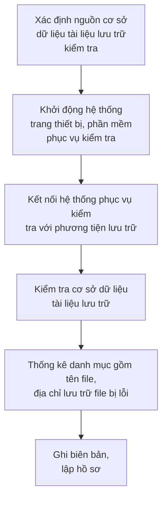
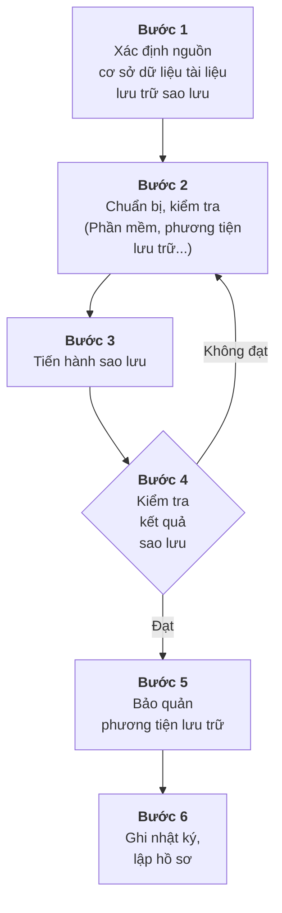

                   BQ NQI VU  CQNG HOA XA HQI CHU NGHIA VIET NAM
                                           Dc lap - Tyr do - Hanh phúc
  S6: 02 /2019/TT-BNV         Hà Ni, ngày4 tháng Mnm 2019
                                                         CONGTHNG TIN IN IV CHIH PHU
  VN PHONG CHINH PHU          THONG TU                   DEN GioC
  CÔNG VN DENQy djnh tièu chun du liu thong tin dàu vào   Ngay. 1512119
  Gid ....Ngy.O.   Yà yêu càu båo qun tài liu luru tr din tú
  Kinh chuyen: ..  ....
   Cn cú Luât Luu tr ngày 11 tháng 11 nm 2011;
   Cn cú Nghi dinh só 34/2017/ND-CP ngày 03 tháng 4 nm 2017 cüa Chinh
  phü quy dnh chúc nng, nhim vu, quyn han và co cáu t chúc cúa B Ni vu
  Cn cú Nghi dnh só 01/2013/ND-CP ngày 03 tháng 01 nm 2013 cüa Chinh
  ph quy dnh chi tiét thi hành mt só diè cüa Lut Luu trú;
  Cn cú Quyét dinh só 28/2018/QD-TTg ngày 12 tháng 7 nm 2018 cia Thi
  t Chih phv vi , nn vn bndi ia c  quan trong he
  thóng hành chinh nhà nuóc;
  Theo dè nghi cüa Cuc trung Cuc Vn thu và Luu tr nà nuóc;
  B trg B Ni vu ban hành Thong tu quy nh tiu chun d liu thng
  tin dàu vào và yêu càu båo qun tài liu luu tr din ti.
                              Churong I
                              QUY DINH CHUNG
  Dièu 1. Pham vi dièu chinh
     Thong tu ny quy dinh tiu chun d liu thong tin dàu vào và yéu u bo
                                                                 u
  llurhi tng qutr hoat  quan .
  Dièu 2. Di turong áp dyng
                     1. Tng tu  áp dg i  quan à nuó, doanh nghip nànuc
theo quy dinh cúa Lut Doanh nghip nm 2014 (sau dåy gi chung là c quan,
  tò chúrc).
  2.Khuyén khích các co quan, tò chúc khòng thuc Khoan 1 Dièu nà và cá
  nhân ap dung các quy dnh tai Thông tu nay
-----------Page 0 

2

### Điều 3. Giải thích từ ngữ
Trong Thông tư này, các từ ngữ dưới đây được hiểu như sau:

1. Cơ sở dữ liệu tài liệu lưu trữ là tập hợp các dữ liệu bao gồm tài liệu lưu trữ điện tử và dữ liệu đặc tả của tài liệu lưu trữ được sắp xếp thông qua phương tiện điện tử để truy cập, khai thác, quản lý và cập nhật.

2. Hệ thống quản lý tài liệu lưu trữ điện tử là hệ thống tin học hóa các quy trình nghiệp vụ về công tác lưu trữ, bao gồm công tác thu thập, bảo quản và sử dụng tài liệu lưu trữ.

3. Sự cố tin học là hiện tượng hệ thống tin học trong quá trình hoạt động xảy ra những trường hợp bất thường như: bị hỏng, hoạt động không bình thường; dữ liệu, phần mềm bị thay đổi, sửa, xóa, sao chép, truy cập trái phép bởi phần mềm bất hợp pháp; có chứa mã độc, có chứa phần mềm gián điệp,... hoặc người sử dụng thực hiện chưa đúng quy trình.

4. Phương tiện lưu trữ là thiết bị vật lý được sử dụng để lưu trữ cơ sở dữ liệu tài liệu lưu trữ, phần mềm (gồm ổ cứng, thẻ nhớ, băng từ, đĩa quang,...).

5. Sao lưu là việc tạo ra bản sao cơ sở dữ liệu tài liệu lưu trữ, phần mềm.

6. Chuyển đổi phương tiện lưu trữ là việc sao lưu cơ sở dữ liệu tài liệu lưu trữ, phần mềm từ phương tiện lưu trữ này sang phương tiện lưu trữ độc lập khác.

7. Phương thức sao lưu gia tăng là việc sao lưu tất cả các thông tin có sự thay đổi hoặc cập nhật so với lần sao lưu gần nhất trước đó.

8. Phương thức sao lưu đầy đủ là việc sao lưu tất cả các thông tin được chọn, không phụ thuộc vào thời điểm lưu trữ và các lần sao lưu trước đó.

9. Tài liệu lưu trữ số hóa là tài liệu điện tử được tạo lập từ việc số hóa đầy đủ, chính xác nội dung của tài liệu lưu trữ và được ký số bởi cơ quan, tổ chức quản lý tài liệu lưu trữ được số hóa.

## Chương II
## TIÊU CHUẨN DỮ LIỆU THÔNG TIN ĐẦU VÀO CỦA CƠ SỞ DỮ LIỆU TÀI LIỆU LƯU TRỮ

### Điều 4. Nguyên tắc thiết kế cấu trúc dữ liệu thông tin đầu vào
1. Bảo đảm thống nhất với tiêu chuẩn thông tin đầu vào của Hệ thống quản lý tài liệu điện tử của các cơ quan, tổ chức.
-----------Page 1 
3

2. Phù hợp với quy chuẩn kỹ thuật quốc gia về cấu trúc mã định danh và định dạng dữ liệu gói tin phục vụ kết nối các hệ thống quản lý văn bản và điều hành quy định tại Thông tư số 10/2016/TT-BTTTT ngày 01 tháng 4 năm 2016 và tiêu chuẩn kỹ thuật về ứng dụng công nghệ thông tin trong cơ quan nhà nước quy định tại Thông tư số 39/2017/TT-BTTTT ngày 15 tháng 12 năm 2017 của Bộ trưởng Bộ Thông tin và Truyền thông.

3. Bảo đảm việc trao đổi dữ liệu giữa Hệ thống quản lý tài liệu lưu trữ điện tử của Lưu trữ lịch sử với Hệ thống quản lý tài liệu điện tử của Lưu trữ cơ quan.

**Điều 5. Yêu cầu biên mục nội dung dữ liệu đặc tả của tài liệu lưu trữ**

1. Biên mục nội dung dữ liệu đặc tả phải bảo đảm cô đọng, rõ nghĩa đối với nội dung tài liệu cần mô tả.

2. Trong trường hợp thuộc tính nội dung có nhiều giá trị khác nhau, thì phân biệt các thuộc tính nội dung bằng dấu chấm phẩy (;).

3. Cơ quan, tổ chức có trách nhiệm cập nhật, bổ sung khi nội dung dữ liệu đặc tả của tài liệu lưu trữ có sự thay đổi.

**Điều 6. Tiêu chuẩn dữ liệu thông tin đầu vào của cơ sở dữ liệu tài liệu lưu trữ**

1. Tài liệu lưu trữ điện tử được số hóa từ tài liệu lưu trữ nền giấy
   a) Định dạng Portable Document Format (.pdf), phiên bản 1.4 trở lên;
   b) Ảnh màu;
   c) Độ phân giải tối thiểu: 200 dpi;
   d) Tỷ lệ số hóa: 100 %;
   đ) Hình thức chữ ký số của cơ quan, tổ chức quản lý tài liệu lưu trữ số hóa
   - Vị trí: Góc trên, bên phải, trang đầu tài liệu;
   - Hình ảnh: Dấu của cơ quan, tổ chức, màu đỏ, kích thước bằng kích thước thực tế của dấu, định dạng Portable Network Graphics (.png);
   - Thông tin: Tên cơ quan, tổ chức, thời gian ký (ngày, tháng, năm; giờ, phút, giây; múi giờ Việt Nam theo Tiêu chuẩn ISO 8601).
   e) Tên file: gồm mã hồ sơ và số thứ tự văn bản trong hồ sơ, cách nhau bởi dấu chấm.

2. Tài liệu ảnh
   a) Định dạng: JPEG;
   b) Độ phân giải tối thiểu: 200 dpi.
-----------Page 2 
4

3. Tài liệu phim ảnh
   a) Định dạng: MPEG-4, .avi, .wmv;
   b) Bit rate tối thiểu: 1500 kbps.
4. Tài liệu âm thanh
   a) Định dạng: MP3, .wma;
   b) Bit rate tối thiểu: 128 kbps.
5. Dữ liệu thông tin đầu vào của cơ sở dữ liệu tài liệu lưu trữ hình thành từ Hệ thống quản lý tài liệu điện tử của các cơ quan, tổ chức nộp lưu vào Lưu trữ lịch sử được đóng gói theo tiêu chuẩn kỹ thuật về ứng dụng công nghệ thông tin trong cơ quan nhà nước quy định tại Thông tư số 39/2017/TT-BTTTT ngày 15 tháng 12 năm 2017 của Bộ trưởng Bộ Thông tin và Truyền thông.
6. Dữ liệu đặc tả của tài liệu lưu trữ quy định tại Phụ lục I Thông tư này.
7. Biên mục, cập nhật nội dung dữ liệu đặc tả của tài liệu lưu trữ quy định tại Phụ lục II Thông tư này.

## Chương III
## BẢO QUẢN CƠ SỞ DỮ LIỆU TÀI LIỆU LƯU TRỮ

### Điều 7. Nguyên tắc
1. Bảo đảm cơ sở dữ liệu tài liệu lưu trữ được bảo quản an toàn, xác thực, bảo mật trên các phương tiện lưu trữ.
2. Bảo đảm khả năng truy cập, quản lý, tìm kiếm, cập nhật cơ sở dữ liệu tài liệu lưu trữ.

### Điều 8. Yêu cầu
1. Không lưu cơ sở dữ liệu tài liệu lưu trữ có chứa thông tin thuộc phạm vi bí mật nhà nước trên các thiết bị kết nối với mạng Internet, mạng máy tính, mạng viễn thông.
2. Không chuyển mục đích sử dụng các thiết bị đã lưu cơ sở dữ liệu tài liệu lưu trữ có chứa thông tin thuộc phạm vi bí mật nhà nước khi chưa loại bỏ triệt để cơ sở dữ liệu tài liệu lưu trữ.
3. Cơ sở dữ liệu tài liệu lưu trữ phải được sao lưu ít nhất 02 bộ, mỗi bộ trên 01 phương tiện lưu trữ độc lập. Việc sao lưu phải bảo đảm đầy đủ, chính xác, kịp thời, an toàn.
4. Bảo đảm thống nhất quy trình kiểm tra, sao lưu, phục hồi dữ liệu.
-----------Page 3 
5
5. Người được giao quản lý cơ sở dữ liệu tài liệu lưu trữ của cơ quan, tổ chức có trách nhiệm kiểm tra, bảo quản, sao lưu, phục hồi.

## **Điều 9. Kiểm tra cơ sở dữ liệu tài liệu lưu trữ**
1. Thời gian kiểm tra: Định kỳ hàng năm.
2. Quy trình kiểm tra quy định tại Phụ lục III Thông tư này.
3. Biên bản kiểm tra quy định tại Phụ lục IV Thông tư này.

## **Điều 10. Sao lưu phần mềm và cơ sở dữ liệu tài liệu lưu trữ**
1. Thời gian và phương thức sao lưu
   a) Cơ sở dữ liệu tài liệu lưu trữ phải sao lưu hàng ngày theo phương thức sao lưu gia tăng, ngày đầu tiên hàng tháng phải sao lưu theo phương thức sao lưu đầy đủ.
   b) Chuyển đổi phương tiện lưu trữ
   
   Cơ sở dữ liệu tài liệu lưu trữ, phần mềm phải chuyển đổi phương tiện lưu trữ 03 năm/01 lần theo phương thức sao lưu đầy đủ; Dữ liệu đặc tả của tài liệu lưu trữ được sao lưu và lưu trữ bằng định dạng file XML (eXtensible Markup Language).
2. Quy trình sao lưu quy định tại Phụ lục V Thông tư này.
3. Nhật ký sao lưu quy định tại Phụ lục VI Thông tư này.
4. Biên bản sao lưu quy định tại Phụ lục VII Thông tư này.

## **Điều 11. Phục hồi cơ sở dữ liệu tài liệu lưu trữ**
1. Quy trình và nội dung phục hồi cơ sở dữ liệu tài liệu lưu trữ quy định tại Phụ lục VIII Thông tư này.
2. Biên bản phục hồi cơ sở dữ liệu tài liệu lưu trữ quy định tại Phụ lục IX Thông tư này.

## **Điều 12. Bảo đảm an toàn cơ sở dữ liệu tài liệu lưu trữ**
1. Cơ sở dữ liệu tài liệu lưu trữ được bảo đảm an toàn thông tin theo cấp độ được quy định tại Nghị định số 85/2016/NĐ-CP ngày 01 tháng 7 năm 2016 của Chính phủ và Thông tư số 03/2017/TT-BTTTT ngày 24 tháng 4 năm 2017 của Bộ trưởng Bộ Thông tin và Truyền thông.
2. Việc tiêu huỷ thiết bị, phương tiện lưu trữ cơ sở dữ liệu tài liệu lưu trữ bảo đảm yêu cầu bảo mật thông tin theo cấp độ được quy định.
3. Không được mang thiết bị, phương tiện lưu trữ cơ sở dữ liệu tài liệu lưu trữ ra khỏi Lưu trữ cơ quan, Lưu trữ lịch sử khi chưa được sự đồng ý của người có thẩm quyền.
-----------Page 4 
6

# Chương IV
## ĐIỀU KHOẢN THI HÀNH

### Điều 13. Hiệu lực thi hành
Thông tư này có hiệu lực thi hành kể từ ngày 10 tháng 3 năm 2019.

### Điều 14. Tổ chức thực hiện
1. Bộ trưởng, Thủ trưởng cơ quan ngang Bộ, Thủ trưởng cơ quan thuộc Chính phủ, Chủ tịch Ủy ban nhân dân tỉnh, thành phố trực thuộc Trung ương và các cơ quan, tổ chức có liên quan chịu trách nhiệm thực hiện Thông tư này.
2. Trong quá trình triển khai thực hiện, nếu có vướng mắc đề nghị các cơ quan, tổ chức, cá nhân phản ánh về Bộ Nội vụ để nghiên cứu, sửa đổi, bổ sung cho phù hợp./.

| ***Nơi nhận:***<br/>- Ban Bí thư trung ương Đảng;<br/>- Văn phòng Quốc hội;<br/>- Văn phòng Chủ tịch nước;<br/>- Các Bộ, cơ quan ngang Bộ, cơ quan thuộc CP;<br/>- Viện Kiểm sát nhân dân tối cao;<br/>- Tòa án nhân dân tối cao;<br/>- Kiểm toán Nhà nước;<br/>- Các Tập đoàn kinh tế, Tổng công ty nhà nước;<br/>- Cơ quan TW của các đoàn thể;<br/>- HĐND, UBND các tỉnh, thành phố trực thuộc TW;<br/>- Sở Nội vụ các tỉnh, thành phố trực thuộc TW;<br/>- Bộ Nội vụ: Bộ trưởng, các Thứ trưởng;<br/>- Cục Văn thư và Lưu trữ nhà nước (20b);<br/>- Cục Kiểm tra văn bản QPPL (Bộ Tư pháp);<br/>- Công báo;<br/>- Cổng Thông tin điện tử Bộ Nội vụ;<br/>- Cổng Thông tin điện tử Cục Văn thư và Lưu trữ nhà nước;<br/>- Lưu: VT, PC. | **KT. BỘ TRƯỞNG**<br/>**THỨ TRƯỞNG**<br/><br/><br/><br/><br/>**Nguyễn Duy Thăng** |
| ---------------------------------------------------------------------------------------------------------------------------------------------------------------------------------------------------------------------------------------------------------------------------------------------------------------------------------------------------------------------------------------------------------------------------------------------------------------------------------------------------------------------------------------------------------------------------------------------------------------------------------------------------------------------------------------------------------------------------------------- | --------------------------------------------------------------------------------- |


-----------Page 5 
<center>
**Phụ lục I**

**DỮ LIỆU ĐẶC TẢ CỦA TÀI LIỆU LƯU TRỮ**

*(Kèm theo Thông tư số 02/2019/TT-BNV ngày 24 tháng 01 năm 2019 của Bộ trưởng Bộ Nội vụ)*
</center>

**1. Dữ liệu đặc tả của phông/công trình/sưu tập lưu trữ**

| STT | Trường thông tin                                | Tên(viết tắt tiếng Anh) | Kiểu dữ liệu | Độ dài |
| --- | ----------------------------------------------- | ----------------------- | ------------ | ------ |
| 1   | Mã cơ quan lưu trữ                              | Identifier              | String       | 13     |
| 2   | Mã phông/công trình/sưu tập lưu trữ             | OrganId                 | String       | 13     |
| 3   | Tên phông/công trình/sưu tập lưu trữ            | FondName                | String       | 200    |
| 4   | Lịch sử đơn vị hình thành phông                 | FondHistory             | LongText     |        |
| 5   | Thời gian tài liệu                              | ArchivesTime            | String       | 30     |
| 6   | Tổng số tài liệu giấy                           | PaperTotal              | Number       | 10     |
| 7   | Số lượng tài liệu giấy đã số hóa                | PaperDigital            | Number       | 10     |
| 8   | Các nhóm tài liệu chủ yếu                       | KeyGroups               | String       | 300    |
| 9   | Các loại hình tài liệu khác                     | OtherTypes              | String       | 300    |
| 10  | Ngôn ngữ                                        | Language                | String       | 100    |
| 11  | Công cụ tra cứu                                 | LookupTools             | String       | 50     |
| 12  | Số lượng trang tài liệu đã lập bản sao bảo hiểm | CopyNumber              | Number       | 10     |
| 13  | Ghi chú                                         | Description             | String       | 1000   |


**2. Dữ liệu đặc tả của hồ sơ lưu trữ**

| STT | Trường thông tin                     | Tên(viết tắt tiếng Anh) | Kiểu dữ liệu | Độ dài |
| --- | ------------------------------------ | ----------------------- | ------------ | ------ |
| 1   | Mã hồ sơ                             | FileCode                |              |        |
| 1.1 | Mã cơ quan lưu trữ lịch sử           | Identifier              | String       | 13     |
| 1.2 | Mã phông/công trình/sưu tập lưu trữ  | OrganId                 | String       | 13     |
| 1.3 | Mục lục số hoặc năm hình thành hồ sơ | FileCatalog             | Number       | 10     |
| 1.4 | Số và ký hiệu hồ sơ                  | FileNotation            | String       | 20     |
| 2   | Tiêu đề hồ sơ                        | Title                   | String       | 1000   |


-----------Page 6 

2

| 3  | Thời hạn bảo quản           | Maintenance | String | 100        |
| -- | --------------------------- | ----------- | ------ | ---------- |
| 4  | Chế độ sử dụng              | Rights      | String | 30         |
| 5  | Ngôn ngữ                    | Language    | String | 100        |
| 6  | Thời gian bắt đầu           | StartDate   | Date   | DD/MM/YYYY |
| 7  | Thời gian kết thúc          | EndDate     | Date   | DD/MM/YYYY |
| 8  | Tổng số văn bản trong hồ sơ | TotalDoc    | Number | 10         |
| 9  | Chú giải                    | Description | String | 2000       |
| 10 | Ký hiệu thông tin           | InforSign   | String | 30         |
| 11 | Từ khóa                     | Keyword     | String | 100        |
| 12 | Số lượng tờ                 | Maintenance | Number | 10         |
| 13 | Số lượng trang              | PageNumber  | Number | 10         |
| 14 | Tình trạng vật lý           | Format      | String | 50         |


### 3. Dữ liệu đặc tả của văn bản

| STT | Trường thông tin                      | Tên(viết tắt tiếng Anh) | Kiểu dữ liệu | Độ dài     |    |
| --- | ------------------------------------- | ----------------------- | ------------ | ---------- | -- |
| 1   | Mã định danh văn bản                  | DocCode                 | String       | 25         |    |
| 2   | Mã hồ sơ                              | FileCode                | String       |            |    |
| 2.1 | Mã cơ quan lưu trữ lịch sử            | Identifier              |              | 13         |    |
| 2.2 | Mã phông/công trình/sưu tập lưu trữ   | OrganId                 |              | 13         |    |
| 2.3 | Mục lục số hoặc năm hình thành hồ sơ  | FileCatalog             |              | Number     | 4  |
| 2.4 | Số và ký hiệu hồ sơ                   | FileNotation            |              | String     | 20 |
| 3   | Số thứ tự văn bản trong hồ sơ         | DocOrdinal              | Number       | 4          |    |
| 4   | Tên loại văn bản                      | TypeName                | String       | 100        |    |
| 5   | Số của văn bản                        | CodeNumber              | String       | 11         |    |
| 6   | Ký hiệu của văn bản                   | CodeNotation            | String       | 30         |    |
| 7   | Ngày, tháng, năm văn bản              | IssuedDate              | Date         | DD/MM/YYYY |    |
| 8   | Tên cơ quan, tổ chức ban hành văn bản | OrganName               | String       | 200        |    |
| 9   | Trích yếu nội dung                    | Subject                 | String       | 500        |    |
| 10  | Ngôn ngữ                              | Language                | String       | 100        |    |
| 11  | Số lượng trang của văn bản            | PageAmount              | Number       | 4          |    |
| 12  | Ghi chú                               | Description             | String       | 500        |    |
| 13  | Ký hiệu thông tin                     | InforSign               | String       | 30         |    |
| 14  | Từ khóa                               | Keyword                 | String       | 100        |    |


-----------Page 7 

3

| 15 | Chế độ sử dụng    | Mode            | String | 20   |
| -- | ----------------- | --------------- | ------ | ---- |
| 16 | Mức độ tin cậy    | ConfidenceLevel | String | 30   |
| 17 | Bút tích          | Autograph       | String | 2000 |
| 18 | Tình trạng vật lý | Format          | String | 50   |


#### 4. Dữ liệu đặc tả của tài liệu phim (âm bản)/ảnh

| STT | Trường thông tin   | Tên(viết tắt tiếng Anh) | Kiểu dữliệu | Độ dài     |
| --- | ------------------ | ----------------------- | ----------- | ---------- |
| 1   | Mã cơ quan lưu trữ | Identifier              | String      | 13         |
| 2   | Số lưu trữ         | ArchivesNumber          | String      | 50         |
| 3   | Ký hiệu thông tin  | InforSign               | String      | 30         |
| 4   | Tên sự kiện        | EventName               | String      | 500        |
| 5   | Tiêu đề phim/ảnh   | ImageTitle              | String      | 500        |
| 6   | Ghi chú            | Description             | String      | 500        |
| 7   | Tác giả            | Photographer            | String      | 300        |
| 8   | Địa điểm chụp      | PhotoPlace              | String      | 300        |
| 9   | Thời gian chụp     | PhotoTime               | Date        | DD/MM/YYYY |
| 10  | Màu sắc            | Colour                  | String      | 50         |
| 11  | Cỡ phim/ảnh        | FilmSize                | String      | 5          |
| 12  | Tài liệu đi kèm    | DocAttached             | String      | 300        |
| 13  | Chế độ sử dụng     | Mode                    | String      | 20         |
| 14  | Tình trạng vật lý  | Format                  | String      | 50         |


#### 5. Dữ liệu đặc tả của tài liệu phim, âm thanh (ghi hình, ghi âm)

| STT | Trường thông tin      | Tên(viết tắt tiếng Anh) | Kiểu dữliệu | Độ dài     |
| --- | --------------------- | ----------------------- | ----------- | ---------- |
| 1   | Mã cơ quan lưu trữ    | Identifier              | String      | 13         |
| 2   | Số lưu trữ            | ArchivesNumber          | String      | 50         |
| 3   | Ký hiệu thông tin     | InforSign               | String      | 30         |
| 4   | Tên sự kiện           | EventName               | String      | 500        |
| 5   | Tiêu đề phim/âm thanh | MovieTitle              | String      | 500        |
| 6   | Ghi chú               | Description             | String      | 500        |
| 7   | Tác giả               | Recorder                | String      | 300        |
| 8   | Địa điểm              | RecordPlace             | String      | 300        |
| 9   | Thời gian             | RecordDate              | Date        | DD/MM/YYYY |
| 10  | Ngôn ngữ              | Language                | String      | 100        |
| 11  | Thời lượng            | PlayTime                | String      | 8          |
| 12  | Tài liệu đi kèm       | DocAttached             | String      | 300        |
| 13  | Chế độ sử dụng        | Mode                    | String      | 20         |
| 14  | Chất lượng            | Quality                 | String      | 50         |
| 15  | Tình trạng vật lý     | Format                  | String      | 50         |


-----------Page 8 
## Phụ lục II
# HƯỚNG DẪN BIÊN MỤC NỘI DUNG DỮ LIỆU ĐẶC TẢ CỦA TÀI LIỆU LƯU TRỮ
*(Kèm theo Thông tư số 02/2019/TT-BNV ngày 24 tháng 01 năm 2019 của Bộ trưởng Bộ Nội vụ)*

----

# I. HƯỚNG DẪN CHUNG
1. Đối với các thông tin ở dạng số thì sử dụng các chữ số Ả Rập.
2. Đối với thông tin là thời gian thì ngày, tháng dùng 2 chữ số, năm dùng 4 chữ số; ngày, tháng, năm cách nhau bởi dấu “/” (ví dụ: 03/01/2008).
3. Mã định danh của cơ quan, tổ chức quy định tại Thông tư số 10/2016/TT-BTTTT ngày 01 tháng 4 năm 2016 của Bộ trưởng Bộ Thông tin và Truyền thông ban hành quy chuẩn kỹ thuật quốc gia về cấu trúc mã định danh và định dạng dữ liệu gói tin phục vụ kết nối các hệ thống quản lý văn bản và điều hành.
4. Mã định danh văn bản quy định tại Quyết định số 28/2018/QĐ-TTg ngày 12 tháng 7 năm 2018 của Thủ tướng Chính phủ về việc gửi, nhận văn bản điện tử giữa các cơ quan trong hệ thống hành chính nhà nước.

# II. PHÔNG/CÔNG TRÌNH/SƯU TẬP LƯU TRỮ
1. Mã cơ quan lưu trữ: Là mã định danh của cơ quan Lưu trữ lịch sử. Mã định danh của cơ quan, tổ chức được mặc định trong Hệ thống.
2. Mã phông/công trình/sưu tập lưu trữ: Đối với phông đóng, ghi theo số trong Danh sách phông do Lưu trữ lịch sử xác định. Đối với phông mở, ghi mã định danh của cơ quan, tổ chức hình thành phông (mã định danh của cơ quan, tổ chức lập danh mục hồ sơ); mã công trình, sưu tập lưu trữ do cơ quan, tổ chức xác định.
3. Tên phông/công trình/sưu tập lưu trữ: Ghi đầy đủ và chính xác tên gọi của phông/công trình/sưu tập lưu trữ.
4. Lịch sử đơn vị hình thành phông: Mô tả tóm tắt quá trình hình thành và hoạt động của đơn vị hình thành phông.
5. Thời gian tài liệu: Ghi năm văn bản có sớm nhất và muộn nhất trong phông, năm đầu và năm cuối cách nhau bởi dấu “-”.
Ví dụ: 1946-1975.
6. Tổng số tài liệu giấy: Ghi tổng số mét giá tài liệu giấy của phông.
7. Số lượng tài liệu giấy đã số hóa: Ghi số lượng trang tài liệu giấy đã số hóa của phông.
8. Các nhóm tài liệu chủ yếu: Ghi tên nhóm tài liệu và thời gian của từng nhóm tài liệu trong phông theo phương án phân loại tài liệu của phông.
Ví dụ: Phông Bộ Y tế giai đoạn 1945-1995, gồm các nhóm tài liệu như sau:
-----------Page 9 
2

a) Tài liệu tổng hợp (1948-1995)
b) Tài liệu về tổ chức cán bộ - lao động tiền lương (1945-1995)
c) Tài liệu về huấn luyện - đào tạo (1946-1994)
d) Tài liệu về khoa học công nghệ (1955-1994)
đ) Tài liệu về hợp tác quốc tế (1952-1995)
e) Tài liệu về công tác tài vụ (1947-1995)
g) Tài liệu về trang thiết bị và xây dựng cơ bản (1954-1990)
h) Tài liệu về phòng chống dịch bệnh và điều trị (1947-1995)
i) Tài liệu về công tác y học dân tộc (1949-1995)
k) Tài liệu về công tác dược chính (1949-1994)

9. Các loại hình tài liệu khác: Trường hợp trong phông có các loại hình tài liệu khác như phim, ảnh, ghi âm, ghi hình, tài liệu điện tử, thì ghi rõ và kèm theo số lượng. Đơn vị tính số lượng theo quy định chế độ báo cáo thống kê ngành Nội vụ tại Thông tư số 03/2018/TT-BNV ngày 06 tháng 3 năm 2018 của Bộ trưởng Bộ Nội vụ.

10. Ngôn ngữ: Nếu trong toàn phông chỉ có tiếng Việt thì để trống, nếu đồng thời có cả tiếng Việt và ngôn ngữ khác thì ghi tất cả ngôn ngữ, giữa các ngôn ngữ cách nhau bởi dấu phẩy và xếp theo thứ tự ABC.

Ví dụ: Anh, Nga, Pháp, Việt.

11. Công cụ tra cứu: Ghi công cụ tra cứu hiện có của phông (sách chỉ dẫn, mục lục, bộ thẻ, cơ sở dữ liệu).

12. Ghi số lượng trang tài liệu đã lập bản sao bảo hiểm.

13. Ghi chú: Ghi những thông tin cần thiết khác của phông mà chưa thể hiện được trong các phần trên.

### III. HỒ SƠ LƯU TRỮ

1. Mã hồ sơ

a) Đối với Lưu trữ cơ quan

Mã hồ sơ bao gồm: Mã định danh của cơ quan, tổ chức hình thành phông, Năm hình thành hồ sơ, Số và ký hiệu hồ sơ.

Năm hình thành hồ sơ, số và ký hiệu hồ sơ được xác định theo Danh mục hồ sơ. Các thành phần của mã hồ sơ được phân định bằng dấu chấm.

Ví dụ: 000.00.00.G09.2010.01.TH là Mã của hồ sơ số 01 nhóm Tổng hợp, năm 2010, Bộ Nội vụ.

Trong đó: 000.00.00.G09 là mã định danh của Bộ Nội vụ, 2010 là năm hình thành hồ sơ, 01.TH là số và ký hiệu hồ sơ.
-----------Page 10 
3

b) Đối với Lưu trữ lịch sử
- Trường hợp phông đóng: Mã hồ sơ bao gồm: Mã định danh của cơ quan lưu trữ, Mã phông/công trình/sưu tập lưu trữ, Mục lục số, Hồ sơ số. Các thành phần của mã hồ sơ được phân định bằng dấu chấm.

Ví dụ: 000.04.16.G09.003.01.30 là Mã của hồ sơ số 30 thuộc mục lục số 1 phông số 3 hiện đang bảo quản tại Trung tâm Lưu trữ quốc gia III.

Trong đó: 000.04.16.G09 là mã định danh của Trung tâm Lưu trữ quốc gia III, 003 là mã phông, 01 là mục lục số, 30 là hồ sơ số.

- Trường hợp phông mở: Mã hồ sơ mô tả như đối với Lưu trữ cơ quan.

2. Tiêu đề hồ sơ: Ghi đầy đủ tiêu đề hồ sơ.

3. Thời hạn bảo quản: Ghi thời hạn bảo quản đã được xác định đối với hồ sơ: “vĩnh viễn” hoặc thời hạn được tính bằng năm cụ thể.

4. Chế độ sử dụng: Ghi “hạn chế” nếu tài liệu thuộc hồ sơ được xác định thuộc danh mục hạn chế sử dụng. Nếu không thuộc diện đó thì để trống.

5. Ngôn ngữ: Mô tả như Mục 10 Phần II.

6. Thời gian bắt đầu: Ghi thời gian sớm nhất của tài liệu có trong hồ sơ.

7. Thời gian kết thúc: Ghi thời gian muộn nhất của tài liệu có trong hồ sơ.

Ví dụ: Trong hồ sơ phê duyệt Dự án “Trung tâm Thông tin Nông nghiệp” của Bộ Nông nghiệp do FAO tài trợ năm 1985 có tài liệu sớm nhất là ngày 10/04/1985 và muộn nhất là 22/05/1985 thì ghi: Thời gian bắt đầu: 10/04/1985; Thời gian kết thúc: 22/05/1985.

8. Tổng số văn bản trong hồ sơ: Ghi tổng số văn bản trong hồ sơ.

9. Chú giải: Nhằm mục đích làm sáng tỏ thêm nội dung văn bản, tên loại văn bản, độ gốc của văn bản, vật mang tin và thời gian, địa điểm diễn ra sự kiện mà tiêu đề hồ sơ chưa phản ánh. Tuỳ theo thực tế của từng hồ sơ mà có chú giải cho phù hợp.

a) Chú giải về nội dung vấn đề
- Không chú giải đối với các hồ sơ có tiêu đề là: chương trình, kế hoạch, báo cáo công tác định kỳ.
- Chỉ chú giải hồ sơ việc mà tiêu đề hồ sơ phản ánh còn chung chung hoặc quá khái quát để sáng tỏ nội dung vấn đề mà tài liệu có trong hồ sơ phản ánh.

Ví dụ 1: “Hồ sơ đoàn ra, đoàn vào năm 1975 của Bộ Văn hoá”.

Trong trường hợp này cần chú giải đến tên nước theo thứ tự thời gian của đoàn ra, đoàn vào trong hồ sơ như sau:
- Đoàn ra: Pháp, Ba Lan, Mông Cổ, Nhật, Mỹ.
- Đoàn vào: Pháp, Anh, Bỉ.
-----------Page 11 
4

Ví dụ 2: “Công văn của Hội đồng Bộ trưởng cho phép một số địa phương làm dịch vụ kiều hối và giao Tổng cục Hải quan có trách nhiệm chính trong việc kiểm tra, kiểm soát hàng của Việt kiều gửi về năm 1985”.

Trong trường hợp này chú giải là: Cho phép Hà Nội và TP. Hồ Chí Minh dùng kiều hối mua thuốc chữa bệnh, mua tư liệu sản xuất và trả bằng tiền Đồng Việt Nam cho gia đình ở trong nước.

Ví dụ 3: “Báo cáo của UBND tỉnh Nghệ Tĩnh về tình hình trật tự trị an ở 2 xóm Tân Yên và Hội Phước, xã Tường Sơn, huyện Anh Sơn năm 1978”.

Trong trường hợp này chú giải là: Sự việc diễn ra ở khu vực đồng bào theo đạo Thiên chúa.

b) Chú giải về độ gốc, tên loại và tác giả của văn bản
- Về độ gốc của văn bản: Độ gốc ở đây được hiểu là tài liệu trong hồ sơ là bản gốc, bản chính, bản thảo hay bản sao của văn bản. Chỉ chú giải đối với các loại văn bản như văn bản quy phạm pháp luật và các văn bản quan trọng khác có trong hồ sơ không phải là bản gốc, bản chính.
- Về tên loại văn bản: Nếu trong hồ sơ có nhiều loại văn bản mà tiêu đề chưa phản ánh hết thì cần chú giải, nhưng không liệt kê toàn bộ mà chỉ chú giải những loại văn bản có nội dung quan trọng hoặc cần đặc biệt lưu ý.
- Về tác giả văn bản: Chỉ chú giải về tác giả của những văn bản quan trọng hoặc có giá trị đặc biệt, tức là các cá nhân hoặc cơ quan, tổ chức làm ra văn bản.

Các chú giải về độ gốc, tên loại và tác giả văn bản được viết liền nhau.

Ví dụ: “Hồ sơ về đàm phán cho vay dài hạn, trao đổi hàng hoá và thanh toán từ năm 1976 đến 1981 giữa Việt Nam và CHDC Đức”.

Chú giải: Bản sao Thư của Thủ tướng Phạm Văn Đồng.

c) Chú giải về tên người
- Nếu trong hồ sơ đề cập đến cá nhân quan trọng hoặc đặc biệt cần lưu ý thì phải chú giải.

Ví dụ: “Công văn của Bộ Nội vụ (nay là Bộ Công an) về việc mang tài liệu khoa học ra nước ngoài năm 1976-1978”.

Trong trường hợp này chú giải là: Đề xuất cho Ông Nguyễn Ngọc Châu mang tài liệu sang Liên Xô để làm Luận án Phó Tiến sỹ.

- Nếu cá nhân mang nhiều bí danh, bút danh,... cần phải thống nhất lấy một tên gọi chung cho các bí danh, bút danh của người đó. Tên gọi chung được chú giải sau tên bí danh và đặt trong ngoặc đơn.

Ví dụ: Anh Ba (Hồ Chí Minh); Trần Lực (Hồ Chí Minh); Chiến sỹ (Hồ Chí Minh).
-----------Page 12 
5
- Nếu cá nhân giữ chức vụ lãnh đạo, có học vị, học hàm, danh hiệu được Nhà nước phong thì chức vụ, học vị, học hàm, danh hiệu được ghi trước họ và tên cá nhân.

Ví dụ: Chủ tịch Hồ Chí Minh, Phó Thủ tướng Lê Thanh Nghị, Giáo sư Tôn Thất Tùng...

d) Chú giải về thời gian sự kiện

Thời gian sự kiện là thời gian sự kiện diễn ra. Chú giải đầy đủ ngày, tháng năm. Trường hợp hồ sơ kéo dài nhiều ngày hoặc nhiều tháng, năm thì giữa ngày, tháng, năm đầu và ngày, tháng, năm cuối cách nhau dấu gạch ngang (-). Ví dụ: 01/02/1970-12/01/1971.

đ) Chú giải về địa điểm sự kiện

- Địa điểm sự kiện là nơi sự kiện diễn ra, chú giải theo thứ tự: xã (phường)- huyện (quận) - tỉnh (Thành phố).

- Nếu địa danh nơi sự kiện diễn ra ngày nay đã mang tên địa danh mới thì tên địa danh mới cần được chú giải sau tên địa danh cũ và đặt trong ngoặc đơn. Ví dụ: Thăng Long ngày xưa nay đổi là Hà Nội thì ở phần chú giải ghi: Thăng Long (Hà Nội).

e) Chú giải về vật mang tin

Trừ tài liệu có vật mang tin là giấy, còn tất cả những tài liệu ghi trên vật mang tin khác có trong hồ sơ đều cần chú giải.

Ví dụ: Trong hồ sơ có ảnh thì ở phần chú giải ghi là: có ảnh chụp ai hoặc sự kiện gì đang diễn ra ở đâu, khi nào và ảnh đó đang bảo quản ở đâu?

10. Ký hiệu thông tin (nếu có).

11. Từ khóa: Ghi các từ mang trọng tâm thông tin.

12. Số lượng tờ: Ghi tổng số tờ tài liệu có trong hồ sơ.

13. Số lượng trang: Ghi tổng số trang tài liệu có trong hồ sơ.

14. Tình trạng vật lý: Chỉ ghi tình trạng vật lý của tài liệu bị hư hỏng, tài liệu bình thường thì để trống.

## IV. VĂN BẢN

1. Mã định danh văn bản: Lưu trong Hệ thống khi văn bản được tạo lập.

2. Mã hồ sơ: Mô tả như Mục 1 Phần III.

3. Số thứ tự văn bản trong hồ sơ: do Hệ thống tự cập nhật.

4. Tên loại văn bản: Ghi đúng tên loại của văn bản.

5. Số của văn bản: Ghi số của văn bản (nếu có).

6. Ký hiệu của văn bản: Ghi ký hiệu của văn bản (nếu có).

7. Ngày, tháng, năm văn bản: Ghi thời gian của văn bản, tài liệu.
-----------Page 13 

6

8. Tên cơ quan, tổ chức ban hành văn bản:
- Ghi tên cơ quan, tổ chức ban hành văn bản theo đúng tên được thể hiện trong văn bản. Nếu là văn bản liên tịch do nhiều cơ quan ban hành thì ghi tất cả các cơ quan ban hành, tên của mỗi cơ quan cách nhau bởi dấu chấm phẩy (;).
- Đối với tài liệu mà tác giả là cá nhân thì ghi họ tên và chức vụ (nếu có) của cá nhân đó theo đúng họ tên và chức vụ được thể hiện trong văn bản, tài liệu.

9. Trích yếu nội dung: Ghi đúng trích yếu nội dung của văn bản, tài liệu. Đối với văn bản, tài liệu không có trích yếu nội dung thì người biên mục phải đọc và tóm tắt nội dung của văn bản, tài liệu đó.

10. Ngôn ngữ: Mô tả như Mục 10 Phần II.

11. Số lượng trang của văn bản: Ghi số lượng trang của văn bản, tài liệu.

12. Ghi chú: Ghi những thông tin cần thiết khác về tài liệu (nếu có).

13. Ký hiệu thông tin (nếu có).

14. Từ khóa: Ghi các từ mang trọng tâm thông tin.

15. Chế độ sử dụng: Ghi là “Hạn chế” hoặc “Không hạn chế”

16. Mức độ tin cậy: Ghi “Bản chính” nếu văn bản, tài liệu là bản chính hoặc “Bản sao” nếu văn bản, tài liệu là bản sao.

17. Bút tích: Bút tích là chữ ký phê duyệt, ghi góp ý, sửa chữa… trên văn bản. Chỉ ghi bút tích của những cá nhân giữ chức vụ: Chủ tịch nước, Chủ tịch Quốc hội, Tổng Bí thư Đảng Cộng sản Việt Nam, Thủ tướng, Tổng thống và những chức vụ tương đương. Những cá nhân này trước đó thường giữ nhiều chức vụ khác, do vậy không ghi chức vụ, chỉ ghi họ tên cá nhân. Ví dụ: Đỗ Mười, Tôn Đức Thắng, Võ Văn Kiệt, trường hợp trên tài liệu ghi bí danh thì sau bí danh ghi họ và tên cá nhân và đặt trong ngoặc đơn.

Ví dụ: Tô (Phạm Văn Đồng); Thận (Trường Chinh)...

18. Tình trạng vật lý: Mô tả như Mục 14 Phần III.

## V. TÀI LIỆU PHIM/ẢNH (ÂM BẢN/ẢNH)

1. Mã cơ quan lưu trữ: mô tả như Mục 1 Phần II.

2. Số lưu trữ:
a) Đối với tài liệu định dạng số: Ghi số, ký hiệu thiết bị lưu trữ tài liệu phim/ảnh; tên file tài liệu phim/ảnh;
b) Đối với tài liệu định dạng khác: Ghi số thứ tự của phim/ảnh trong kho lưu trữ.

3. Ký hiệu thông tin (nếu có).

4. Tên sự kiện: Ghi tên sự kiện chẳng hạn như tên đại hội, hội nghị, chuyến thăm.
-----------Page 14 
7

> Ví dụ: Chủ tịch nước Trần Đức Lương thăm huyện Bắc Sơn tỉnh Lạng Sơn ngày 27 tháng 9 năm 2003.

5. Tiêu đề phim/ảnh: Ghi tên phim/ảnh. Nếu phim/ảnh có nhiều nhân vật thì ghi theo trật tự: thứ tự hàng thứ nhất, thứ hai (nếu có), chức vụ và họ, tên người trong phim/ảnh theo thứ tự từ trái sang phải.

> Ví dụ: Chủ tịch nước Trần Đức Lương thăm hỏi các đồng chí lão thành cách mạng và cựu chiến binh huyện Bắc Sơn.
>
> Từ trái sang phải: Chủ tịch UBND tỉnh Lạng Sơn Đoàn Bá Nhiên (người thứ hai); Chủ tịch nước Trần Đức Lương (người thứ ba).

6. Ghi chú: Chú giải thêm những thông tin mà tiêu đề chưa phản ánh hết như các dữ kiện về sự kiện trong phim/ảnh, xuất xứ phim/ảnh, phim/ảnh được giải thưởng trong và ngoài nước.

7. Tác giả: Ghi họ và tên tác giả chụp ảnh.

8. Địa điểm chụp: Ghi nơi xảy ra sự kiện mà ảnh được chụp theo trình tự: xã (phường/thị trấn), huyện (quận, thị xã, thành phố thuộc tỉnh), tỉnh (thành phố trực thuộc trung ương).

9. Thời gian chụp: Ghi ngày, tháng, năm mà ảnh đó được chụp.

10. Màu sắc: Ghi rõ đó là “Màu” hoặc “Đen trắng”.

11. Cỡ phim/ảnh: Ghi cỡ phim/ảnh.

12. Tài liệu đi kèm: Ghi tài liệu đi kèm nếu có.

13. Chế độ sử dụng: Ghi là “Hạn chế” hoặc “Không hạn chế”

14. Tình trạng vật lý: Ghi tình trạng vật lý của phim/ảnh như: bình thường; rách; mờ; nấm mốc; ố, vàng (đối với tài liệu không ở định dạng số).

## VI. TÀI LIỆU PHIM, ÂM THANH (GHI HÌNH, GHI ÂM)

1. Mã cơ quan lưu trữ: mô tả như Mục 1 Phần II.

2. Số lưu trữ:

a) Đối với tài liệu định dạng số: Ghi số, ký hiệu thiết bị lưu trữ tài liệu phim, âm thanh; tên file tài liệu phim, âm thanh;

b) Đối với tài liệu định dạng khác: Ghi số ký hiệu của băng gốc; số ký hiệu của băng sao.

3. Ký hiệu thông tin (nếu có).

4. Tên sự kiện: Ghi đầy đủ tên sự kiện, địa điểm và thời gian xảy ra sự kiện.

> Ví dụ: Đại hội Đại biểu toàn quốc lần thứ IV của Đảng Lao động Việt Nam tổ chức tại Hà Nội từ ngày 14 tháng 12 năm 1976 đến ngày 20 tháng 12 năm 1976.

5. Tiêu đề phim, âm thanh: Ghi theo trình tự tên loại, tác giả, nội dung, thời gian.
-----------Page 15 
8

6. Ghi chú: Ghi những nội dung nhằm làm sáng tỏ sự kiện, nội dung tài liệu hoặc những đặc điểm nổi bật khác cần lưu ý.
7. Tác giả: Ghi theo thứ tự tác giả (nếu không có thì bỏ qua): lời; nhạc; tác phẩm văn học; kịch bản; đạo diễn; biên tập; quay phim hoặc thu thanh.
8. Địa điểm: Ghi địa điểm nơi ghi âm, ghi hình.
9. Thời gian: Ghi đầy đủ ngày, tháng, năm.
10. Ngôn ngữ: Ghi tất cả ngôn ngữ được sử dụng trong sự kiện.
11. Thời lượng phát: Ghi cụ thể thời lượng phát của tài liệu bao nhiêu giờ, phút, giây; giữa các số cách nhau bằng dấu hai chấm (:).
    Ví dụ: 00:05:35; 01:12:58
12. Tài liệu đi kèm: Ghi tài liệu đi kèm nếu có.
    Ví dụ: bài gõ bằng, ảnh v.v...
13. Chế độ sử dụng: Ghi là “Hạn chế” hoặc “Không hạn chế”
14. Chất lượng: Ghi chất lượng thực tế của phim, âm thanh như: bình thường, mờ; lẫn tạp âm; tiếng rè, méo; tiếng lúc to, lúc nhỏ.
15. Tình trạng vật lý: Ghi tình trạng vật lý của vật mang tin như: bình thường, quăn, xoắn, bết dính; bong lớp từ, xước; nấm mốc; đứt nối (đối với tài liệu không ở định dạng số).

-----------Page 16 
# Phụ lục III
## QUY TRÌNH KIỂM TRA CƠ SỞ DỮ LIỆU TÀI LIỆU LƯU TRỮ
*(Kèm theo Thông tư số 02/2019/TT-BNV ngày 24 tháng 01 năm 2019 của Bộ trưởng Bộ Nội vụ)*

**1. Lưu đồ quy trình**



| Bước thực hiện | Nội dung thực hiện                                           |
| -------------- | ------------------------------------------------------------ |
| Bước 1         | Xác định nguồn cơ sở dữ liệu tài liệu lưu trữ kiểm tra       |
| Bước 2         | Khởi động hệ thống trang thiết bị, phần mềm phục vụ kiểm tra |
| Bước 3         | Kết nối hệ thống phục vụ kiểm tra với phương tiện lưu trữ    |
| Bước 4         | Kiểm tra cơ sở dữ liệu tài liệu lưu trữ                      |
| Bước 5         | Thống kê danh mục gồm tên file, địa chỉ lưu trữ file bị lỗi  |
| Bước 6         | Ghi biên bản, lập hồ sơ                                      |


-----------Page 17 
2

## 2. Mô tả chi tiết quy trình

**Bước 1. Xác định nguồn cơ sở dữ liệu tài liệu lưu trữ kiểm tra**

Người được giao quản lý cơ sở dữ liệu tài liệu lưu trữ của cơ quan, tổ chức thực hiện xác định cơ sở dữ liệu tài liệu lưu trữ để tiến hành kiểm tra định kỳ.

**Bước 2. Khởi động hệ thống trang thiết bị, phần mềm phục vụ kiểm tra**

Chuẩn bị trang thiết bị, phần mềm quản lý tài liệu lưu trữ, phương tiện lưu trữ, phần mềm phục vụ kiểm tra và khởi động hệ thống kiểm tra. Việc chuẩn bị nhằm bảo đảm an toàn, hạn chế tối đa lỗi có thể xảy ra trong quá trình tiến hành kiểm tra.

**Bước 3. Kết nối hệ thống phục vụ kiểm tra với phương tiện lưu trữ**

Sau khi đã thực hiện xác định nguồn cơ sở dữ liệu kiểm tra và chuẩn bị các phương tiện lưu trữ, phần mềm, cần thiết để phục vụ việc kiểm tra, người được giao quản lý cơ sở dữ liệu tài liệu lưu trữ của cơ quan, tổ chức tiến hành kết nối các phương tiện lưu trữ cơ sở dữ liệu tài liệu lưu trữ với hệ thống để kiểm tra.

**Bước 4. Kiểm tra cơ sở dữ liệu tài liệu lưu trữ**

Sử dụng phần mềm để kiểm tra dữ liệu tài liệu lưu trữ cần kiểm tra.

**Bước 5. Thống kê danh mục gồm tên file, địa chỉ lưu trữ file bị lỗi**

Thống kê danh mục gồm tên file, địa chỉ lưu trữ file bị lỗi, địa chỉ lưu trữ file lỗi bao gồm: Số, ký hiệu phương tiện lưu trữ, đường dẫn thư mục chứa file.

**Bước 6. Ghi biên bản, lập hồ sơ**

Kết thúc quá trình kiểm tra, người được giao quản lý cơ sở dữ liệu tài liệu lưu trữ của cơ quan, tổ chức ghi Biên bản kiểm tra cơ sở dữ liệu tài liệu lưu trữ quy định tại Phụ lục IV Thông tư này, lập và lưu hồ sơ việc phục vụ hoạt động quản lý và theo dõi định kỳ.
-----------Page 18 


| Phụ lục IV<br/>**BIÊN BẢN**<br/>**KIỂM TRA CƠ SỞ DỮ LIỆU TÀI LIỆU LƯU TRỮ**<br/>*(Kèm theo Thông tư số 02/2019/TT-BNV ngày 24 tháng 01 năm 2019<br/>của Bộ trưởng Bộ Nội vụ)* |
| ----------------------------------------------------------------------------------------------------------------------------------------------------------------------------- |


| **CƠ QUAN/TỔ CHỨC**<br/>***ĐƠN VỊ:....*** | **CỘNG HÒA XÃ HỘI CHỦ NGHĨA VIỆT NAM**<br/>***Độc lập - Tự do - Hạnh phúc*** |
| ----------------------------------------- | ---------------------------------------------------------------------------- |


<br>

<div style="text-align: center;">
    <strong>BIÊN BẢN</strong><br>
    <strong>KIỂM TRA CƠ SỞ DỮ LIỆU TÀI LIỆU LƯU TRỮ</strong>
</div>

1. Thời gian: ngày......tháng......năm......
2. Người kiểm tra:................................................................................................................
3. Địa chỉ tra tìm thiết bị lưu trữ:........................................................................................
4. Nội dung kiểm tra:

| TT  | Nội dung | Kết quả<br/>Bình thường | Kết quả<br/>Lỗi | Ghi chú |
| --- | -------- | ----------------------- | --------------- | ------- |
| 1   |          |                         |                 |         |
| 2   |          |                         |                 |         |
| ... |          |                         |                 |         |


5. Đề xuất phương án khắc phục lỗi
..................................................................................................................................
..................................................................................................................................
..................................................................................................................................

<br><br><br>

| **NGƯỜI KIỂM TRA**<br/>*(Ký và ghi rõ họ tên)* | **ĐẠI DIỆN ĐƠN VỊ**<br/>*(Ký và ghi rõ họ tên)* |
| ---------------------------------------------- | ----------------------------------------------- |


-----------Page 19 
NO_CONTENT_HERE
-----------Page 20 
Phụ lục V

**QUY TRÌNH SAO LƯU CƠ SỞ DỮ LIỆU TÀI LIỆU LƯU TRỮ**
*(Kèm theo Thông tư số 02/2019/TT-BNV ngày 24 tháng 01 năm 2019 của Bộ trưởng Bộ Nội vụ)*

----

### 1. Lưu đồ quy trình


-----------Page 21 
2

## 2. Mô tả chi tiết quy trình

### Bước 1. Xác định nguồn cơ sở dữ liệu tài liệu lưu trữ sao lưu

Người được giao quản lý cơ sở dữ liệu tài liệu lưu trữ của cơ quan, tổ chức thực hiện xác định cơ sở dữ liệu tài liệu lưu trữ để tiến hành sao lưu định kỳ.

### Bước 2. Chuẩn bị, kiểm tra (phần mềm quản lý cơ sở dữ liệu tài liệu lưu trữ, phương tiện lưu trữ, phần mềm phục vụ sao lưu).

Việc chuẩn bị nhằm bảo đảm an toàn, hạn chế tối đa lỗi có thể xảy ra trong quá trình tiến hành sao lưu.

### Bước 3. Tiến hành sao lưu

Sau khi đã thực hiện xác định nguồn cơ sở dữ liệu tài liệu lưu trữ sao lưu và chuẩn bị các phương tiện lưu trữ, phần mềm để phục vụ việc sao lưu, người được giao quản lý cơ sở dữ liệu tài liệu lưu trữ của cơ quan, tổ chức tiến hành sao lưu gồm mã nguồn phần mềm và cơ sở dữ liệu tài liệu lưu trữ vào phương tiện lưu trữ.

### Bước 4. Kiểm tra kết quả sao lưu

Sau khi hoàn thành sao lưu cơ sở dữ liệu tài liệu lưu trữ, người được giao quản lý cơ sở dữ liệu tài liệu lưu trữ của cơ quan, tổ chức thực hiện kiểm tra kết quả sao lưu. Trường hợp kết quả sao lưu không đạt yêu cầu thì quay lại Bước 2 để kiểm tra, tìm hướng khắc phục lỗi và báo cáo Lãnh đạo; Trường hợp việc sao lưu đạt yêu cầu thì chuyển phương tiện lưu trữ chứa cơ sở dữ liệu tài liệu lưu trữ sao lưu vào nơi bảo quản.

### Bước 5. Bảo quản phương tiện lưu trữ

Việc bảo quản phương tiện lưu trữ chứa cơ sở dữ liệu tài liệu lưu trữ sao lưu được thực hiện theo quy định tại Điều 12 Thông tư này.

### Bước 6. Ghi nhật ký, lập hồ sơ

Kết thúc quá trình sao lưu, người được giao quản lý cơ sở dữ liệu tài liệu lưu trữ của cơ quan, tổ chức ghi nhật ký quá trình sao lưu quy định tại Phụ lục VI Thông tư này, Biên bản sao lưu quy định tại Phụ lục VII Thông này, lập và lưu hồ sơ việc phục vụ hoạt động quản lý và theo dõi định kỳ.
-----------Page 22 


|   | **Phụ lục VI**<br/>NHẬT KÝ SAO LƯU CƠ SỞ DỮ LIỆU TÀI LIỆU LƯU TRỮ<br/>*(Kèm theo Thông tư số 02/2019/TT-BNV ngày 24 tháng 01 năm 2019 của Bộ trưởng Bộ Nội vụ)* |
| - | --------------------------------------------------------------------------------------------------------------------------------------------------------------- |


| **CƠ QUAN/TỔ CHỨC**<br/>**ĐƠN VỊ....**<br/>\_\_\_\_\_\_\_\_\_\_\_\_ | **CỘNG HÒA XÃ HỘI CHỦ NGHĨA VIỆT NAM**<br/>**Độc lập - Tự do - Hạnh phúc**<br/>\_\_\_\_\_\_\_\_\_\_\_\_ |
| ------------------------------------------------------------------- | ------------------------------------------------------------------------------------------------------- |


<br>
## NHẬT KÝ SAO LƯU CƠ SỞ DỮ LIỆU TÀI LIỆU LƯU TRỮ

| TT  | Phương thức, nội dung | Thời gian | Tên file/ Thư mục | Mã phương tiện lưu trữ | Người sao lưu |
| --- | --------------------- | --------- | ----------------- | ---------------------- | ------------- |
| 1   |                       |           |                   |                        |               |
| 2   |                       |           |                   |                        |               |
| 3   |                       |           |                   |                        |               |
| ... |                       |           |                   |                        |               |


<br>

|   | **NGƯỜI GHI NHẬT KÝ**<br/>(Ký và ghi rõ họ tên) |
| - | ----------------------------------------------- |


-----------Page 23 
NO_CONTENT_HERE
-----------Page 24 


|   | **Phụ lục VII**<br/>**BIÊN BẢN**<br/>**SAO LƯU CƠ SỞ DỮ LIỆU TÀI LIỆU LƯU TRỮ**<br/>(Kèm theo Thông tư số 02/2019/TT-BNV ngày 24 tháng 01 năm 2019<br/>của Bộ trưởng Bộ Nội vụ) |
| - | ------------------------------------------------------------------------------------------------------------------------------------------------------------------------------- |


| **CƠ QUAN/TỔ CHỨC**<br/>**ĐƠN VỊ.....** | **CỘNG HÒA XÃ HỘI CHỦ NGHĨA VIỆT NAM**<br/>**Độc lập - Tự do - Hạnh phúc** |
| --------------------------------------- | -------------------------------------------------------------------------- |


<br>

<div style="text-align:center;">
  <h2>BIÊN BẢN</h2>
  <h3>SAO LƯU CƠ SỞ DỮ LIỆU TÀI LIỆU LƯU TRỮ</h3>
</div>

1. Thời gian: ngày.......tháng.......năm.......
2. Địa điểm:3. Người sao lưu:................................................................................................................................................................................................................................................................................................................................................................................................................................................................................................................................................................................................................................................................................................................................................................................................................................................................................................................................................................................................................................................................................................................................................................................................................................................................................................................................................................................................................................................................................................................................................................................................................................................................................................................................................................................................................................................................................................................................................................................................................................................................................................................................................................................................................................................................................................................................................................................................................................................................................................................................................................................................................................................................................................................................................................................................................................................................................................................................................................................................................................................................................................................................................................................................................................................................................................................................................................................................................................................................................................................................................................................................................................................................................................................................................................................................................................................................................................................................................................................................................................................................................................................................................................................................................................................................................................................................................................................................................................................................................................................................................................................................................................................................................................................................................................................................................................................................................................................................................................................................................................................................................................................................................................................................................................................................................................................................................................................................................................................................................................................................................................................................................................................................................................................................................................................................................................................................................................................................................................................................................................................................................................................................................................................................................................................................................................................................................................................................................................................................................................................................................................................................................................................................................................................................................................................................................................................................................................................................................................................................................................................................................................................................................................................................................................................................................................................................................................................................................................................................................................................................................................................................................................................................................................................................................................................................................................................................................................................................................................................................................................................................................................................................................................................................................................................................................................................................................................................................................................................................................................................................................................................................................................................................................................................................................................................................................................................................................................................................................................................................................................................................................................................................................................................................................................................................................................................................................................................................................................................................................................................................................................................................................................................................................................................................................................................................................................................................................................................................................................................................................................................................................................................................................................................................................................................................................................................................................................................................................................................................................................................................................................................................................................................................................................................................................................................................................................................................................................................................................................................................................................................................................................................................................................................................................................................................................................................................................................................................................................................................................................................................................................................................................................................................................................................................................................................................................................................................................................................................................................................................................................................................................................................................................................................................................................................................................................................................................................................................................................................................................................................................................................................................................................................................................................................................................................................................................................................................................................................................................................................................................................................................................................................................................................................................................................................................................................................................................................................................................................................................................................................................................................................................................................................................................................................................................................................................................................................................................................................................................-
4. Mã phương tiện lưu trữ cũ:................................................................................................................................................................................................................................................................................................................................................................................................................................................................................................................................................................................................................................................................................................................................................................................................................................................................................................................................................................................................................................................................................................................................................................................................................................................................................................................................................................................................................................................................................................................................................................................................................................................................................................................................................................................................................................................................................................................................................................................................................................................................................................................................................................................................................................................................................................................................................................................................................................................................................................................................................................................................................................................................................................................................................................................................................................................................................................................................................................................................................................................................................................................................................................................................................................................................................................................................................................................................................................................................................................................................................................................................................................................................................................................................................................................................................................................................................................................................................................................................................................................................................................................................................................................................................................................................................................................................................................................................................................................................................................................................................................................................................................................................................................................................................................................................................................................................................................................................................................................................................................................................................................................................................................................................................................................................................................................................................................................................................................................................................................................................................................................................................................................................................................................................................................................................................................................................................................................................................................................................................................................................................................................................................................................................................................................................................................................................................................................................................................................................................................................................................................................................................................................................................................................................................................................................................................................................................................................................................................................................................................................................................................................................................................................................................................................................................................-
5. Mã phương tiện lưu trữ mới:................................................................................................................................................................................................................................................................................................................................................................................................................................................................................................................................................................................................................................................................................................................................................................................................................................................................................................................................................................................................................................................................................................................................................................................................................................................................................................................................................................................................................................................................................................................................................................................................................................................................................................................................................................................................................................................................................................................................................................................................................................................................................................................................................................................................................................................................................................................................................................................................................................................................................................................................................................................................................................................................................................................................................................................................................................................................................................................................................................................................................................................................................................................................................................................................................................................................................................................................................................................................................................................................................................................................................................................................................................................................................................................................................................................................................................................................................................................................................................................................................................................................................................................................................................................................................................................................................................................................................................................................................................................................................................................................................................................................................................................................................................................................................................................................................................................................................................................................................................................................................................................................................................................................................................................................................................................................................................................................................................................................................................................................................................................................................................................................................................................................................................................................................................................................................................................................................................................................................................................................................................................................................................................................................................................................................................................................................................................................................................................................................................................................................................................................................................................................................................................................................................................................................................................................................................................................................................................................................................................................................................................................................................................................................................................................................................................................................................................................................................................................................................................................................................................................................................................................................................................................................................................................................................................................................................................................................................................................................................................................................................................................................................................................................................................................................................................................................................................................................................................................................................................................................................................................................................................................................................................................................................................................................................................................................................................................................................................................................................................................................................................................................................................................................................................................................................................................................................................................................................................................................................................................................................................................................................................................................................................................................................................................................................................................................................................................................................................................................................................................................................................................................................................................................................................................................................................................................................................................................................................................................................................................................................................................................................................................................................................................................................................................................................................................................................................................................................................................................................................................................................................................................................................................................................................................................................................................................................................................................................................................................................................................................................................................................................................................................................................................................................................................................................................................................................................................................................................................................................................................................................................................................................................................................................................................................................................................................................................................................................................................................................................................................................................................................................................................................................................................................................................................................................................................................................................................................................................................................................................................................................................................................................................................................................................................................................................................................................................................................................................................................................................................................................................................................................................................................................................................................................................................................................................................................................................................................................................................................................................................................................................................................................................................................................................................................................................................................................................................................................................................................................................................................................................................................................................................................................................................................................................................................................................................................................................................................................................................................................................................................................................................................................................................................................................................................................................................................................................................................................................................................................................................................................................................................................................................................................................................................................................................................................................................................................................................................................................................................................................................................................................................................................................................................................................................................................................................................................................................................................................................................................................................................................................................................................................................................................................................................................................................................................................................................................................................................................................................................................................................................................................................................................................................-
6. Phương thức sao lưu:................................................................................................................................................................................................................................................................................................................................................................................................................................................................................................................................................................................................................................................................................................................................................................................................................................................................................................................................................................................................................................................................................................................................................................................................................................................................................................................................................................................................................................................................................................................................................................................................................................................................................................................................................................................................................................................................................................................................................................................................................................................................................................................................................................................................................................................................................................................................................................................................................................................................................................................................................................................................................................................................................................................................................................................................................................................................................................................................................................................................................................................................................................................................................................................................................................................................................................................................................................................................................................................................................................................................................................................................................................................................................................................................................................................................................................................................................................................................................................................................................................................................................................................................................................................................................................................................................................................................................................................................................................................................................................................................................................................................................................................................................................................................................................................................................................................................................................................................................................................................................................................................................................................................................................................................................................................................................................................................................................................................................................................................................................................................................................................................................................................................................................................................................................................................................................................................................................................................................................................................................................................................................................................................................................................................................................................................................................................................................................................................................................................................................................................-
7. Cơ sở dữ liệu tài liệu lưu trữ sao lưu:
   7.1. Tên cơ sở dữ liệu:................................................................................................................................................................................................................................................................................................................................................................................................................................................................................................................................................................................................................................................................................................................................................................................................................................................................................................................................................................................................................................................................................................................................................................................................................................................................................................................................................................................................................................................................................................................................................................................................................................................................................................................................................................................................................................................................................................................................................................................................................................................................................................................................................................................................................................................................................................................................................................................................................................................................................................................................................................................................................................................................................................................................................................................................................................................................................................................................................................................................................................................................................................................................................................................................................................................................................................................................................................................................................................................................................................................................................................................................................................................................................................................................................................................................................................................................................................................................................................................................................................................................................................................................................................................................................................................................................................................................................................................................................................................................................................................................................................................................................................................................................................................................................................................................................................................................................................................................................................................................................................................................................................................................................................................................................................................................................................................................................................................................................................................................................................................................................................................................................................................................................................................................................................................................................................................................................................................................................................................................................................................................................................................................................................................................................................................................................................................................................................................................................................................................................................................................................................................................................................................................................................................................................................................................................................................................................................................................................................................................................................................................................................................................................................................................................................................................................................................................................................................................................................................................................................................................................................................................................................................................................................................................................................................................................................................................................................................................................................................................................................................................................................................................................................................................................................................................................................................................................................................................................................................................................................................................................................................................................................................................................................................................................................................................................................................................................................................................................................................................................................................................................................................................................................................................................................................................................................................................................................................................................................................................................................................................................................................................................................................................................................................................................................................................................................................................................................................................................................................................................................................................................................................................................................................................................................................................................................................................................................................................................................................................................................................................................................................................................................................................................................................................................................................................................................................................................................................................................................................................................................................................................................................................................................................................................................................................................................................................................................................................................................................................................................................................................................................................................................................................................................................................................................................................................................................................................................................................................................................................................................................................................................................................................................................................................................................................................................................................................................................................................................................................................................................................................................................................................................................................................................................................................................................................................................................................................................................................................................................................................................................................................................................................................................................................................................................................................................................................................................................................................................................................................................................................................................................................................................................................................................................................................................................................................................................................................................................................................................................................................................................................................................................................................................................................................................................................................................................................................................................................................................................................................................................................................................................................................................................................................................................................................................................................................................................................................................................................................................................................................................................................................................................................................................................................................................................................................................................................................................................................................................................................................................................................................................................................................................................................................................................................................................................................................................................................................................................................................................................................................................................................................................................................................................................................................................................................................................................................................................................................................................................................................................................................................................................................................................................................................................................................................................................................................................................................................................................................................................................................................................................................................................................................................................................................................................................................................................................................................................................................................................................................................................................................................................................................................................................................................................................................................................................................................................................................................................................................................................................................................................................................................................................................................................................................................................................................................................................................................................................................................................................................................................................................................................................................................................................................................................................................................................................................................................................................................................................................................................................................................................................................................................................................................................................................................................................................-
   7.2. Nội dung dữ liệu sao lưu:................................................................................................................................................................................................................................................................................................................................................................................................................................................................................................................................................................................................................................................................................................................................................................................................................................................................................................................................................................................................................................................................................................................................................................................................................................................................................................................................................................................................................................................................................................................................................................................................................................................................................................................................................................................................................................................................................................................................................................................................................................................................................................................................................................................................................................................................................................................................................................................................................................................................................................................................................................................................................................................................................................................................................................................................................................................................................................................................................................................................................................................................................................................................................................................................................................................................................................................................................................................................................................................................................................................................................................................................................................................................................................................................................................................................................................................................................................................................................................................................................................................................................................................................................................................................................................................................................................................................................................................................................................................................................................................................................................................................................................................................................................................................................................................................................................................................................................................................................................................................................................................................................................................................................................................................................................................................................................................................................................................................................................................................................................................................................................................................................................................................................................................................................................................................................................................................................................................................................................................................................................................................................................................................................-
   7.3. Dung lượng sao lưu:................................................................................................................................................................................................................................................................................................................................................................................................................................................................................................................................................................................................................................................................................................................................................................................................................................................................................................................................................................................................................................................................................................................................................................................................................................................................................................................................................................................................................................................................................................................................................................................................................................................................................................................................................................................................................................................................................................................................................................................................................................................................................................................................................................................................................................................................................................................................................................................................................................................................................................................................................................................................................................................................................................................................................................................................................................................................................................................................................................................................................................................................................................................................................................................................................................................................................................................................................................................................................................................................................................................................................................................................................................................................................................................................................................................................................................................................................................................................................................................................................................................................................................................................................................................................................................................................................................................................................................................................................................................................................................................................................................................................................................................................................................................................................................................................................................................................................................................................................................................................................................................................................................................................................................................................................................................................................................................................................................................................................................................................................................................................................................................................................................................................................................................................................................................................................................................................................................................................................................................................................................................................................................................................................................................................................................................................................................................................................................................................................................................................................................................................................................................................................................................................................................................................................................................................................................................................................................................................................................................................................................................................................................................................................................................................................................................................................................................................................................................................................................................................................................................................................................................................................................................................................................................................................................................................................................................................................................................................................................................................................................................................................................................................................................................................................................................................................................................................................................................................................................................................................................................................................................................................................................................................................................................................................................................................................................................................................................................................................................................................................................................................................................................................................................................................................................................................................................................................................................................................................................................................................................................................................................................................................................................................................................................................................................................................................................................................................................................................................................................................................................................................................................................................................................................................................................................................................................................................................................................................................................................................................................................................................................................................................................................................-
8. Lỗi xảy ra trong quá trình sao lưu dữ liệu:
   ................................................................................................................................................................................................................................................................................................................................................................................................................................................................................................................................................................................................................................................................................................................................................................................................................................................................................................................................................................................................................................................................................................................................................................................................................................................................................................................................................................................................................................................................................................................................................................................................................................................................................................................................................................................................................................................................................................................................................................................................................................................................................................................................................................................................................................................................................................-
   ................................................................................................................................................................................................................................................................................................................................................................................................................................................................................................................................................................................................................................................................................................................................................................................................................................................................................................................................................................................................................................................................................................................................................................................................................................................................................................................................................................................................................................................................................................................................................................................................................................................................................................................................................................................................................................................................................................................................................................................................................................................................................................................................................................................................................................................................................................................................................................................................................................................................................................................................................................................................................................................................................................................................................................................................................................................................................................................................................................................................................................................................................................................................................................................................................................................................................................................................................................................................................................................................................................................................................................................................................................................................................................................................................................................................................................................................................................................................................................................................................................................................................................................................................................................................................................................................................................................................................................................................................................................................................................................................................................................................................................................................................................................................................................................................................................................................................................................................................................................................................................................................................................................................................................................................................................................................................................................................................................................................................................................................................................................................................................................................................................................................................................................................................................................................................................................................................................................................................................................................................................................................................................................................................................................................................................................................................................................................................................................................................................................................................................................................................................................................................................................................................................................................................................................................................................................................................................................................................................................................................................................................................................................................................................................................................................................................................................................................................................................................................................................................................................................................................................................................................................................................................................................................................................................................................................................................................................................................................................................................................................................................................................................................................................................................................................................................................................................................................................................................................................................................................................................................................................................................................................................................................................................................................................................................................................................................................................................................................................................................................................................................................................................................................................................................................................................................................................................................................................................................................................................................................................................................................................................................................................................................................................................................................................................................................................................................................................................................................................................................................................................................................................................................................................................................................................................................................................................................................................................................................................................................................................................................................................................................................................................................................................................................................................................................................................................................................................................................................................................................................................................................................................................................................................................................................................................................................................................................................................................................................................................................................................................................................................................................................................................................................................................................................................................................................................................................................................................................................................................................................................................................................................................................................................................................................................................................................................................................................................................................................................................................................................................................................................................................................................................................................................................................................................................................................................................................................................................................................................................................................................................................................................................................................................................................................................................................................................................................................................................................................................................................................................................................................................................................................................................................................................................................................................................................................................................................................................................................................................................................................................................................................................................................................................................................................................................................................................................................................................................................................................................................................................................................................................................................................................................................................................................................................................................................................................................................................................................................................................................................................-
9. Giải pháp khắc phục:
   ................................................................................................................................................................................................................................................................................................................................................................................................................................................................................................................................................................................................................................................................................................................................................................................................................................................................................................................................................................................................................................................................................................................................................................................................................................................................................................................................................................................................................................................................................................................................................................................................................................................................................................................................................................................................................................................................................................................................................................................................................................................................................................................................................................................................................................................................................................................................................................................................................................................................................................................................................................................................................................................................................................................................................................................................................................................................................................................................................................................................................................................................................................................................................................................................................................................................................................................................................................................................................................................................................................................................................................................................................................................................................................................................................................................................................................................................................................................................................................................................................................................................................................................................................................................................................................................................................................................................................................................................................................................................................................................................................................................................................................................................................................................................................................................................................................................................................................................................................................................................................................................................................................................................................................................................................................................................................................................................................................................................................................................................................................................................................................................................................................................................................................................................................................................................................................................................................................................................................................................................................................................................................................................................................................................................................................................................................................................................................................................................................................................................................................................................................................................................................................................................................................................................................................................................................................................................................................................................................................................................................................................................................................................................................................................................................................................................................................................................................................................................................................................................................................................................................................................................................................................................................................................................................................................................................................................................................................................................................................................................................................................................................................................................................................................................................................................................................................................................................................................................................................................................................................................................................................................................................................................................................................................................................................................................................................................................................................................................................................................................................................................................................................................................................................................................................................................................................................................................................................................................................................................................................................................................................................................................................................................................................................................................................................................................................................................................................................................................................................................................................................................................................................................................................................................................................................................................................................................................................................................................................................................................................................................................................................................................................................................................................................................................................................................................................................................................................................................................................................................................................................................................................................................................................................................................................................................................................................................................................................................................................................................................................................................................................................................................................................................................................................................................................................................................................................................................................................................................................................................................................................................................................................................................................................................................................................................................................................................................................................................................................................................................................................................................................................................................................................................................................................................................................................................................................................................................................................................................................-
   ................................................................................................................................................................................................................................................................................................................................................................................................................................................................................................................................................................................................................................................................................................................................................................................................................................................................................................................................................................................................................................................................................................................................................................................................................................................................................................................................................................................................................................................................................................................................................................................................................................................................................................................................................................................................................................................................................................................................................................................-
10. Kết quả:
    ................................................................................................................................................................................................................................................................................................................................................................................................................................................................................................................................................................................................................................................................................................................................................................................................................................................................................................................................................................................................................................................................................................................................................................................................................................................................................................................................................................................................................................................................................................................................................................................................................................................................................................................................................................................................................................................................................................................................................................................................................................................................................................................................................................................................................................................................................................................................................................................................................................................................................................................................................................................................................................................................................................................................................................................................................................................................................................................................................................................................................................................................................................................................................................................................................................................................................................................................................................................................................................................................................................................................................................................................................................................................................................................................................................................................................................................................................................................................................................................................................................................................................................................................................................................................................................................................................................................................................................................................................................................................................................................................................................................................................................................................................................................................................................................................................................................................................................................................................................................................................................................................................................................................................................................................................................................................................................................................................................................................................................................................................................................................................................................................................................................................................................................................................................................................................................................................................................................................................................................................................................................................................................................................................................................................................................................................................................................................................................................................................................................................................................................................................................................................................................................................................................................................................................................................................................................................................................................................................................................................................................................................................................................................................................................................................................................................................................................................................................................................................................................................................................................................................................................................................................................................................................................................................................................................................................................................................................................................................................................................................................................................................................................................................................................................................................................................................................................................................................................................................................................................................................................................................................................................................................................................................................................................................................................................................................................................................................................................................................................................................................................................................................................................................................................................................................................................................................................................................................................................................................................................................................................................................................................................................................................................................................................................................................................................................................................................................................................................................................................................................................................................................................................................................................................................................................................................................................................................................................................................................................................................................................................................................................................................................................................................................................................................................................................................................................................................................................................................................................................................................................................................................................................................................................................................................................................................................................................................................................................................................................................................................................................................................................................................................................................................................................................................................................................................................................................................................................................................................................................................................................................................................................................................................................................................................................................................................................................................................................................................................................................................................................................................................................................................................................................................................................................................................................................................................................................................................................................................................................................................................................................................................................................................................................................................................................................................................................................................................................................................................................................................................................................................................................................................................................................................................................................................................................................................................................................................................................................................................................................................................................................................................................................................................................................................................-
    ................................................................................................................................................................................................................................................................................................................................................................................................................................................................................................................................................................................................................................................................................................................................................................................................................................................................................................................................................................................................................................................................................................................................................................................................................................-

<br>

| **NGƯỜI SAO LƯU**<br/>(Ký và ghi rõ họ tên) | **ĐẠI DIỆN ĐƠN VỊ**<br/>(Ký và ghi rõ họ tên) |
| ------------------------------------------- | --------------------------------------------- |


-----------Page 25 
NO_CONTENT_HERE
-----------Page 26 
**Phụ lục VIII**

**QUY TRÌNH PHỤC HỒI CƠ SỞ DỮ LIỆU TÀI LIỆU LƯU TRỮ**
*(Kèm theo Thông tư số 02/2019/TT-BNV ngày 24 tháng 01 năm 2019 của Bộ trưởng Bộ Nội vụ)*

----

**1. Lưu đồ quy trình**

| Bước thực hiện | Nội dung thực hiện                                                                                                                                                                                                                                                                                                                                                                                                                                                                                                                   |
| -------------- | ------------------------------------------------------------------------------------------------------------------------------------------------------------------------------------------------------------------------------------------------------------------------------------------------------------------------------------------------------------------------------------------------------------------------------------------------------------------------------------------------------------------------------------ |
| Bước 1         | ```

graph TD
    A["Xác định
sự cố tin học"] --> B["Thực hiện cách ly cơ sở dữ liệu tài liệu lưu trữ với
nguồn gây hỏng dữ liệu, khắc phục sự cố phần cứng"];
    B --> C{"Kiểm tra lỗi phần
mềm, cơ sở dữ liệu"};
    C -- Lỗi --> D["Xác định trường hợp
phục hồi"];
    D --> E["Xác định nguồn cơ sở dữ liệu
tài liệu lưu trữ phục hồi"];
    E --> F["Tiến hành phục hồi"];
    F --> G{"Kiểm tra
kết quả
phục hồi"};
    G -- Đạt --> H["Ghi biên bản, lập hồ sơ"];
    G -- Không đạt --> E;
    C -- Bình thường --> H;
``` |
| Bước 2         |                                                                                                                                                                                                                                                                                                                                                                                                                                                                                                                                      |
| Bước 3         |                                                                                                                                                                                                                                                                                                                                                                                                                                                                                                                                      |
| Bước 4         |                                                                                                                                                                                                                                                                                                                                                                                                                                                                                                                                      |
| Bước 5         |                                                                                                                                                                                                                                                                                                                                                                                                                                                                                                                                      |
| Bước 6         |                                                                                                                                                                                                                                                                                                                                                                                                                                                                                                                                      |
| Bước 7         |                                                                                                                                                                                                                                                                                                                                                                                                                                                                                                                                      |
| Bước 8         |                                                                                                                                                                                                                                                                                                                                                                                                                                                                                                                                      |


-----------Page 27 
2

## 2. Mô tả chi tiết quy trình

**Bước 1. Xác định sự cố tin học**

Người được giao quản lý cơ sở dữ liệu tài liệu lưu trữ của cơ quan, tổ chức xác định nguyên nhân xảy ra sự cố tin học do lỗi phần cứng hoặc lỗi phần mềm để tìm hướng khắc phục.

**Bước 2. Thực hiện cách ly cơ sở dữ liệu tài liệu lưu trữ với nguồn gây hỏng dữ liệu, khắc phục sự cố phần cứng**

Người được giao quản lý cơ sở dữ liệu tài liệu lưu trữ của cơ quan, tổ chức thực hiện cách ly cơ sở dữ liệu tài liệu lưu trữ với nguồn gây hỏng dữ liệu bằng cách sửa chữa, thay thế thiết bị, chặn tấn công xâm nhập mạng, tắt tiến trình phần mềm bảo đảm cho hệ thống được vận hành bình thường.

**Bước 3. Kiểm tra lỗi phần mềm, cơ sở dữ liệu**

Sau khi thực hiện khắc phục sự cố phần cứng, người được giao quản lý cơ sở dữ liệu tài liệu lưu trữ của cơ quan, tổ chức kiểm tra lỗi phần mềm (gồm hệ điều hành, phần mềm quản lý cơ sở dữ liệu tài liệu lưu trữ).

Trường hợp phần mềm không lỗi, sau khi khắc phục sự cố phần cứng hệ thống hoạt động bình thường thì tiến hành ghi nhật ký và lập hồ sơ công việc.

Trường hợp phần mềm lỗi thì chuyển sang Bước 4 xác định trường hợp phục hồi.

**Bước 4. Xác định trường hợp phục hồi**

Người được giao quản lý cơ sở dữ liệu tài liệu lưu trữ của cơ quan, tổ chức cần xác định trường hợp phục hồi là do sự cố dữ liệu, phần mềm quản trị cơ sở dữ liệu, phần mềm ứng dụng để từ đó đưa ra cách phục hồi nhanh chóng, chính xác.

**Bước 5. Xác định nguồn cơ sở dữ liệu tài liệu lưu trữ phục hồi**

Người được giao quản lý cơ sở dữ liệu tài liệu lưu trữ của cơ quan, tổ chức xác định và lấy bản sao lưu cơ sở dữ liệu gần nhất trước thời điểm xảy ra sự cố để tiến hành phục hồi.

**Bước 6. Tiến hành phục hồi**

a) Trường hợp sự cố dữ liệu

Khi toàn bộ dữ liệu hệ thống của hệ quản trị cơ sở dữ liệu vẫn an toàn, chỉ có dữ liệu tài liệu lưu trữ bị hỏng, người được giao quản lý cơ sở dữ liệu tài liệu lưu trữ của cơ quan, tổ chức thực hiện khôi phục lại dữ liệu bằng cách sử dụng file sao lưu dữ liệu gần nhất trước thời điểm xảy ra sự cố (dùng chức năng Backup/Restore của hệ quản trị cơ sở dữ liệu hoặc chức năng phục hồi dữ liệu của phần mềm ứng dụng).

b) Trường hợp sự cố phần mềm quản trị cơ sở dữ liệu

- Lưu lại dữ liệu tài liệu lưu trữ và tiến hành cài đặt lại hệ quản trị cơ sở dữ liệu;
-----------Page 28 
3

- Dùng chức năng Attach Database của hệ quản trị cơ sở dữ liệu để phục hồi lại dữ liệu đã lưu lại ở bước trên hoặc sử dụng dữ liệu sao lưu gần nhất trước thời điểm xảy ra sự cố để tiến hành phục hồi dữ liệu.

c) Trường hợp sự cố phần mềm ứng dụng

Người được giao quản lý cơ sở dữ liệu của cơ quan, tổ chức thực hiện khôi phục lại phần mềm ứng dụng bằng cách sử dụng phần mềm ứng dụng đã được sao lưu gần nhất trước thời điểm xảy ra sự cố.

**Bước 7. Kiểm tra kết quả phục hồi**

Khi hệ thống hoạt động trở lại bình thường, người được giao quản lý cơ sở dữ liệu tài liệu lưu trữ của cơ quan, tổ chức thực hiện kiểm tra dữ liệu để bảo đảm dữ liệu sau khi phục hồi hoàn toàn đầy đủ, chính xác so với trước thời điểm xảy ra sự cố. Trường hợp dữ liệu không đạt yêu cầu thì quay lại Bước 5 để kiểm tra nguồn dữ liệu phục hồi; Trường hợp đạt yêu cầu thì tiến hành chuyển sang bước tiếp theo.

**Bước 8. Ghi biên bản, lập hồ sơ**

Sau khi hoàn thành quá trình phục hồi, người được giao quản lý cơ sở dữ liệu tài liệu lưu trữ của cơ quan, tổ chức thực hiện ghi Biên bản phục hồi cơ sở dữ liệu tài liệu lưu trữ quy định tại Phụ lục IX Thông tư này, lập và lưu hồ sơ việc phục vụ hoạt động quản lý và theo dõi định kỳ.
-----------Page 29 
NO_CONTENT_HERE
-----------Page 30 


|   | Phụ lục IX<br/>**BIÊN BẢN**<br/>**PHỤC HỒI CƠ SỞ DỮ LIỆU TÀI LIỆU LƯU TRỮ**<br/>*(Kèm theo Thông tư số 02/2019/TT-BNV ngày 24 tháng 01 năm 2019<br/>của Bộ trưởng Bộ Nội vụ)* |
| - | ----------------------------------------------------------------------------------------------------------------------------------------------------------------------------- |


| CƠ QUAN/TỔ CHỨC<br/>**ĐƠN VỊ....** | **CỘNG HÒA XÃ HỘI CHỦ NGHĨA VIỆT NAM**<br/>**Độc lập - Tự do - Hạnh phúc**<br/>-------------------- |
| ---------------------------------- | --------------------------------------------------------------------------------------------------- |


<br>
<div style="text-align: center;">
<strong>BIÊN BẢN</strong><br>
<strong>PHỤC HỒI CƠ SỞ DỮ LIỆU TÀI LIỆU LƯU TRỮ</strong>
</div>
<br>

1. Thời gian: ngày......tháng......năm......
2. Người phục hồi:3. Lý do phục hồi:................................................................................................................................................................................................................................................................................................................................................................................................................................................................................................................................................................................................................................................................................................................................................................................................................................................................................................................................................................................................................................................................................................................................................................................................................................................................................................................................................................................................................................................................................................................................................................................................................................................................................................................................................................................................................................................................................................................................................................................................................................................................................................................................................................................................................................................................................................................................................................................................................................................................................................................................................................................................................................................................................................................................................................................................................................................................................................................................................................................................................................................................................................................................................................................................................................................................................................................................................................................................................................................................................................................................................................................................................................................................................................................................................................................................................................................................................................................................................................................................................................................................................................................................................................................................................................................................................................................................................................................................................................................................................................................................................................................................................................................................................................................................................................................................................................................................................................................................................................................................................................................................................................................................................................................................................................................................................................................................................................................................................................................................................................................................................................................................................................................................................................................................................................................................................................................................................................................................................................................................................................................................................................................................................................................................................................................................................................................................................................................................................................................................................................................................................................................................................................................................................................................................................................................................................................................................................................................................................................................................................- 4. Địa chỉ tra tìm thiết bị lưu trữ:................................................................................................................................................................................................................................................................................................................................................................................................................................................................................................................................................................................................................................................................................................................................................................................................................................................................................................................................................................................................................................................................................................................................................................................................................................................................................................................................................................................................................................................................................................................................................................................................................................................................................................................................................................................................................................................................................................................................................................................................................................................................................................................................................................................................................................................................................................................................................................................................................................................................................................................................................................................................................................................................................................................................................................................................................................................................................................................................................................................................................................................................................................................................................................................................................................................................................................................................................................................................................................................................................................................................................................................................................................................................................................................................................................................................................................................................................................................................................................................................................................................................................................................................................................................................................................................................................................................................................................................................................................................................................................................................................................................................................................................................................................................................................................................................................................................................................................................................................................................................................................................................................................................................................................................................................................................................................................................................................................................................................................................................................................................................................................................................................................................................................................................................................................................................................................................................................................................................................................................................................................................................................................................................................................................................................................................................................................................................................................................................................................................................................................................................................................................................................................................................................................................................................................................................................................................................................................................................................................................................................................................................................................................................................................................................................................................................................................................................................................................................................................................................................................................................................................................................................................................................................................................................................................................................................................................................................................................................................................................................................................................................................................................................................................................................................................................................................................................................................................................................................................................................................................................................................................................................................................................................................................................................................................................................................................................................................................................................................................................................................................................................................................................................................................................................................................................................................................................................................................................................................................................................................................................................................................................................................................................................................................................................................................................................................................................................................................................................................................................................................................................................................................................................................................................................................................................................................................................................................................................................................................................................................................................................................................................................................................................................................................................................................................................................................................................................................................................................................................................................................................................................................................................................................................................................................................................................................................................................................................................................................................................................................................................................................................................................................................................................................................................................................................................................................................................................................................................................................................................................................................................................................................................................................................................................................................................................................................................................................................................................................................................................................................................................................................................................................................................................................................................................................................................................................................................................................................................................................................................................................................................................................................................................................................................................................................................................................................................................................................................................................................................................................................................................................................................................................................................................................................................................................................................................................................................................................................................................- 5. Tên, ngày tháng file phục hồi:................................................................................................................................................................................................................................................................................................................................................................................................................................................................................................................................................................................................................................................................................................................................................................................................................................................................................................................................................................................................................................................................................................................................................................................................................................................................................................................................................................................................................................................................................................................................................................................................................................................................................................................................................................................................................................................................................................................................................................................................................................................................................................................................................................................................................................................................................................................................................................................................................................................................................................................................................................................................................................................................................................................................................................................................................................................................................................................................................................................................................................................................................................................................................................................................................................................................................................................................................................................................................................................................................................................................................................................................................................................................................................................................................................................................................................................................................................................................................................................................................................................................................................................................................................................................................................................................................- 6. Nội dung phục hồi:
...................................................................................................................................................................................................................................................................................................................................................................................................................................................................................................................................................................................................................................................................................................................................................................................................................................................................................................................................................................................................................................................................................................................................................................................................................................................................................................................................................................................................................................................................................................................................................................................................................................................................................................................................................................................................................................................................................................................................................................................................................................................................................................................................................................................................................................................................................................................................................................................................................................................................................................................................................................................................................................................................................................................................................................................................................................................................................................................................................................................................................................................................................................................................................................................................................................................................................................................................................................................................................................................................................................................................................................................................................................................................................................................................................................................................................................................................................................................................................................................................................................................................................................................................................................................................................................................................................................................................................................................................................................................................................................................................................................................................................................................................................................................................................................................................................................................................................................................................................................................................................................................................................................................................................................................................................................................................................................................................................................................................................................................................................................................................................................................................................................................................................................................................................................................................................................................................................................................................................................................................................................................................................................................................................................................................................................................................................................................................................................................................................................................................................................................................................................................................................................................................................................................................................................................................................................................................................................................................................................................................................................................................................................................................................................................................................................................................................................................................................................................................................................................................................................................................................................................................................................................................................................................................................................................................................................................................................................................................................................................................................................................................................................................................................................................................................................................................................................................................................................................................................................................................................................................................................................................................................................................................................................................................................................................................................................................................................................................................................................................................................................................................................................................................................................................................................................................................................................................................................................................................................................................................................................................................................................................................................................................................................................................................................................................................................................................................................................................................................................................................................................................................................................................................................................................................................................................................................................................................................................................................................................................................................................................................................................................................................................................................................................................................................................................................................................................................................................................................................................................................................................................................................................................................................................................................................................................................................................................................................................................................................................................................................................................................................................................................................................................................................................................................................................................................................................................................................................................................................................................................................................................................................................................................................................................................................................................................................................................................................................................................................................................................................................................................................................................................................................................................................................................................................................................................................................................................................................................................................................................................................................................................................................................................................................................................................................................................................................................................................................................................................................................................................................................................................................................................................................................................................................................................................................................................................................................................................................................................................................................................................................................................................................................................................................................................................................................................................................................................................................................................................................................................................................................................................................................................................................................................................................................................................................................................................................................................................................................................................................................................................................................................................................................................................................................................................................................................................................................................................................................................................................................................................................................................................................................................................................................................................................................................................................................................................................................................................................................................................................................................................................................................................................................................................................................................................................................................................................................................................................................................................................................................................................................................................................................................................................................................................................................................................................................................................................................................................................................................................................................................................................................................................................................................................................................................................................................................................................................................................................................................................................................................................................................................................................................................................................................................................................................................................................................................................................................................................................................................................................................................................................................................................................................................................................................................................................................................................................................................................................................................................................................................................................................................................................................................................................................................................................................................................................................................................................................................................................................................................................................................................................................................................................................................................................................................................................................................................................................................................................................................................................................................................................................................................................................................................................................................................................................................................................................................................................................................................................................................................................
7. Lỗi xảy ra trong quá trình phục hồi:
...................................................................................................................................................................................................................................................................................................................................................................................................................................................................................................................................................................................................................................................................................................................................................................................................................................................................................................................................................................................................................................................................................................................................................................................................................................................................................................................................................................................................................................................................................................................................................................................................................................................................................................................................................................................................................................................................................................................................................................................................................................................................................................................................................................................................................................................................................................................................................................................................................................................................................................................................................................................................................................................................................................................................................................................................................................................................................................................................................................................................................................................................................................................................................................................................................................................................................................................................................................................................................................................................................................................................................................................................................................................................................................................................................................................................................................................................................................................................................................................................................................................................................................................................................................................................................................................................................................................................................................................................................................................................................................................................................................................................................................................................................................................................................................................................................................................................................................................................................................................................................................................................................................................................................................................................................................................................................................................................................................................................................................................................................................................................................................................................................................................................................................................................................................................................................................................................................................................................................................................................................................................................................................................................................................................................................................................................................................................................................................................................................................................................................................................................................................................................................................................................................................................................................................................................................................................................................................................................................................................................................................................................................................................................................................................................................................................................................................................................................................................................................................................................................................................................................................................................................................................................................................................................................................................................................................................................................................................................................................................................................................................................................................................................................................................................................................................................................................................................................................................................................................................................................................................................................................................................................................................................................................................................................................................................................................................................................................................................................................................................................................................................................................................................................................................................................................................................................................................................................................................................................................................................................................................................................................................................................................................................................................................................................................................................................................................................................................................................................................................................................................................................................................................................................................................................................................................................................................................................................................................................................................................................................................................................................................................................................................................................................................................................................................................................................................................................................................................................................................................................................................................................................................................................................................................................................................................................................................................................................................................................................................................................................................................................................................................................................................................................................................................................................................................................................................................................................................................................................................................................................................................................................................................................................................................................................................................................................................................................................................................................................................................................................................................................................................................................................................................................................................................................................................................................................................................................................................................................................................................................................................................................................................................................................................................................................................................................................................................................................................................................................................................................................................................................................................................................................................................................................................................................................................................................................................................................................................................................................................................................................................................................................................................................................................................................................................................................................................................................................................................................................................................................................................................................................................................................................................................................................................................................................................................................................................................................................................................................................................................................................................................................................................................................................................................................................................................................................................................................................................................................................................................................................................................................................................................................................................................................................................................................................................................................................................................................................................................................................................................................................................................................................................................................................................................................................................................................................................................................................................................................................................................................................................................................................................................................................................................................................................................................................................................................................................................................................................................................................................................................................................................................................................................................................................................................................................................................................................................................................................................................................................................................................................................................................................................................................................................................................................................................................................................................................................................................................................................................................................................................................................................................................................................................................................................................................................................................................................................................................................................................................................................................................................................................................................................................................................................................................................................................................................................................................................................................................................................................................................................................................................................................................................................................................................................................................................................................................................................................................
8. Kết quả:
................................................................................................................................................................................................................................................................................................................................................................................................................................................................................................................................................................................................................................................................................................................................................................................................................................................................................................................................................................................................................................................................................................................................................................................................................................................................................................................................................................................................................................................................................................................................................................................................................................................................................................................................................................................................................................................................................................................................................................................................................................................................................................................................................................................................................................................................................................................................................................................................................................................................................................................................................................................................................................................................................................................................................................................................................................................................................................................................................................................................................................................................................................................................................................................................................................................................................................................................................................................................................................................................................................................................................................................................................................................................................................................................................................................................................................................................................................................................................................................................................................................................................................................................................................................................................................................................................................................................................................................................................................................................................................................................................................................................................................................................................................................................................................................................................................................................................................................................................................................................................................................................................................................................................................................................................................................................................................................................................................................................................................................................................................................................................................................................................................................................................................................................................................................................................................................................................................................................................................................................................................................................................................................................................................................................................................................................................................................................................................................................................................................................................................................- 

<br>

| **NGƯỜI PHỤC HỒI**<br/>*(Ký và ghi rõ họ tên)* | **ĐẠI DIỆN ĐƠN VỊ**<br/>*(Ký và ghi rõ họ tên)* |
| ---------------------------------------------- | ----------------------------------------------- |


-----------Page 31 

4

-----------Page 32 
